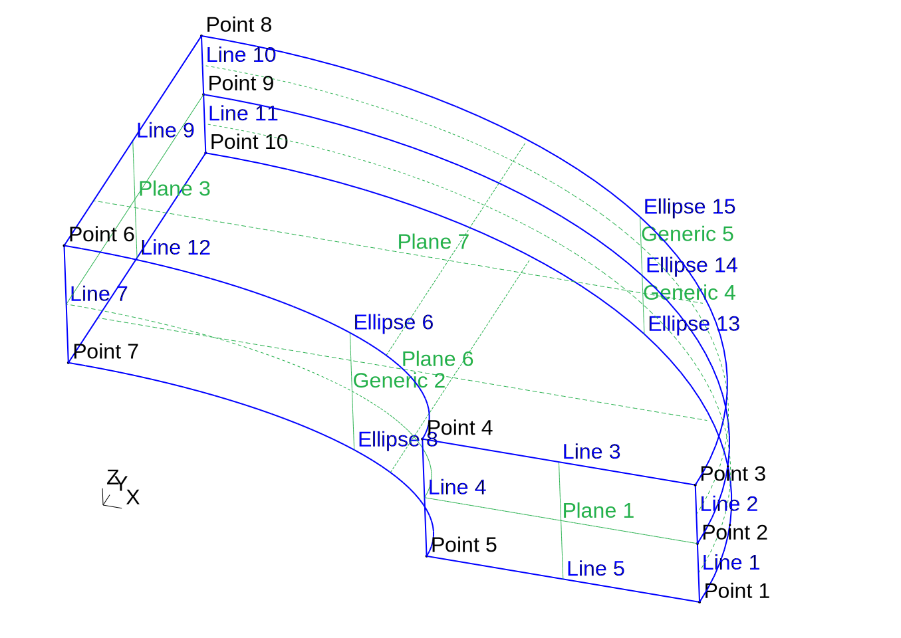

---
title: Design basis differences between FeenoX and other free and open source FEA software
lang: en-US
number-sections: true
fontsize: 11pt
geometry:
- paper=a4paper
- left=2.5cm
- right=2cm
- bottom=3.5cm
- foot=2cm
- top=3.5cm
- head=2cm
colorlinks: true
mathspec: true
syntax-definition: ../feenox.xml
header-includes: \include{syntax.tex}
listings: true
toc: true
...

# Introduction

This brief text describes the differences between the design basis of FeenoX and that of some free and open source FEA packages. Please note that only _differences_ are mentioned in such a way to show why FeenoX is indeed, _different_ from other tools. It is by no means a way of saying that one program is better than another one, because clearly all of the tools have a solid foundation and there are many users that benefit from each one. Again, this list is to justify _why_ I wrote FeenoX from scratch even if there are other free and open source tools already available.

The comparison is performed only against other free^[As in freedom] and open source FEA software packages.


## The NAFEMS LE-10 thick plate benchmark 

In order to better illustrate the different approaches proposed by each FEA tool, the classic NAFEMS LE-10 benchmark will be solved ([@fig:nafems-le10]). This test case is a linear elastic problem, which is very simple but at the same time involves a three-dimensional load state, symmetry conditions and evaluation of stresses at nodes.

{#fig:nafems-le10}


The geometry is defined by two ellipses, namely $(x/2)^2+y^2=1$ and $(x/3.25)^2+(y/2.75)^2=1$. As such, the continuous geometry can be created programatically (and exactly) by a CAD kernel. Since FeenoX better interacts with [Gmsh](http://gmsh.info/), which in turn uses [OpenCASCADE](https://dev.opencascade.org/), it can be easily created using for example the script [`le10-cad.geo`](le10-cad.geo). Other people might want to use an interactive 3D CAD tool to create the continuous geometry.

{#fig:nafems-le10-tags width=70%}

Let us assume we already created the geometry as a CAD file in a common format such as [`le10.step`](le10.step)---which is what most pre-processors and meshers do---shown in [@fig:nafems-le10-tags] and let us create a proper FEM mesh with Gmsh. The problem names a few surfaces to set the boundary conditions, which are then translated to the geometrical entities as follows:

Surface in the problem       |  CAD geometrical entity
-----------------------------|:-------------------------:
Upper surface of the plate   |             7
Face $DCD'C'$                |             1
Face $ABA'B'$                |             3
Face $BCB'C'$                |           4 & 5

Also, face $BCB'C'$’s “mid-plane” is Ellipse\ 14 in the CAD. A mesh with a local refinement around the point\ $D$ where the direct stress $\sigma_y$ is asked for (point number\ 4 in the CAD) can be created with Gmsh using the following [`le10.geo`](le10.geo) ([@fig:nafems-le10-mesh])

```c
// NAFEMS LE10 benchmark mesh
Merge "le10.step";   // load the CAD

// define physical names from the geometrical entity ids
Physical Surface("upper") = {7};
Physical Surface("DCD'C'") = {1};
Physical Surface("ABA'B'") = {3};
Physical Surface("BCB'C'") = {4, 5};
Physical Curve("midplane") = {14};
Physical Volume("bulk") = {1};

// meshing settings, read Gmsh' manual for further reference
Mesh.ElementOrder = 2;      // use second-order tetrahedra
Mesh.Algorithm = 9;         // 2D mesh algorithm:  9: Packing of Parallelograms
Mesh.Algorithm3D = 10;      // 3D mesh algorithm: 10: HXT
Mesh.Optimize = 1;          // Optimize the mesh
Mesh.HighOrderOptimize = 2; // Optimize high-order meshes? 2: elastic+optimization

Mesh.MeshSizeMax = 120;     // main element size 
Mesh.MeshSizeMin = 40;      // refined element size

// local refinement around the point D (entity 5)
Field[1] = Distance;
Field[1].NodesList = {5};
Field[2] = Threshold;
Field[2].IField = 1;
Field[2].LcMin = Mesh.MeshSizeMin;
Field[2].LcMax = Mesh.MeshSizeMax;
Field[2].DistMin = 2 * Mesh.MeshSizeMax;
Field[2].DistMax = 6 * Mesh.MeshSizeMax;
Background Field = {2};
```

With some extra effort, we might even get a hexahedral fully structured grid with [`le10-structured.geo`](le10-structured.geo) ([@fig:nafems-le10-structured]).

::: {#fig:nafems-le10-meshes}
{#fig:nafems-le10-mesh width=75%}

{#fig:nafems-le10-structured width=75%}

Two FEM meshes generated with Gmsh. Colored surfaces and edges hold boundary conditions.
:::


```feenox
asdasdsa
```

Note that there is no need to define a density.


# Comparison to other FEA tools

## CalculiX

[CalculiX](http://www.calculix.de/) reads an input file like FeenoX, but by design it was decided that these files had to be “compatible” with Abaqus’ `.inp` format. The result is that the input files are clotted up with mesh data because the loads have to be given node-wise, so
  1. a particular pre-processor (such as ccg, PrePoMax or FreeCAD) is needed, and
  2. the input files cannot be Git-tracked
  3. simple problems still need complex inputs

Even though...

 1. in theory CalculiX is released under the terms of the GPLv3+, but it...
    a. it written in a mixture of C (the main function) and Fortran\ 77 (the rest of the functions) in such a way that it is impossible for anyone but the main author to understand what the program does and how it works.
    b. there is no official Git repository, nor issue tracker nor contributing guidelines.
 2. the input format was chosen to be compatible with Abaqus, most of the time they cannot be exchanged and each program does not understand the other’s input files.
 3. CalculiX can run on a cloud server, but it was not designed for that end.
 

<https://cofea.readthedocs.io/en/latest/benchmarks/001-thick-plate/tested-codes.html>

## Code Aster

## Elmer

## MoFEM

## Sparselizard

## GetDP

## Fenics

## Firedrake

## Moose

## Deal.ii

## XC

