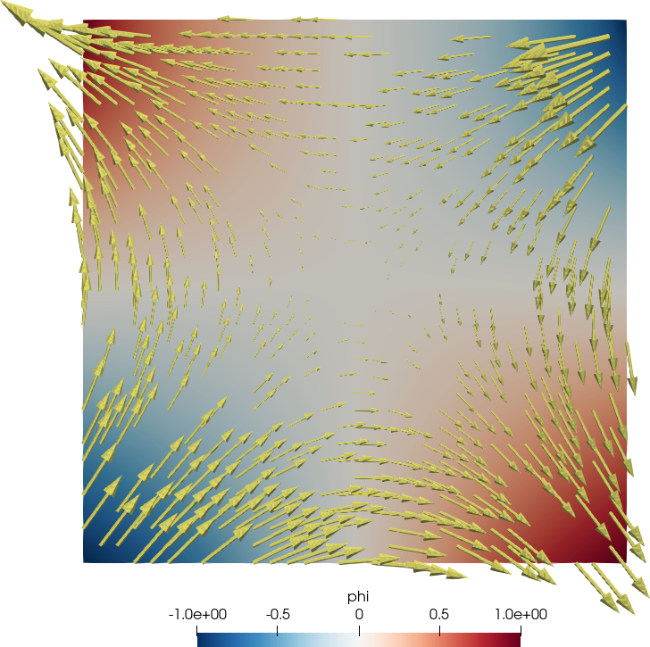

::: {.not-in-format .texinfo .man}
$$
\begin{cases}
\phi(x,y) = +y & \text{for $x=-1$ (left)} \\
\phi(x,y) = -y & \text{for $x=+1$ (right)} \\
\nabla \phi \cdot \hat{\vec{n}} = \sin\left(\frac{\pi}{2} \cdot x\right) & \text{for $y=-1$ (bottom)} \\
\nabla \phi \cdot \hat{\vec{n}} =0 & \text{for $y=+1$ (top)} \\
\end{cases}
$$
:::

::: {.only-in-format .texinfo .man}
$\phi(x,y) = +y \quad$ for $x=-1$ (left)

$\phi(x,y) = -y \quad$ for $x=+1$ (right)

$\nabla \phi \cdot \hat{n} = \sin(\pi/2 x) \quad$ for $y=-1$ (bottom)

$\nabla \phi \cdot \hat{n} =0 \quad$ for $y=+1$ (top)
:::


```{.feenox include="laplace-square.fee"}
```

::: {#fig:laplace}
{width_latex=46% width_texinfo=7cm}
{width_latex=51% width_texinfo=7cm}

Laplace’s equation solved with FeenoX
:::

