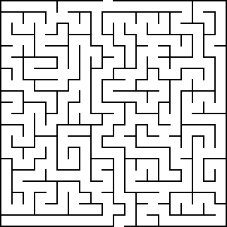
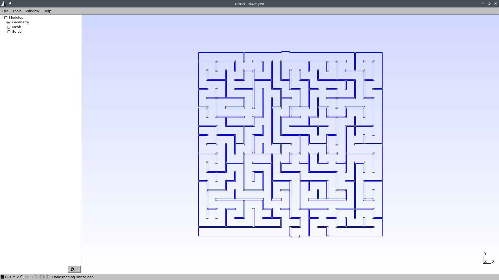
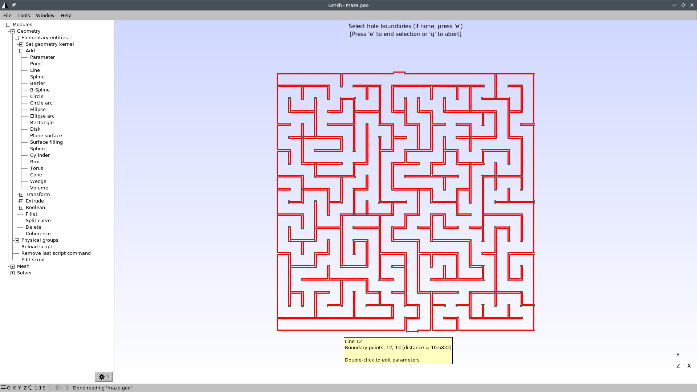
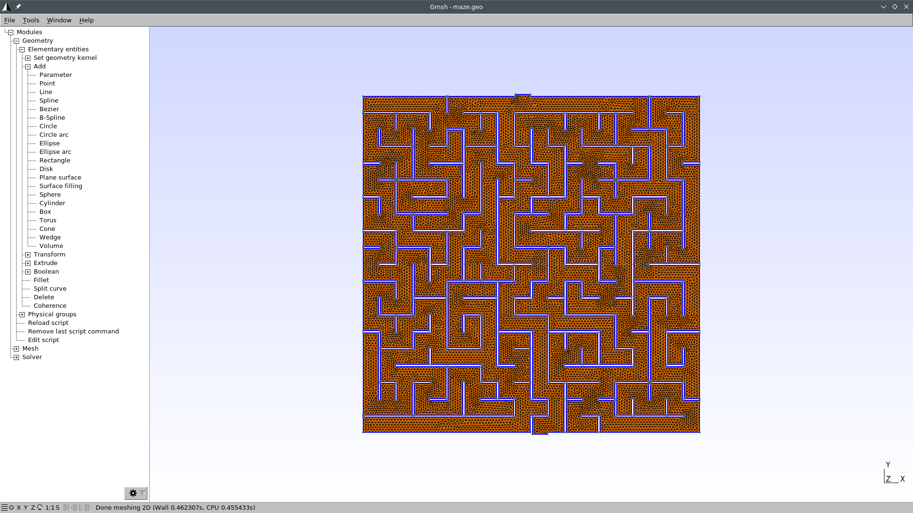
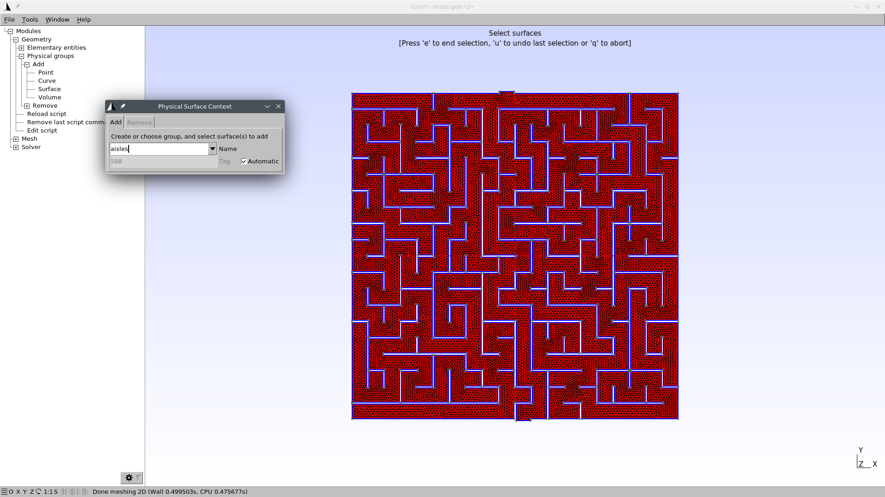
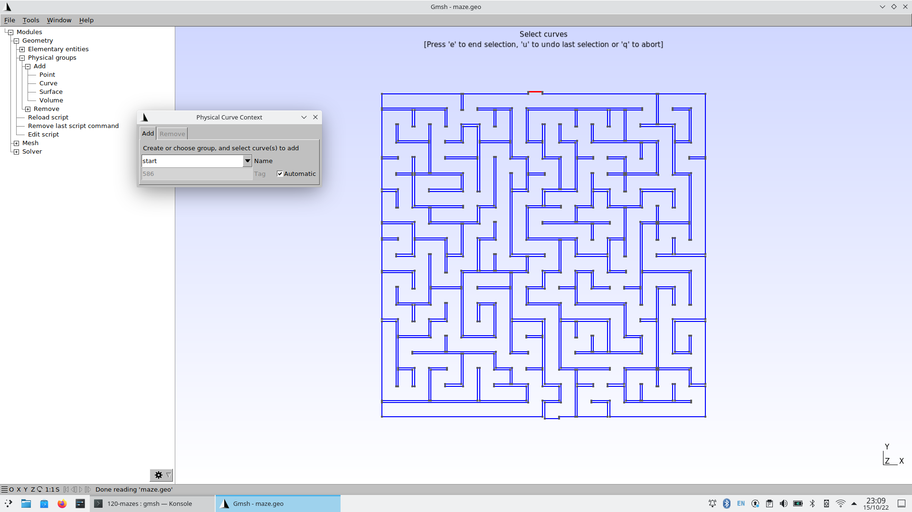
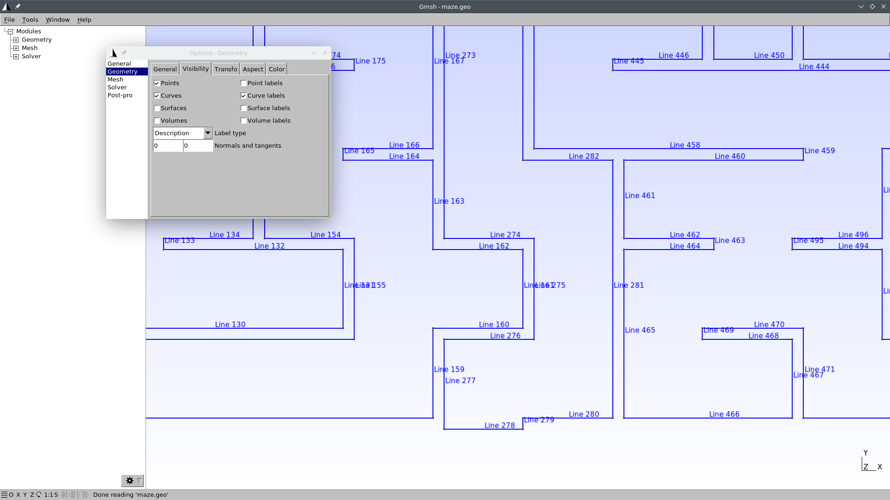
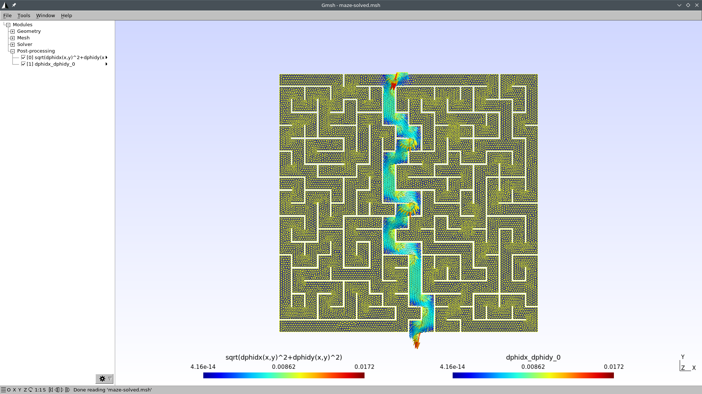
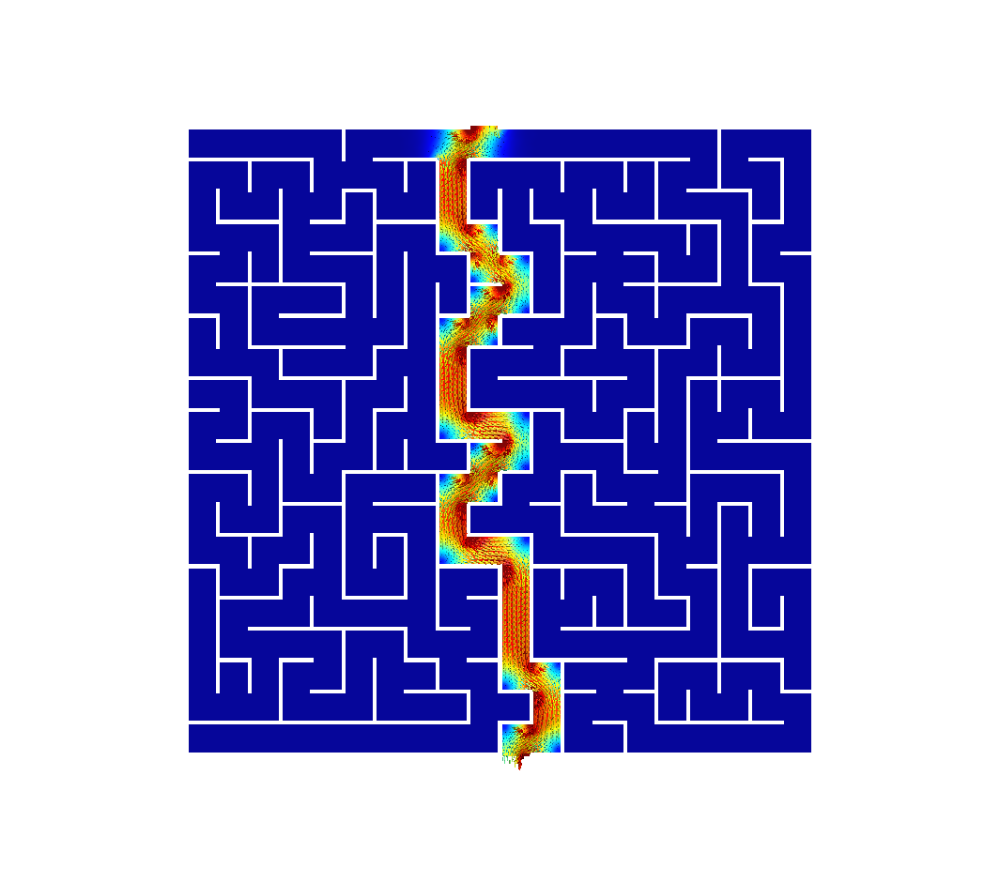

---
title: Solving mazes with PDEs instead of AI
subtitle: FeenoX Tutorial \#2
titleblock: |
 FeenoX Tutorial \#2: Solving mazes with PDEs instead of AI
 =================================
lang: en-US
number-sections: true
toc: true
prev_link: ../110-tensile-test
prev_title: \#1 Tensile test
next_link: ../320-thermal
next_title: \#3 Heat conduction

...


# Foreword

Welcome the the **Second Feenox tutorial**, very much inspired on Donald Knuth’s [Selected Papers on Fun and Games](https://web.stanford.edu/group/cslipublications/cslipublications/site/9781575865843.shtml). And a little bit on Homer Simpson.


{#fig:maze-homer}

Say you want to solve a maze drawn in a restaurant's placemat: one where both the start and end points are known beforehand as shown in @fig:maze-homer.
Nowadays the first instinctive reaction would be to fire some fancy AI or ML algorithm.
But we are actual engineers and we do value nice maths hacks, don't we?
In order to avoid falling into the alligator's mouth, we can exploit the ellipticity of the Laplacian operator to solve any maze---even hand-drawn ones.
Just [FeenoX](https://www.seamplex.com/feenox/) and a bunch of standard open source tools to convert a bitmapped picture of the maze into an unstructured mesh.


> A couple of LinkedIn posts to see some comments and discussions:
>
>  * <https://www.linkedin.com/feed/update/urn:li:activity:6831291311832760320/>
>  * <https://www.linkedin.com/feed/update/urn:li:activity:6973982270852325376/>
>
> Other people's maze-related posts:
>
>  * <https://www.linkedin.com/feed/update/urn:li:activity:7117082910381232128/>
>  * <https://www.linkedin.com/feed/update/urn:li:activity:6972370982489509888/>
>  * <https://www.linkedin.com/feed/update/urn:li:activity:6972949021711630336/>
>  * <https://www.linkedin.com/feed/update/urn:li:activity:6973522069703516160/>
>  * <https://www.linkedin.com/feed/update/urn:li:activity:6973921855275458560/>
>  * <https://www.linkedin.com/feed/update/urn:li:activity:6974663157952745472/>
>  * <https://www.linkedin.com/feed/update/urn:li:activity:6974979951049519104/>
>  * <https://www.linkedin.com/feed/update/urn:li:activity:6982049404568449024/>


## Executive summary

We will...

 1. Create and download a random maze online.
 2. Create a FEM mesh for the aisle of the maze (the walls will be the boundary of the domain) using [Gmsh](http://gmsh.info/).
 3. Solve $\nabla^2 \phi(x,y) = 0$ subject to the following boundary conditions:
 
    $$
    \begin{cases}
    \phi(x,y) = 1 & \text{at the inlet} \\
    \phi(x,y) = 0 & \text{at the outlet} \\
    \frac{\partial \phi}{\partial n} = 0 & \text{everywhere else} \\
    \end{cases}
    $$
    
 
    ```feenox
    PROBLEM laplace 2D
    READ_MESH maze.msh

    BC start  phi=0 
    BC end    phi=1

    SOLVE_PROBLEM
    ```
   
 4. Show the solution of the maze given by $\nabla \phi$, properly scaled, in [Gmsh](http://gmsh.info/):
 
    ```feenox
    # write the norm of gradient as a scalar field
    # and the gradient as a 2d vector into a .msh file
     WRITE_MESH maze-solved.msh \
         sqrt(dphidx(x,y)^2+dphidy(x,y)^2) \
         VECTOR dphidx dphidy 0 
    ```
   
 5. As a bonus, we will also solve a transient case to see how Laplace “tries” all the paths and only keeps the ones that do not find any dead end.
 
::: {#fig:maze123}
{#fig:maze12 width_html=100% width_latex=95%}

{#fig:maze3 width_html=100% width_latex=47.5%}

Bitmapped, meshed and solved mazes.
:::
 

# Creating the mesh


 1. Go to <http://www.mazegenerator.net/>
 
 2. Choose shape, style, width, height, etc. and create a maze

    \ 
 
 3. Download it in PNG (@fig:maze12)

    \ 
 
 4. Perform some manipulations and conversions. We are going to need a bunch of free an open source tools:
 
    ```terminal
    sudo apt-get install imagemagick potrace inkscape pstoedit make g++
    ```
 
     a. Invert the PNG and convert it to PNM with `convert` so the aisles are black and the walls are white:
     
        ```terminal
        convert maze.png -negate maze_negated.pnm
        ```
     
        \ 

     b. Vectorize the negated bitmap into an SVG with `potrace`:

        ```terminal
        potrace maze_negated.pnm --alphamax 0  --opttolerance 0 -b svg -o maze.svg
        ```
     
        \ 
        
     c. Convert the SVG to EPS with `inskcape`
     
        ```terminal
        inkscape maze.svg --export-eps=maze.eps
        ```
        
     d. Convert the EPS to DXF with `pstoedit`
     
        ```terminal
        pstoedit -dt -f 'dxf:-polyaslines -mm' maze.eps > maze.dxf
        ```
        
     e. Convert the DXF to a Gmsh’s `.geo` with `dxf2geo` (a C++ tool that comes with Gmsh)

        ```terminal
        make dxf2geo
        ./dxf2geo maze.dxf 0.1
        ```
        
    The tutorial directory contains a convenience script to perfom all these steps in a single call.
    Just name your PNG `maze.png` and run `./png2geo.sh`.
    
    
 5. The last file `maze.geo` contains only lines with the walls of the maze.
    We need to tell FeenoX where the maze starts and where it ends.
    Open it with Gmsh:

    ```terminal
    gmsh maze.geo
    ```
 
    \ 
 
    We have to

     i. Add a surface for the aisles of the maze (i.e. the 2D domain where we will apply the Laplace operator):
     
         * In the left-pane tree, go to Geometry $\rightarrow$ Elementary entities $\rightarrow$ Add $\rightarrow$ Plane Surface.
         * When prompted to "select surface boundary" click on any of the blue edges. They all should turn to red:
         
           \ 
         
         * Press `e` to end selection and `q` to exit the selection mode.
         * Press `2` to make a preliminary 2D mesh to see if it worked:
         
           \ 
           
         * Go to Geometry $\rightarrow$ Physical groups $\rightarrow$ Add $\rightarrow$ Surface.
         * When prompted to "select surfaces" click on any point of the maze. The mesh should turn red:
         
           \ 

         * Write “aisles” as the group’s name.
         * Press `e` to end the selection. You might need to click somewhere in the Gmsh window so as to get the focus out of the name text field.
         * Press `q` to exit the selection mode.
         * Press `0` to reload the `maze.geo` file and remove the temporary mesh.
     
     ii. Set physical curves for "start" and "end" (i.e. the 1D edges that will hold the Dirichlet boundary conditions)

         * In the left-pane tree, go to Geometry $\rightarrow$ Physical groups $\rightarrow$ Add $\rightarrow$ Curve.
         * When prompted to "select curves" click on the edge (or edges) that define the inlet. 
         * Write “start” as the group’s name.
         * Press `e` to end the selection. You might need to click somewhere in the Gmsh window so as to get the focus out of the name text field.

           \ 
           
         * Do the same thing for the outlet, and name it “end.” Alternatively, find out the edge id of the outlet by zooming in a little bit into the outlet and then going to Tools $\rightarrow$ Options $\rightarrow$ Geometry $\rightarrow$ Curve Labels:

           \ 
           
           In this case, the curve id is 278. So we can edit the file `maze.geo` and add this line at the very end:
           
           ```c
           Physical Curve("end") = {278};
           ```
    Now our `maze.geo` contains a proper definition of the domain where we will solve\ $\nabla^2 \phi = 0$.
         
    
 6. Create the actual mesh `maze.msh` out of `maze.geo`
 
    ```terminal
    gmsh -2 maze.geo
    ```
    
# Solving the steady-state Laplace equation

We have to solve $\nabla^2 \phi = 0$ with the following boundary conditions

$$
\begin{cases}
\phi=0 & \text{at “start”} \\
\phi=1 & \text{at “end”} \\
\nabla \phi \cdot \hat{\mathbf{n}} = 0 & \text{everywhere else} \\
\end{cases}
$$

The solution to the maze is given by the gradient of the solution\ $\nabla \phi$.

This translates into FeenoX to the following input file:

```{.feenox include="maze.fee"}
```

Let us break the [`WRITE_MESH`](https://seamplex.com/feenox/doc/feenox-manual.html#write_mesh) instruction up.
The resulting mesh name is `maze-solved.msh`. It cannot be the same `maze.msh` we used as the input mesh.

Those aisles that go into dead ends are expected to have a very small gradient, while the aisles that lead to the exit are expected to have a large gradient.
The solution\ $\phi(x,y)$ is mapped into a function `phi(x,y)`. Its gradient

$$\nabla \phi =
\begin{bmatrix}
\frac{\partial \phi}{\partial x} \\
\frac{\partial \phi}{\partial y}
\end{bmatrix}
$$
is mapped into two scalar functions, `dphidx(x,y)` and `dphidy(x,y)`.
So we write a scalar field with the magnitude of the gradient\ $\nabla \phi$ as `sqrt(dphidx(x,y)^2+dphidy(x,y)^2)`(remember that everything is an expression, including the fields written in the post-processing files).
We also write the gradient itself as a vector so we can follow the arrows from the start down to the end.

```terminal
$ feenox maze.fee
$
```

That's it. Remember the [Unix rule](https://www.seamplex.com/feenox/doc/tutorials/110-tensile-test/#sec:unix) of silence.
 
 
# Results

Open `maze-solved.msh` with Gmsh:

```terminal
gmsh maze-solved.msh
```

You should see something like this:

{width=100%}

I bet you did not see the straightforward path that FeenoX found!
Now we just need some make up to make a nice social-network-worth picture.
Let us create a file `maze-fig.geo` so Gmsh can scale everything up for us:

```{.c include="maze-fig.geo"}
```

```terminal
$ gmsh maze-fig.geo
$
```

{width=100%}


# Transient Laplace 
 
Use this transient input file for FeenoX, with the same mesh, to solve for the transient Laplace problem going from top to down (i.e. `td`):

$$
\nabla^2 \phi = \alpha \frac{\partial \phi}{\partial t}
$$


```{.feenox include="maze-tran-td.fee"}
```

```terminal
$ feenox maze-tran-td.fee
0
0.00736111
0.017873
0.0338879
0.0541553
[...]
390.125
419.195
450.667
475.333
500
$
```

So we have transient data in `maze-tran-td.msh`. Let's create a video (or a GIF) out of it.
Use this `maze-tran-td-anim.geo` to create PNGs of each time step:

```{.c include="maze-tran-td-anim.geo"}
```
 
```terminal
$ gmsh maze-tran-td-anim.geo 
# all frames dumped, now run
ffmpeg -y -framerate 10 -f image2 -i maze-tran-td-%03d.png maze-tran-td.mp4
ffmpeg -y -framerate 10 -f image2 -i maze-tran-td-%03d.png maze-tran-td.gif
$ sudo apt-get install ffmpeg
[...]
$ ffmpeg -y -framerate 10 -f image2 -i maze-tran-td-%03d.png maze-tran-td.mp4
[...]
$ ffmpeg -y -framerate 10 -f image2 -i maze-tran-td-%03d.png maze-tran-td.gif
[...]
$
```
 

 
# Homework

 1. Solve the bottom-up case.
 2. Play with different types of mazes! What if you actually draw and scan one yourself?
 
::: {#fig:mazes}

{width=45%}
{width=45%}

{width=45%}
{width=45%}

Any arbitrary maze (even hand-drawn) can be solved with FeenoX
::: 


