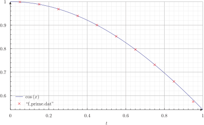
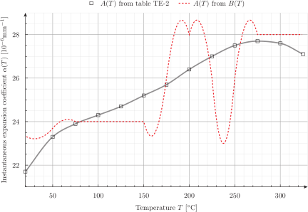
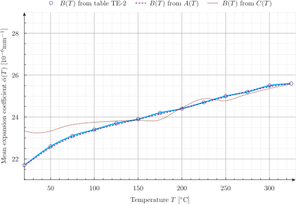
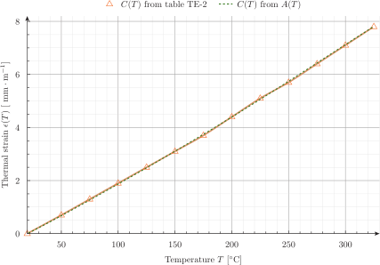
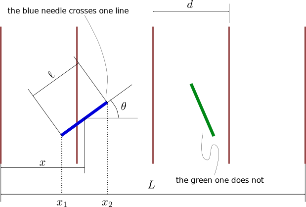
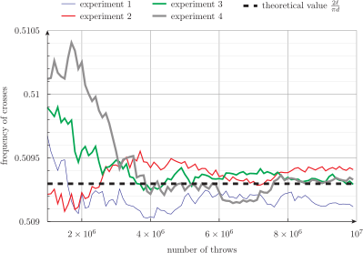

---
title: Basic mathematics
titleblock: |
 Basic mathematics
 =================
lang: en-US
toc: true 
...
# Hello World (and Universe)!


```feenox
PRINT "Hello $1!"
```


```terminal
$ feenox hello.fee World
Hello World!
$ feenox hello.fee Universe
Hello Universe!
$

```


# Ten ways of computing $\pi$

1.  Internal symbol `pi` equal to libc's `M_PI`

    $$
    \pi = \pi
    $$

2.  Four times the arc tangent of one

    $$
    \pi = 4 \cdot \arctan{1}
    $$

3.  The root of $\tan x=0$

    $$
    x / \tan x = 0
    $$

4.  The integral of the gaussian bell, squared

    $$
    \pi = \left[ \int_{-\infty}^{\infty} e^{-x^2} \, dx \right]^2
    $$

5.  The integral of $(x^2 + y^2) < 1$ inside a unit square

    $$
    \pi = \int_{-1}^{+1} \int_{-1}^{+1} \left[(x^2 + y^2) < 1\right] \, dy \, dx
    $$

6.  The integral of one inside a parametrized circle

    $$
    \pi = \int_{-1}^{+1} \int_{-\sqrt{1-x^2}}^{+\sqrt{1-x^2}} \, dy \, dx
    $$

7.  The Gregoy-Leibniz sum

    $$
    \pi = 4 \cdot \sum_{i}^{\infty} \frac{(-1)^{i+1}}{2i-1}
    $$

8.  The Abraham-Sharp sum

    $$
    \pi =  \sum_{i}^{\infty} \frac{2 \cdot (-1)^i \cdot 3^{\frac{1}{2-i}}}{2i+1}
    $$

9.  An integral which is equal to $22/7-\pi$

    $$
    22/7 - \pi = \int_{0}^{1} \frac{x^4 \cdot (1-x)^4}{1+x^2} \, dx
    $$

10. Ramanujan-Sato series

    $$
    \frac{1}{\pi} = \frac{2 \cdot \sqrt{2}}{99^2} \cdot \sum_{i=0}^{\infty} \frac{(4i)!}{(i^4)!} \cdot \frac{26390 \cdot i +  1103}{396^{4i}}
    $$


```feenox
# computing pi in ten different ways
VECTOR piapprox SIZE 10
VAR x y

# the double-precision internal representation of pi (M_PI)
piapprox[1] = pi

# four times the arc-tangent of the unity
piapprox[2] = 4*atan(1)

# the abscissae x where tan(x) = 0 in the range [3:3.5]
piapprox[3] = root(tan(x), x, 3, 3.5)

# the square of the numerical integral of the guassian curve 
piapprox[4] = integral(exp(-x^2), x, -10, 10)^2

# the numerical integral of a circle inscribed in a unit square
piapprox[5] = integral(integral((x^2+y^2) < 1, y, -1, 1), x, -1, 1)

# the numerical integral of a circle parametrized with sqrt(1-x^2)
piapprox[6] = integral(integral(1, y, -sqrt(1-x^2), sqrt(1-x^2)), x, -1, 1)

# the gregory-leibniz sum (one hundred thousand terms)
piapprox[7] = 4*sum((-1)^(i+1)/(2*i-1), i, 1, 1e5)

# the abraham sharp sum (twenty-one terms)
piapprox[8] = sum(2*(-1)^i * 3^(1/2-i)/(2*i+1), i, 0, 20)

# this integral is equal to 22/7-pi
piapprox[9] = 22/7-integral((x^4*(1-x)^4)/(1+x^2), x, 0, 1)

# ramanujan-sato series
piapprox[10] = 1/(2*sqrt(2)/(99^2)*sum(gammaf(4*i)/gammaf(i)^4 * (26390*i + 1103)/(396^(4*i)), i, 0, 2))

PRINT_VECTOR "% .16f" piapprox piapprox(i)-pi
```


```terminal
$ feenox pi.fee
3.1415926535897931      0.0000000000000000
3.1415926535897931      0.0000000000000000
3.1415926535897936      0.0000000000000004
3.1415926535899108      0.0000000000001177
3.1417605332857996      0.0001678796960065
3.1415956548678512      0.0000030012780581
3.1415826535897198     -0.0000100000000733
3.1415926535956351      0.0000000000058420
3.1415926535897931      0.0000000000000000
3.1415927109074255      0.0000000573176324
$

```


# Financial decisions under inflation

You live in a country with a high inflation rate. A retailer offers you
a good with two payment options:

a.  30% off the full price plus 3 equal monthly installments, or
b.  full price in 12 equal monthly installments

If the inflation rate is small (large), option a (b) wins.

**Question** What is the monthly inflation rate at which the two options
are equally good (or bad)?


```feenox
# n = number of payments
# d = discount 
# r = monthly inflation rate
present_value(n, d, r) = sum((1-d)/n * (1/(1+r))^(i-1), i, 1, n)
r0 = root(present_value(12,0,r) - present_value(3,0.3,r), r, 0, 0.2)

PRINTF "the tipping monthly inflation is %g (that means %.1f%% per month and %.1f%% per year)" r0 100*r0 100*(1+r0)^12

PRINT

PRINTF "with 12 payments no discount with r = %g you pay %.3f"  r0+0.01 present_value(12,0,r0+0.01)
PRINTF "with  3 payments and 30%% off with r = %g you pay %.3f" r0+0.01 present_value(3,0.3,r0+0.01)

PRINT

PRINTF "with 12 payments no discount with r = %g you pay %.3f"  r0-0.01 present_value(12,0,r0-0.01)
PRINTF "with  3 payments and 30%% off with r = %g you pay %.3f" r0-0.01 present_value(3,0.3,r0-0.01)
```


```terminal
$ feenox inflation.fee 
the tipping monthly inflation is 0.0931703 (that means 9.3% per month and 291.2% per year)

with 12 payments no discount with r = 0.10317 you pay 0.617
with  3 payments and 30% off with r = 0.10317 you pay 0.637

with 12 payments no discount with r = 0.0831703 you pay 0.669
with  3 payments and 30% off with r = 0.0831703 you pay 0.648
$ 

```


# The logistic map

Plot the asymptotic behavior of the [logistic
map](https://en.wikipedia.org/wiki/Logistic_map)

$$
x_{n+1} = r \cdot x \cdot (1-x)
$$

for a range of the parameter $r$.


```feenox
DEFAULT_ARGUMENT_VALUE 1 2.6   # by default show r in [2.6:4]
DEFAULT_ARGUMENT_VALUE 2 4

steps_per_r = 2^10
steps_asymptotic = 2^8
steps_for_r = 2^10

static_steps = steps_for_r*steps_per_r

# change r every steps_per_r steps
IF mod(step_static,steps_per_r)=1
 r = quasi_random($1,$2)
ENDIF

x_init = 0.5           # start at x = 0.5
x = r*x*(1-x)          # apply the map

IF step_static-steps_per_r*floor(step_static/steps_per_r)>(steps_per_r-steps_asymptotic)
 # write the asymptotic behavior only
 PRINT r x
ENDIF
```


```terminal
$ gnuplot
gnuplot> plot "< feenox logistic.fee" w p pt 50 ps 0.02
gnuplot> quit
$

```


# The Fibonacci sequence

## Using the closed-form formula as a function

When directly executing FeenoX, one gives a single argument to the
executable with the path to the main input file. For example, the
following input computes the first twenty numbers of the [Fibonacci
sequence](https://en.wikipedia.org/wiki/Fibonacci_number) using the
closed-form formula

$$
f(n) = \frac{\varphi^n - (1-\varphi)^n}{\sqrt{5}}
$$

where $\varphi=(1+\sqrt{5})/2$ is the [Golden
ratio](https://en.wikipedia.org/wiki/Golden_ratio).


```feenox
# the fibonacci sequence as function
phi = (1+sqrt(5))/2 
f(n) = (phi^n - (1-phi)^n)/sqrt(5)
PRINT_FUNCTION f MIN 1 MAX 20 STEP 1
```


```terminal
$ feenox fibo_formula.fee | tee one
1	1
2	1
3	2
4	3
5	5
6	8
7	13
8	21
9	34
10	55
11	89
12	144
13	233
14	377
15	610
16	987
17	1597
18	2584
19	4181
20	6765
$

```


## Using a vector

We could also have computed these twenty numbers by using the direct
definition of the sequence into a vector $\vec{f}$ of size 20.


```feenox
# the fibonacci sequence as a vector
VECTOR f SIZE 20

f[i]<1:2> = 1
f[i]<3:vecsize(f)> = f[i-2] + f[i-1]

PRINT_VECTOR i f
```


```terminal
$ feenox fibo_vector.fee > two
$

```


## Solving an iterative problem

Finally, we print the sequence as an iterative problem and check that
the three outputs are the same.


```feenox
static_steps = 20
#static_iterations = 1476  # limit of doubles

IF step_static=1|step_static=2
 f_n = 1
 f_nminus1 = 1
 f_nminus2 = 1
ELSE
 f_n = f_nminus1 + f_nminus2
 f_nminus2 = f_nminus1
 f_nminus1 = f_n
ENDIF

PRINT step_static f_n
```


```terminal
$ feenox fibo_iterative.fee > three
$ diff one two
$ diff two three
$

```


# Computing the derivative of a function as a Unix filter

This example illustrates how well FeenoX integrates into the Unix
philosophy. Let's say one has a function $f(t)$ as an ASCII file with
two columns and one wants to compute the derivative $f'(t)$. Just pipe
the function file into this example's input file `derivative.fee` used
as a filter.

For example, this small input file `f.fee` writes the function of time
provided in the first command-line argument from zero up to the second
command-line argument:

``` feenox
end_time = $2
PRINT t $1
```

``` terminal
$ feenox f.fee "sin(t)" 1
0       0
0.0625  0.0624593
0.125   0.124675
0.1875  0.186403
0.25    0.247404
0.3125  0.307439
0.375   0.366273
0.4375  0.423676
0.5     0.479426
0.5625  0.533303
0.625   0.585097
0.6875  0.634607
0.75    0.681639
0.8125  0.726009
0.875   0.767544
0.9375  0.806081
1       0.841471
$
```

Then we can pipe the output of this command to the derivative filter.
Note that

-   The `derivative.fee` has the execution flag has on and a [shebang
    line](https://en.wikipedia.org/wiki/Shebang_(Unix)) pointing to a
    global location of the FeenoX binary in `/usr/local/bin` e.g. after
    doing `sudo make install`.
-   The first argument of `derivative.fee` controls the time step. This
    is only important to control the number of output lines. It does not
    have anything to do with precision, since the derivative is computed
    using an adaptive centered numerical differentiation scheme using
    the [GNU Scientific
    Library](https://www.gnu.org/software/gsl/doc/html/diff.html).
-   Before doing the actual differentiation, the input data is
    interpolated using a third-order monotonous scheme (also with
    [GSL](https://www.gnu.org/software/gsl/doc/html/interp.html#c.gsl_interp_type.gsl_interp_steffen)).
-   TL;DR: this is not just "current value minus last value divided time
    increment."


```feenox
#!/usr/local/bin/feenox
# read the function from stdin
FUNCTION f(t) FILE - INTERPOLATION steffen

# detect the domain range
a = vecmin(vec_f_t)
b = vecmax(vec_f_t)

# time step from arguments (or default 10 steps)
DEFAULT_ARGUMENT_VALUE 1 (b-a)/10
h = $1

# compute the derivative with a wrapper for gsl_deriv_central()
VAR t'
f'(t) = derivative(f(t'),t',t)

# write the result
PRINT_FUNCTION f' MIN a+0.5*h MAX b-0.5*h STEP h
```


```terminal
$ chmod +x derivative.sh
$ feenox f.fee "sin(t)" 1 | ./derivative.fee 0.1 | tee f_prime.dat
0.05    0.998725
0.15    0.989041
0.25    0.968288
0.35    0.939643
0.45    0.900427
0.55    0.852504
0.65    0.796311
0.75    0.731216
0.85    0.66018
0.95    0.574296
$

```





# On the evaluation of thermal expansion coefficients

When solving thermal-mechanical problems it is customary to use thermal
expansion coefficients in order to take into account the mechanical
strains induced by changes in the material temperature with respect to a
reference temperature where the deformation is identically zero. These
coefficients $\alpha$ are defined as the partial derivative of the
strain $\epsilon$ with respect to temperature $T$ such that differential
relationships like

$$
d\epsilon = \frac{\partial \epsilon}{\partial T} \, dT = \alpha \cdot dT
$$

hold. This derivative $\alpha$ is called the *instantaneous* thermal
expansion coefficient. For finite temperature increments, one would like
to be able to write

$$
\Delta \epsilon = \alpha \cdot \Delta T
$$

But if the strain is not linear with respect to the temperature---which
is the most common case---then $\alpha$ depends on $T$. Therefore, when
dealing with finite temperature increments $\Delta T = T-T_0$ where the
thermal expansion coefficient $\alpha(T)$ depends on the temperature
itself then *mean* values for the thermal expansion ought to be used:

$$
\Delta \epsilon = \int_{\epsilon_0}^{\epsilon} d\epsilon^{\prime} 
= \int_{T_0}^{T} \frac{\partial \epsilon}{\partial T^\prime} \, dT^\prime
= \int_{T_0}^{T} \alpha(T^\prime) \, dT^\prime
$$

We can multiply and divide by $\Delta T$ to obtain

$$
\int_{T_0}^{T} \alpha(T^\prime) \, dT^\prime \cdot \frac{\Delta T}{\Delta T}
= \bar{\alpha}(T) \cdot \Delta T
$$

where the mean expansion coefficient for the temperature range $[T_0,T]$
is

$$
\bar{\alpha}(T) = \frac{\displaystyle \int_{T_0}^{T} \alpha(T^\prime) \, dT^\prime}{T-T_0}
$$

This is of course the classical calculus result of the mean value of a
continuous one-dimensional function in a certain range.

Let $\epsilon(T)$ be the linear thermal expansion of a given material in
a certain direction when heating a piece of such material from an
initial temperature $T_0$ up to $T$ so that $\epsilon(T_0)=0$.

.](asme-expansion-table.png){#fig:table-asme-expansion}

From our previous analysis, we can see that in
@fig:table-asme-expansion:

$$
\begin{aligned}
A(T) &= \alpha(T)       = \frac{\partial \epsilon}{\partial T} \\
B(T) &= \bar{\alpha}(T) = \frac{\epsilon(T)}{T-T_0} = \frac{\displaystyle \int_{T_0}^{T} \alpha(T^\prime) \, dT^\prime}{T - T_0} \\
C(T) &= \epsilon(T)     = \int_{T_0}^T \alpha(T^\prime) \, dT^\prime
\end{aligned}
$$

Therefore,

i.  $A(T)$ can be computed out of $C(T)$
ii. $B(T)$ can be computed either out of $A(T)$ or $C(T)$
iii. $C(T)$ can be computed out of $A(T)$


```feenox
# just in case we wanted to interpolate with another method (linear, splines, etc.)
DEFAULT_ARGUMENT_VALUE 1 steffen

# read columns from data file and interpolate
# A is the instantaenous coefficient of thermal expansion x 10^-6 (mm/mm/ºC)
FUNCTION A(T) FILE asme-expansion-table.dat COLUMNS 1 2 INTERPOLATION $1
# B is the mean coefficient of thermal expansion x 10^-6 (mm/mm/ºC) in going
# from 20ºC to indicated temperature
FUNCTION B(T) FILE asme-expansion-table.dat COLUMNS 1 3 INTERPOLATION $1
# C is the linear thermal expansion (mm/m) in going from 20ºC
# to indicated temperature
FUNCTION C(T) FILE asme-expansion-table.dat COLUMNS 1 4 INTERPOLATION $1

VAR T'                   # dummy variable for integration
T0 = 20                  # reference temperature
T_min = vecmin(vec_A_T)  # smallest argument of function A(T)
T_max = vecmax(vec_A_T)  # largest argument of function A(T)

# compute one column from another one
A_fromC(T) := 1e3*derivative(C(T'), T', T)

B_fromA(T) := integral(A(T'), T', T0, T)/(T-T0)
B_fromC(T) := 1e3*C(T)/(T-T0)   # C is in mm/m, hence the 1e3

C_fromA(T) := 1e-3*integral(A(T'), T', T0, T)

# write interpolated results
PRINT_FUNCTION A A_fromC   B B_fromA B_fromC   C C_fromA MIN T_min+1 MAX T_max-1 STEP 1
```


```terminal
$ cat asme-expansion-table.dat 
# temp  A       B        C
20      21.7    21.7     0
50      23.3    22.6     0.7
75      23.9    23.1     1.3
100     24.3    23.4     1.9
125     24.7    23.7     2.5
150     25.2    23.9     3.1
175     25.7    24.2     3.7
200     26.4    24.4     4.4
225     27.0    24.7     5.1
250     27.5    25.0     5.7
275     27.7    25.2     6.4
300     27.6    25.5     7.1
325     27.1    25.6     7.8
$ feenox asme-expansion.fee > asme-expansion-interpolation.dat
$ pyxplot asme-expansion.ppl
$

```


{width=100%}
{width=100%}
{width=100%}

> The conclusion (see
> [this](https://www.linkedin.com/pulse/accuracy-thermal-expansion-properties-asme-bpv-code-angus-ramsay/),
> [this](https://www.seamplex.com/docs/SP-WA-17-TN-F38B-A.pdf) and
> [this](https://www.linkedin.com/pulse/ansys-potential-issue-thermal-expansion-calculations-angus-ramsay/) reports)
> is that values rounded to only one decimal value as presented in the ASME code
> section II subsection D tables are not enough to satisfy the mathematical relationships
> between the physical magnitudes related to thermal expansion properties of the materials listed.
> Therefore, care has to be taken as which of the three columns is chosen when using the data
> for actual thermo-mechanical numerical computations.
> As an exercise, the reader is encouraged to try different interpolation algorithms to
> see how the results change. _Spoiler alert_: they are also highly sensible to the interpolation method used
> to “fill in” the gaps between the table values.


# Buffon's needle

Buffon's needle is a classical probability problem that dates back from
the 18th century whose solution depends on the value of $\pi$. When I
first read about this problem in my high-school years, I could not
believe two things. The first one, that the number $\pi$ had something
to do with the probability a stick has of crossing a line. And the
other, that one would actually be able to compute $\pi$ by throwing away
sticks. Of course, this was long before I learned about calculus,
distributions and Monte Carlo methods.

The problem consists of a table of length $L$ over which transversal
lines separated by a length $d$ are drawn. A stick (needle) of
length $\ell$ is randomly thrown over the table. What is the
probability $p$ that the stick crosses one line?



For $\ell < d$ the answer is

$$
p = \frac{ 2 \ell }{ \pi d}
$$

To convince myself that the two facts I did not believe back when I was
a youngster were actually true, I would just run the example below. Four
experiments (I know that generating random numbers in a digital computer
is not a real experiment, as neither is solving the equations of a
chaotic natural convection loop. However, I could not come up with a
better word) of ten millions throws each are simulated, and the
experimental frequency is compared to the theoretical value. I am now
convinced.

To solve the Buffon's needle problem the Monte Carlo way, two random
numbers are generated: the distance $0 \leq x < L$ from one side of the
table to the center of the thrown stick, and the angle
$0 \leq \theta < 2\pi$ with respect to the table longitudinal axis. One
way of checking whether a stick crosses or not a line is the following.
First, compute the location of both ends of the stick

`\begin{align*}
x_1 &= x + \frac{1}{2} \ell \cos(\theta)  \\
x_2 &= x - \frac{1}{2} \ell \cos(\theta)  \\
\end{align*}`{=tex}

Now, if the floor of $x_1/d$ is equal to the floor of $x_2/d$, the stick
does not cross a line. Otherwise, it does.

The input file iteratively performs $10^7$ throws and prints the partial
frequency of crosses as a function of the number of throws, along with
the constant analytical result. Four runs are performed, and the results
are plotted in the figure.


```feenox
static_steps = 1e7  # number of times we trow the stick

L = 10    # length of the table
l = 0.8   # length of the stick
d = 1     # distance between lines
result = 2*l/(pi*d) # expected theoretical result

x = random(0, L)          # location of the center of the stick
theta = random(0, 2*pi)   # the resulting angle

x1 = x + 0.5*l*cos(theta) # coordinates of the stick ends 
x2 = x - 0.5*l*cos(theta)

# increase count if the stick crosses one line
# (remember ! is the "not equal" operator)
count = count + (floor(x1/d)!floor(x2/d))

# print the partial results
PRINT %g step_static count/step_static result SKIP_STATIC_STEP 1e5
```


```terminal
$ for i in $(seq 1 4); do echo $i; feenox buffon.fee > buffon${i}.dat; done
1
2
3
4
$ pyxplot buffon.ppl

```





