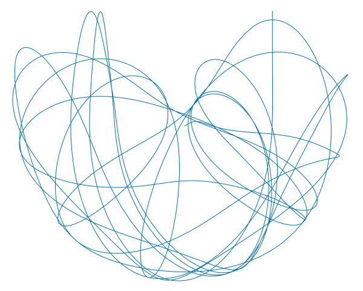
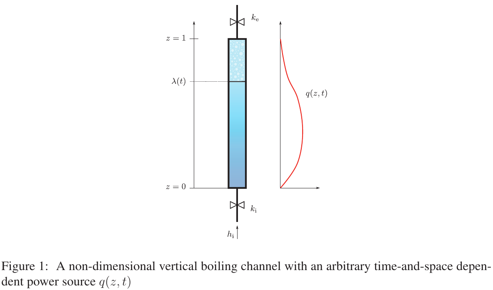
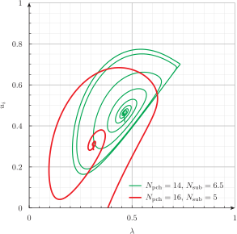

---
title: Ordinary Differential Equations & Differential-Algebraic Equations
titleblock: |
 Ordinary Differential Equations & Differential-Algebraic Equations
 ==================================================================
lang: en-US
toc: true 
...
# Lorenz' attractor---the one with the butterfly

Solve

$$
\begin{cases}
\dot{x} &= \sigma \cdot (y - x)  \\
\dot{y} &= x \cdot (r - z) - y   \\
\dot{z} &= x y - b z             \\
\end{cases}
$$

for $0 < t < 40$ with initial conditions

$$
\begin{cases}
x(0) = -11  \\
y(0) = -16  \\
z(0) = 22.5 \\
\end{cases}
$$

and $\sigma=10$, $r=28$ and $b=8/3$, which are the classical parameters
that generate the butterfly as presented by Edward Lorenz back in his
seminal 1963 paper [Deterministic non-periodic
flow](http://journals.ametsoc.org/doi/abs/10.1175/1520-0469%281963%29020%3C0130%3ADNF%3E2.0.CO%3B2).
This example's input file ressembles the parameters, inital conditions
and differential equations of the problem as naturally as possible with
an ASCII file.


```feenox
PHASE_SPACE x y z     # Lorenz attractor’s phase space is x-y-z
end_time = 40         # we go from t=0 to 40 non-dimensional units

sigma = 10            # the original parameters from the 1963 paper
r = 28
b = 8/3

x_0 = -11             # initial conditions
y_0 = -16
z_0 = 22.5

# the dynamical system's equations written as naturally as possible
x_dot = sigma*(y - x)
y_dot = x*(r - z) - y
z_dot = x*y - b*z

PRINT t x y z        # four-column plain-ASCII output
```


```terminal
$ feenox lorenz.fee > lorenz.dat
$ gnuplot lorenz.gp
$ python3 lorenz.py
$ sh lorenz2x3d.sh < lorenz.dat > lorenz.html

```


::: {#fig:ex_lorenz}
{width=48%}
{width=48%}

The Lorenz attractor computed with FeenoX plotted with two different tools
:::


# The double pendulum

Find the location of the two bobs vs time in the double pendulum
in @fig:double-pendulum.

{#fig:double-pendulum
width="60%"}

Use these four different approaches:

a.  Hamiltonian formulation with numerical derivatives

    $$
    \begin{aligned}
    \mathcal{H}(\theta_1, \theta_2, p_1, p_2) =&
     - \frac{\ell_2^2 m_2 p_1^2 - 2 \ell_1 \ell_2 m_2 \cos(\theta_1-\theta_2) p_1 p_2 + \ell_1^2 (m_1+m_2) p_2^2}
     {\ell_1^2 \ell_2^2 m_2 \left[-2m_1-m_2+m_2\cos\Big(2(\theta_1-\theta_2)\Big)\right]} \\
     & - \Big[ m_1 g \ell_1 \cos \theta_1 + m_2 g (\ell_1 \cos \theta_1 + \ell_2 \cos \theta_2) \Big]
    \end{aligned}
    $$

    $$
    \begin{cases}
    \displaystyle  \dot{\theta}_1 &= \displaystyle +\frac{\partial \mathcal{H}}{\partial p_1} \\
    \displaystyle  \dot{\theta}_2 &= \displaystyle +\frac{\partial \mathcal{H}}{\partial p_2} \\
    \displaystyle  \dot{p}_1 &= \displaystyle -\frac{\partial \mathcal{H}}{\partial \theta_1} \\
    \displaystyle  \dot{p}_2 &= \displaystyle -\frac{\partial \mathcal{H}}{\partial \theta_2} \\
    \end{cases}
    $$

    ``` feenox
    # the double pendulum solved by the hamiltonian formulation
    # and numerically computing its derivatives

    PHASE_SPACE theta1 theta2 p1 p2
    VAR theta1' theta2' p1' p2'

    H(theta1,theta2,p1,p2) = \
              - (m1*g*l1*cos(theta1) + m2*g*(l1*cos(theta1) \
              + l2*cos(theta2))) \
              - (l2^2*m2*p1^2 - 2*l1*l2*m2*cos(theta1-theta2)*p1*p2 + \
                   l1^2*(m1+m2)*p2^2)/(l1^2*l2^2*m2 \ 
                     * (-2*m1-m2+m2*cos(2*(theta1-theta2))))


    theta1_dot .= +derivative(H(theta1,theta2,p1',p2), p1', p1)
    theta2_dot .= +derivative(H(theta1,theta2,p1,p2'), p2', p2)

    p1_dot     .= -derivative(H(theta1',theta2,p1,p2), theta1', theta1)
    p2_dot     .= -derivative(H(theta1,theta2',p1,p2), theta2', theta2)
    ```

b.  Hamiltonian formulation with analytical derivatives

    $$
    \begin{cases}
    \dot{\theta}_1 &= \displaystyle         \frac{p_1 \ell_2 - p_2 \ell_1 \cos(\theta_1-\theta_2)}{\ell_1^2 \ell_2 [m_1 + m_2 \sin^2(\theta_1-\theta_2)]} \\
    \dot{\theta}_2 &= \displaystyle  \frac{p_2 (m_1+m_2)/m_2 \ell_1 - p_1 \ell_2 \cos(\theta_1-\theta_2)}{\ell_1 \ell_2^2 [m_1 + m_2 \sin^2(\theta_1-\theta_2)]} \\
    \dot{p_1} &= \displaystyle -(m_1+m_2) g \ell_1 \sin(\theta_1) - c_1 + c_2 \\
    \dot{p_2} &= \displaystyle -m_2 g \ell_2 \sin(\theta_2) + c_1 - c_2
    \end{cases}
    $$ where the expressions $c_1$ and $c_2$ are

    $$\begin{aligned}
    c1 &= \frac{p_1 p_2 \sin(\theta_1-\theta_2)}{\ell_1 \ell_2 \Big[m_1+m_2 \sin(\theta_1-\theta_2)^2\Big]} \\
    c2 &= \frac{\Big[ p_1^2 m_2 \ell_2^2 - 2 p_1 p_2 m_2 \ell_1 \ell_2 \cos(\theta_1-\theta_2)
       + p_2^2 (m_1+m_2) \ell_1^2)\Big] \sin(2 (\theta_1-\theta_2)}{
      2 \ell_1^2 \ell_2^2 \left[m_1+m_2 \sin^2(\theta_1-\theta_2)\right]^2}
    \end{aligned}
    $$

    ``` feenox
    # the double pendulum solved by the hamiltonian formulation
    # and analytically computing its derivatives

    PHASE_SPACE theta1 theta2 p1 p2 c1 c2

    theta1_dot .=            (p1*l2 - p2*l1*cos(theta1-theta2))/(l1^2*l2*(m1 + m2*sin(theta1-theta2)^2))
    theta2_dot .= (p2*(m1+m2)/m2*l1 - p1*l2*cos(theta1-theta2))/(l1*l2^2*(m1 + m2*sin(theta1-theta2)^2))

    p1_dot .= -(m1+m2)*g*l1*sin(theta1) - c1 + c2
    p2_dot .=      -m2*g*l2*sin(theta2) + c1 - c2

    c1 .= p1*p2*sin(theta1-theta2)/(l1*l2*(m1+m2*sin(theta1-theta2)^2))
    c2 .= { (p1^2*m2*l2^2 - 2*p1*p2*m2*l1*l2*cos(theta1-theta2)
             + p2^2*(m1+m2)*l1^2)*sin(2*(theta1-theta2))/
            (2*l1^2*l2^2*(m1+m2*sin(theta1-theta2)^2)^2) }
    ```

c.  Lagrangian formulation with numerical derivatives

    $$
    \begin{aligned}
    \mathcal{L}(\theta_1, \theta_2, \dot{\theta}_1, \dot{\theta}_2) =& 
    \frac{1}{2} m_1 \ell_1^2 \dot{\theta}_1^2 +
    \frac{1}{2} m_2 \left[\ell_1^2 \dot{\theta}_1^2 + \ell_2^2 \dot{\theta}_2^2 + 2 \ell_1 \ell_2 \dot{\theta}_1 \dot{\theta}_2 \cos(\theta_1-\theta_2)\right] + \\
    & m_1 g  \ell_1\cos \theta_1 + m_2 g \left(\ell_1\cos \theta_1 + \ell_2 \cos \theta_2 \right)
    \end{aligned}
    $$

    $$
    \begin{cases}
    \displaystyle \frac{\partial}{\partial t}\left(\frac{\partial \mathcal{L}}{\partial \dot{\theta}_1}\right) &= \displaystyle \frac{\partial \mathcal{L}}{\partial \theta_1} \\
    \displaystyle  \frac{\partial}{\partial t}\left(\frac{\partial \mathcal{L}}{\partial \dot{\theta}_2}\right) &= \displaystyle \frac{\partial \mathcal{L}}{\partial \theta_2}
    \end{cases}
    $$

    ``` feenox
    # the double pendulum solved by the lagrangian formulation
    # and numerically computing its derivatives

    PHASE_SPACE theta1 theta2 dL_dthetadot1 dL_dthetadot2
    VAR theta1' theta2' theta1_dot' theta2_dot'

    L(theta1,theta2,theta1_dot,theta2_dot) = {
    # kinetic energy of m1
     1/2*m1*l1^2*theta1_dot^2 + 
    # kinetic energy of m2
     1/2*m2*(l1^2*theta1_dot^2 + l2^2*theta2_dot^2 + 2*l1*l2*theta1_dot*theta2_dot*cos(theta1-theta2))
     + ( 
    # potential energy of m1 
     m1*g *  l1*cos(theta1) +
    # potential energy of m2
     m2*g * (l1*cos(theta1) + l2*cos(theta2))
     ) }

    # there is nothing wrong with numerical derivatives, is there?
    dL_dthetadot1 .= derivative(L(theta1, theta2, theta1_dot', theta2_dot), theta1_dot', theta1_dot)
    dL_dthetadot2 .= derivative(L(theta1, theta2, theta1_dot, theta2_dot'), theta2_dot', theta2_dot)

    dL_dthetadot1_dot .= derivative(L(theta1', theta2,theta1_dot, theta2_dot), theta1', theta1)
    dL_dthetadot2_dot .= derivative(L(theta1, theta2',theta1_dot, theta2_dot), theta2', theta2)

    ```

d.  Lagrangian formulation with analytical derivatives

    $$
    \begin{cases}
    0 &= (m_1+m_2) \ell_1^2 \ddot{\theta}_1 + m_2 \ell_1 \ell_2 \ddot{\theta}_2 \cos(\theta_1-\theta_2) + m_2 \ell_1 \ell_2 \dot{\theta}_2^2 \sin(\theta_1-\theta_2) + \ell_1 (m_1+m_2) g \sin(\theta_1) \\
    0 &= m_2 \ell_2^2 \ddot{\theta}_2 + m_2 \ell_1 \ell_2 \ddot{\theta}_1 \cos(\theta_1-\theta_2) - m_2 \ell_1 \ell_2 \dot{\theta}_1^2 \sin(\theta_1-\theta_2) + \ell_2 m_2 g \sin(\theta_2)
    \end{cases}
    $$

    ``` feenox
    # the double pendulum solved by the lagrangian formulation
    # and analytically computing its derivatives

    PHASE_SPACE theta1 theta2 omega1 omega2

    # reduction to a first-order system
    omega1 .= theta1_dot
    omega2 .= theta2_dot

    # lagrange equations
    0 .= (m1+m2)*l1^2*omega1_dot + m2*l1*l2*omega2_dot*cos(theta1-theta2) + \
     m2*l1*l2*omega2^2*sin(theta1-theta2) + l1*(m1+m2)*g*sin(theta1)


    0 .= m2*l2^2*omega2_dot + m2*l1*l2*omega1_dot*cos(theta1-theta2) - \
     m2*l1*l2*omega1^2*sin(theta1-theta2) + l2*m2*g*sin(theta2)
    ```

The combination Hamilton/Lagrange and numerical/analytical is given in
the command line as arguments `$1` and `$2` respectively.


```feenox
# the double pendulum solved using different formulations

# parameters
end_time = 10
m1 = 0.3
m2 = 0.2
l1 = 0.3
l2 = 0.25
g = 9.8

# inital conditions
theta1_0 = pi/2
theta2_0 = pi

# include the selected formulation
DEFAULT_ARGUMENT_VALUE 1 hamilton
DEFAULT_ARGUMENT_VALUE 2 numerical
INCLUDE double-$1-$2.fee

# output the results vs. time
PRINT t theta1 theta2 theta1_dot theta2_dot \
      l1*sin(theta1)                -l1*cos(theta1) \
      l1*sin(theta1)+l2*sin(theta2) -l1*cos(theta1)-l2*cos(theta2) 
```


```terminal
$ for guy in hamilton lagrange; do
   for form in numerical analytical; do
     feenox double.fee $guy $form > double-${guy}-${form}.tsv;
     m4 -Dguy=$guy -Dform=$form -Dtype=$RANDOM double.gp.m4 | gnuplot -;
   done;
  done
$ 

```


::: {#fig:double-results}
{width=48%}
{width=48%}

{width=48%}
{width=48%}

Position of the double pendulum's $m_2$ solved with four (slightly) different formulations
:::


# Vertical boiling channel

## Original Clausse-Lahey formulation with uniform power distribution

Implementation of the dynamical system as described in

-   [The Moving Boiling-Boundary Model Of A Vertical Two-Phase Flow
    Channel
    Revisited](http://www.cimec.org.ar/ojs/index.php/mc/article/view/3277/3200),
    by Jeremy Theler, Alejandro Clausse and Fabián J. Bonetto (2010).

The original paper was written using the **first** version of the code,
named mochin. Recall that FeenoX is a *third system effect*.



For reference, the non-dimensional equations are

$$
\begin{aligned}
0 &= \, -\frac{1}{h_\text{i}(t)} \cdot \frac{d h_\text{i}}{dt} \left( N_1 - n - \frac{1}{2} \right) \Big[\ell_{n}(t) - \ell_{n-1}(t) \Big]  
+ \frac{1}{2} \left( \frac{d\ell_n}{dt} + \frac{d\ell_{n-1}}{dt} \right)  \quad\quad & \nonumber \\
& \quad\quad\quad\quad - u_\text{i}(t) - \frac{N_1}{h_\text{i}(t)} \cdot \frac{N_\text{sub}}{N_\text{pch}} \int_{\ell_{n-1}(t)}^{\ell{n}(t)} q(z,t) \, dz \quad\quad\quad\quad\quad \text{for $n=1,\dots,N_1$}
\\
0 &=  u_\text{i}(t) - u_\text{e}(t)  + N_\text{sub} \int_{\lambda(t)}^{1} q(z',t) \, dz' 
\\
0 &=  \, \rho_\text{e}(t) - \frac{1}{\displaystyle 1 + N_\text{pch} \cdot \eta(t) \cdot \int_{\lambda(t)}^{1} q(z',t) \, dz'}
\\
0 &= \lambda(t) - m(t) + \bigint_{\lambda(t)}^{1} \frac{dz}{\displaystyle 1 + N_\text{pch} \cdot \eta(t) \cdot \int_{\lambda(t)}^{z} q(z',t) \, dz'} 
\\
0 &= \varphi(t) - \bigint_{\lambda(t)}^{1} \frac{ \displaystyle u_\text{i}(t) + N_\text{sub}  \int_{\lambda(t)}^{z} q(z',t) \, dz'}{\displaystyle 1 + N_\text{pch}  \cdot \eta(t) \cdot \int_{\lambda(t)}^{z} q(z',t) \, dz'} \, dz
\\
0 &= \frac{d m(t)}{dt} + \rho_\text{e}(t) \cdot u_\text{e}(t) - u_\text{i}(t)
\\
0 &= 
 \frac{d u_\text{i}(t)}{dt} \cdot \lambda(t) + u_\text{i}(t) \cdot \frac{d \lambda(t)}{dt} + \frac{d\varphi(t)}{dt}
 + \rho_\text{e}(t) \, u_\text{e}^2(t) - \rho_\text{i}(t) \, u_\text{i}^2(t)  \\
& \quad\quad\quad\quad +
\Lambda \cdot \left[ u_\text{i}^2(t) \cdot \lambda(t) +
 \bigint_{\lambda(t)}^{1} \frac{\left( \displaystyle u_\text{i}(t) + N_\text{sub}  \int_{\lambda(t)}^{z} q(z',t) \, dz'\right)^2}{\displaystyle 1 + N_\text{pch}  \cdot \eta(t) \cdot \int_{\lambda(t)}^{z} q(z',t) \, dz'} \, dz \right] \\
& \quad\quad\quad\quad\quad\quad
 + k_\text{i} \cdot \rho_\text{i}(t) \, u_\text{i}^2(t)
 + k_\text{e} \cdot \rho_\text{e}(t) \, u_\text{e}^2(t)
+ \frac{m(t)}{\text{Fr}} - \text{Eu}(t) \\
0 &= h_\text{i}(t) + f(\vec{x}, \vec{\dot{x}}, t) \\
0 &= \text{Eu}(t) + g(\vec{x}, \vec{\dot{x}}, t)
\end{aligned}
$$

where $\ell_0 = 0$ and $\ell_{N_1}=\lambda$. See the full paper for the
details.

The input file `boiling-2010-eta.fee` takes two optional arguments from
the command line:

1.  The phase-change number $N_\text{pch}$ (default is 14)
2.  The subcooling number $N_\text{sub}$ (default is 6.5)

When run, FeenoX...

a.  computes the steady state conditions (including the Euler number of
    of the two numbers from the command line),

b.  prints a commented-out block (each line starting with `#`) with the
    dimensionless numbers of the problem,

c.  disturbs the inlet velocity to 90% of the nominal value,

d.  solves the system up to a non-dimensional time of 100, and

e.  for each time step, writes three columns:

    i.  the non-dimensional time $t$
    ii. the non-dimesinoal location of the boiling interface $\lambda$
    iii. the non-dimensional inlet velocity $u_i$

The input file [`boiling-2010.fee`](boiling-2010.fee) contains the
original Clausse-Lahey formulation without the intermediate
variable $\eta$.


```feenox
##############################
# vertical boiling channel
# clausse & lahey nodalization, nondimensional DAE version
# version with eta (N1+5 variables) as presented at MECOM 2010
# Theler G., Clausse A., Bonetto F.,
# The moving boiling-boundary model of a vertical two-phase flow channel revisited.
# Mecanica Computacional, Volume XXIX Number 39, Fluid Mechanics (H), pages 3949-3976.
# http://www.cimec.org.ar/ojs/index.php/mc/article/view/3277/3200
# updated to work with FeenoX
# jeremy@seamplex.com
##############################

##############################
# non-dimensional parameters
##############################
DEFAULT_ARGUMENT_VALUE 1 14
DEFAULT_ARGUMENT_VALUE 2 6.5
Npch = $1    # phase-change number (read from command line)
Nsub = $2    # subcooling number   (read from command line)

Fr = 1       # froude number
Lambda = 3   # distributed friction number
ki = 6       # inlet head loss coefficient
ke = 2       # outlet head loss coefficient


##############################
# phase-space definition
##############################
N1 = 6       # nodes in the one-phase region
VECTOR l SIZE N1

PHASE_SPACE l ui ue m rhoe eta

# the boiling frontier is equal to the last one-phase node position
# and we refer to it as lambda throughout the file
ALIAS l[N1] AS lambda 


##############################
# DAE solver settings
##############################
end_time = 100        # final integration time

# compute the initial derivatives of the differential objects
# from the variables of both differential and algebraic objects
INITIAL_CONDITIONS_MODE FROM_VARIABLES


##############################
# steady state values
##############################
IF Npch<(Nsub+1e-2)
 PRINT "Npch =" Npch "should be larger than Nsub =" Nsub SEP " "
 ABORT
ENDIF

# compute the needed euler (external pressure) number
Eu = {  (1/Npch)*(Nsub^2 + 0.5*Lambda*Nsub^2 + ke*Nsub^2)
      + (1/Npch^2)*(-Nsub^3 + Lambda*Nsub^2 - Lambda*Nsub^3
                     + ki*Nsub^2 + ke*Nsub^2 - ke*Nsub^3)
      + (Nsub/Npch)* 1/Fr * (1 + log(1 + Npch - Nsub)/Nsub)
      + 0.5*Nsub^4/Npch^3*Lambda }
      
# and the steady-state (starred in the paper) values
ui_star = Nsub/Npch
lambda_star = Nsub/Npch
m_star = lambda_star + 1/Npch*(log(1+Npch*(1-lambda_star)))
rhoe_star = 1/(1 + Npch*(1-lambda_star))
ue_star = ui_star + Nsub*(1-lambda_star)
eta_star = 1


##############################
# initial conditions
##############################
l_0[i] = lambda_star * i/N1
m_0 = m_star
ui_0 = 0.9*ui_star         # disturbance
ue_0 = ue_star
rhoe_0 = rhoe_star
eta_0 = eta_star

# stop the integration if certain variables get out of
# the [0:1] interval -> unstable condition
done = done | m>1 | lambda>1 | ui<0 | ui>1
IF done
 PRINT TEXT "\# model is out of bounds" Nsub Npch m lambda ui
 ABORT
ENDIF


##############################
# the dynamical system equations
##############################
# equations (29)
0 .= 0.5*(        0  + l_dot[1]) + N1*(l[1] -     0 ) - ui

# TODO: this used to work but now it does not
# 0[i]<2:N1> .= 0.5*(l_dot[i-1] + l_dot[i]) + N1*(l[i] - l[i-1]) - ui
 
0 .= 0.5*(l_dot[2-1] + l_dot[2]) + N1*(l[2] - l[2-1]) - ui
0 .= 0.5*(l_dot[3-1] + l_dot[3]) + N1*(l[3] - l[3-1]) - ui
0 .= 0.5*(l_dot[4-1] + l_dot[4]) + N1*(l[4] - l[4-1]) - ui
0 .= 0.5*(l_dot[5-1] + l_dot[5]) + N1*(l[5] - l[5-1]) - ui
0 .= 0.5*(l_dot[6-1] + l_dot[6]) + N1*(l[6] - l[6-1]) - ui

# equation (31)
0 .= ui - ue + Nsub*(1-lambda)

# equation (34)
0 .= rhoe - 1/(1+eta*Npch*(1-lambda))

# equation (35)
0 .= lambda - m + 1/(eta*Npch)*log(1/rhoe)

# equation (36)
0 .= m_dot + rhoe*ue - ui

# equation (30)
0 .= {
   + m*ui_dot + m_dot*ui
   - Nsub*(1-m)/(eta^2*Npch)*eta_dot - Nsub/(eta*Npch)*m_dot
   + rhoe * ue^2 - ui^2 
   + m/Fr - Eu
   + ki*ui^2 + ke*rhoe*ue^2
   + Lambda*( m*ui^2
              + (Nsub*log(1/rhoe))/(eta*Npch)^2*(Nsub/(eta*Npch) - 2*ui)
              + lambda^2*Nsub^2/(2*Npch)
              + 2*ui*Nsub*(1-lambda)/(eta*Npch)
              + Nsub^2/(eta*Npch)*((0.5-lambda)-(1-lambda)/(eta*Npch))
            ) }


##############################
# output results
##############################
# write information (commented out) in the ouput header
IF in_static
 PRINT "\# vertical boiling channel with uniform power (eta formulation 2010)"
 PRINT "\# Npch = "   Npch
 PRINT "\# Nsub = "   Nsub
 PRINT "\# Fr   = "   Fr
 PRINT "\# Lambda = " Lambda
 PRINT "\# ki   = "   ki
 PRINT "\# ke   = "   ke
 PRINT "\# Eu   = "   %.10f Eu
ENDIF

PRINT t lambda ui
```


```terminal
$ feenox boiling-2010.fee | tee boiling-2010-14-6.5.dat
# vertical boiling channel with uniform power (original formulation 2010)
# Npch =        14
# Nsub =        6.5
# Fr   =        1
# Lambda =      3
# ki   =        6
# ke   =        2
# Eu   =        9.1375899118
0       0.464286        0.417857
1.52588e-05     0.464286        0.41787
3.05176e-05     0.464286        0.417884
[...]
49.9456 0.260377        0.532362
49.9759 0.270814        0.556147
50      0.279815        0.574653
$ feenox boiling-2010.fee 16 5 | tee boiling-2010-16-5.dat
# vertical boiling channel with uniform power (original formulation 2010)
# Npch =        16
# Nsub =        5
# Fr   =        1
# Lambda =      3
# ki   =        6
# ke   =        2
# Eu   =        5.8724697515
0       0.3125  0.28125
1.52588e-05     0.3125  0.281258
3.05176e-05     0.3125  0.281267
[...]
9.70317 0.383792        0.00373348
9.71746 0.375037        -0.0176774
# model is out of bounds        5       16      0.600731        0.375037        -0.0176774  
$ 

```





