# Hello World (and Universe)!


```feenox
PRINT "Hello $1!"
```


```terminal
$ feenox hello.fee World
Hello World!
$ feenox hello.fee Universe
Hello Universe!
$
```


# Lorenz' attractor---the one with the butterfly

Solve

$$
\begin{cases}
\dot{x} &= \sigma \cdot (y - x)  \\
\dot{y} &= x \cdot (r - z) - y   \\
\dot{z} &= x y - b z             \\
\end{cases}
$$

for $0 < t < 40$ with initial conditions

$$
\begin{cases}
x(0) = -11  \\
y(0) = -16  \\
z(0) = 22.5 \\
\end{cases}
$$

and $\sigma=10$, $r=28$ and $b=8/3$, which are the classical parameters
that generate the butterfly as presented by Edward Lorenz back in his
seminal 1963 paper [Deterministic non-periodic
flow](http://journals.ametsoc.org/doi/abs/10.1175/1520-0469%281963%29020%3C0130%3ADNF%3E2.0.CO%3B2).
This example's input file ressembles the parameters, inital conditions
and differential equations of the problem as naturally as possible with
an ASCII file.


```feenox
PHASE_SPACE x y z     # Lorenz attractor’s phase space is x-y-z
end_time = 40         # we go from t=0 to 40 non-dimensional units

sigma = 10            # the original parameters from the 1963 paper
r = 28
b = 8/3

x_0 = -11             # initial conditions
y_0 = -16
z_0 = 22.5

# the dynamical system's equations written as naturally as possible
x_dot = sigma*(y - x)
y_dot = x*(r - z) - y
z_dot = x*y - b*z

PRINT t x y z        # four-column plain-ASCII output
```


```terminal
$ feenox lorenz.fee > lorenz.dat
$ gnuplot lorenz.gp
$ python3 lorenz.py
$ sh lorenz2x3d.sh < lorenz.dat > lorenz.html
```


::: {#fig:ex_lorenz}
{width=48%}
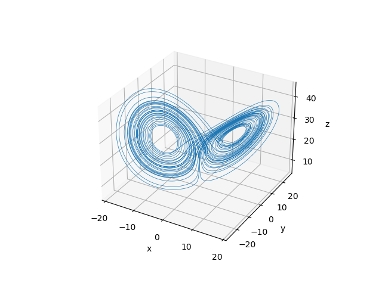{width=48%}

The Lorenz attractor computed with FeenoX plotted with two different tools
:::

# The logistic map

Plot the asymptotic behavior of the [logistic
map](https://en.wikipedia.org/wiki/Logistic_map)

$$
x_{n+1} = r \cdot x \cdot (1-x)
$$

for a range of the parameter $r$.


```feenox
DEFAULT_ARGUMENT_VALUE 1 2.6   # by default show r in [2.6:4]
DEFAULT_ARGUMENT_VALUE 2 4

steps_per_r = 2^10
steps_asymptotic = 2^8
steps_for_r = 2^10

static_steps = steps_for_r*steps_per_r

# change r every steps_per_r steps
IF mod(step_static,steps_per_r)=1
 r = quasi_random($1,$2)
ENDIF

x_init = 0.5           # start at x = 0.5
x = r*x*(1-x)          # apply the map

IF step_static-steps_per_r*floor(step_static/steps_per_r)>(steps_per_r-steps_asymptotic)
 # write the asymptotic behavior only
 PRINT r x
ENDIF
```


```terminal
$ gnuplot
gnuplot> plot "< feenox logistic.fee" w p pt 50 ps 0.02
gnuplot> quit
$
```


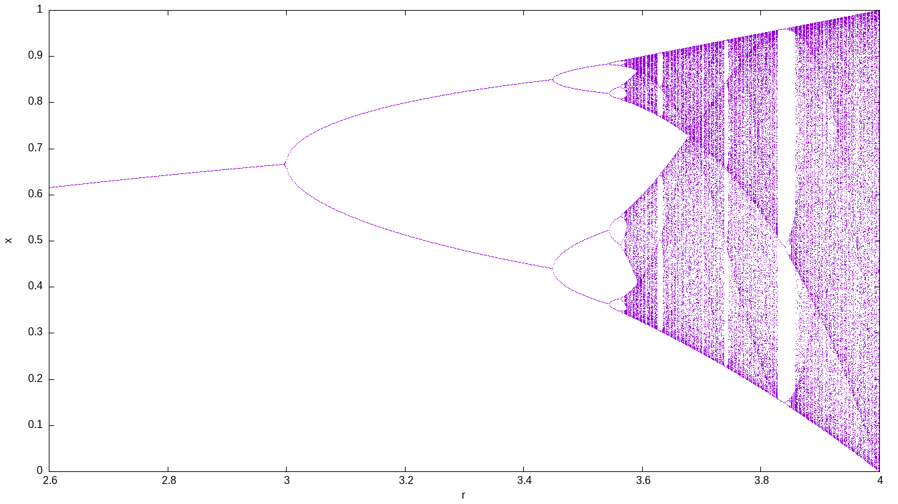

# Thermal slabs

## One-dimensional linear

Solve heat conduction on the slab $x \in [0:1]$ with boundary conditions

$$
\begin{cases}
T(0) = 0 & \text{(left)} \\
T(1) = 1 & \text{(right)} \\
\end{cases}
$$

and uniform conductivity. Compute $T\left(\frac{1}{2}\right)$.

Please note that:

-   The input written in a self-evident English-like dialect
    -   Syntactic sugared plain-text ASCII file
    -   Simple problems (like this one) need simple inputs
    -   FeenoX follows the UNIX rule of simplicity
-   Output is 100% user-defined
    -   No `PRINT` no output
    -   Feenox follows the UNIX rule of silence
-   There is no node at $x=1/2=0.5$!
    -   FeenoX knows how to interpolate
-   Mesh separated from problem
    -   The geometry comes from a Git-friendly `.geo`

    ``` c
    Point(1) = {0, 0, 0};          // geometry: 
    Point(2) = {1, 0, 0};          // two points
    Line(1) = {1, 2};              // and a line connecting them!

    Physical Point("left") = {1};  // groups for BCs and materials
    Physical Point("right") = {2};
    Physical Line("bulk") = {1};   // needed due to how Gmsh works

    Mesh.MeshSizeMax = 1/3;        // mesh size, three line elements
    Mesh.MeshSizeMin = Mesh.MeshSizeMax;
    ```

    -   UNIX rule of composition
    -   The actual input file is a Git-friendly `.fee`


```feenox
PROBLEM thermal 1D    # tell FeenoX what we want to solve 
READ_MESH slab.msh    # read mesh in Gmsh's v4.1 format
k = 1                 # set uniform conductivity
BC left  T=0          # set fixed temperatures as BCs
BC right T=1          # "left" and "right" are defined in the mesh
SOLVE_PROBLEM         # we are ready to solve the problem
PRINT T(1/2)          # ask for the temperature at x=1/2
```


```terminal
$ gmsh -1 slab.geo
[...]
Info    : 4 nodes 5 elements
Info    : Writing 'slab.msh'...
[...]
$ feenox thermal-1d-dirichlet-uniform-k.fee 
0.5
$ 
```


# NAFEMS LE10 "Thick plate pressure" benchmark

{width="100%"}

Assuming the CAD has already been created in [STEP
format](nafems-le10.step) (for instance using Gmsh with [this geo
file](https://github.com/seamplex/feenox/blob/main/examples/nafems-le10-cad.geo)),
create a tetrahedral locally-refined unstructured grid with Gmsh using
the following `.geo` file:

``` c
// NAFEMS LE10 benchmark unstructured locally-refined tetrahedral mesh
Merge "nafems-le10.step";   // load the CAD

// define physical names from the geometrical entity ids
Physical Surface("upper") = {7};
Physical Surface("DCD'C'") = {1};
Physical Surface("ABA'B'") = {3};
Physical Surface("BCB'C'") = {4, 5};
Physical Curve("midplane") = {14};
Physical Volume("bulk") = {1};

// meshing settings, read Gmsh' manual for further reference
Mesh.ElementOrder = 2;      // use second-order tetrahedra
Mesh.Algorithm = 6;         // 2D mesh algorithm:  6: Frontal Delaunay
Mesh.Algorithm3D = 10;      // 3D mesh algorithm: 10: HXT
Mesh.Optimize = 1;          // Optimize the mesh
Mesh.HighOrderOptimize = 1; // Optimize high-order meshes? 2: elastic+optimization

Mesh.MeshSizeMax = 80;      // main element size 
Mesh.MeshSizeMin = 20;      // refined element size

// local refinement around the point D (entity 4)
Field[1] = Distance;
Field[1].NodesList = {4};
Field[2] = Threshold;
Field[2].IField = 1;
Field[2].LcMin = Mesh.MeshSizeMin;
Field[2].LcMax = Mesh.MeshSizeMax;
Field[2].DistMin = 2 * Mesh.MeshSizeMax;
Field[2].DistMax = 6 * Mesh.MeshSizeMax;
Background Field = {2};

```

and then use this pretty-straightforward input file that has a
one-to-one correspondence with the original problem formulation from
1990:


```feenox
# NAFEMS Benchmark LE-10: thick plate pressure
PROBLEM mechanical 3D
READ_MESH nafems-le10.msh   # mesh in millimeters

# LOADING: uniform normal pressure on the upper surface
BC upper    p=1      # 1 Mpa

# BOUNDARY CONDITIONS:
BC DCD'C'   v=0      # Face DCD'C' zero y-displacement
BC ABA'B'   u=0      # Face ABA'B' zero x-displacement
BC BCB'C'   u=0 v=0  # Face BCB'C' x and y displ. fixed
BC midplane w=0      #  z displacements fixed along mid-plane

# MATERIAL PROPERTIES: isotropic single-material properties
E = 210e3   # Young modulus in MPa
nu = 0.3    # Poisson's ratio

SOLVE_PROBLEM   # solve!

# print the direct stress y at D (and nothing more)
PRINT "sigma_y @ D = " sigmay(2000,0,300) "MPa"

# write post-processing data for paraview
WRITE_MESH nafems-le10.vtk sigmay VECTOR u v w
```


```terminal
$ gmsh -3 nafems-le10.geo
[...]
$ feenox nafems-le10.fee
sigma_y @ D =   -5.38016        MPa
$
```


{width_latex=75% width_html=100%}

# NAFEMS LE11 "Solid Cylinder/Taper/Sphere-Temperature" benchmark

::: {#fig:nafems-le11-problem}
{width="48%"} {width="48%"}

The NAFEMS LE11 problem formulation
:::

Following the spirit from LE10, note how easy it is to give a
space-dependent temperature field in FeenoX. Just write
$\sqrt{x^2+y^2}+z$ like `sqrt(x^2 + y^2) + z`!


```feenox
# NAFEMS Benchmark LE-11: solid cylinder/taper/sphere-temperature
PROBLEM mechanical 3D
READ_MESH nafems-le11.msh

# linear temperature gradient in the radial and axial direction
# as an algebraic expression as human-friendly as it can be
T(x,y,z) := sqrt(x^2 + y^2) + z

BC xz     v=0       # displacement vector is [u,v,w]
BC yz     u=0       # u = displacement in x
BC xy     w=0       # v = displacement in y
BC HIH'I' w=0       # w = displacement in z

E = 210e3*1e6       # mesh is in meters, so E=210e3 MPa -> Pa
nu = 0.3            # dimensionless
alpha = 2.3e-4      # in 1/ºC as in the problem
SOLVE_PROBLEM

# for post-processing in Paraview
WRITE_MESH nafems-le11.vtk VECTOR u v w   T sigmax sigmay sigmaz

PRINT "sigma_z(A) =" %.2f sigmaz(1,0,0)/1e6 "MPa" SEP " "
PRINT "wall time  =" %.2f wall_time() "seconds"  SEP " "
```


```terminal
$ gmsh -3 nafems-le11.geo
[...]
$ feenox nafems-le11.fee
sigma_z(A) = -105.04 MPa
wall time  = wall time  = 1.91 seconds
$
```


::: {#fig:nafems-le11-result}
{width=48%}
{width=48%}

The NAFEMS LE11 problem results
:::

# NAFEMS LE1 "Elliptical membrane" plane-stress benchmark

{width="90%"}

Tell FenooX the problem is `plane_stress`. Use the `nafems-le1.geo` file
provided to create the mesh. Read it with `READ_MESH`, set material
properties, `BC`s and `SOLVE_PROBLEM`!


```feenox
PROBLEM mechanical plane_stress
READ_MESH nafems-le1.msh

E = 210e3
nu = 0.3

BC AB u=0
BC CD v=0
BC BC tension=10

SOLVE_PROBLEM

WRITE_MESH nafems-le1.vtk VECTOR u v 0 sigmax sigmay tauxy
PRINT "σy at point D = " %.4f sigmay(2000,0) "(reference is 92.7)" SEP " "
```


```terminal
$ gmsh -2 nafems-le11.geo
[...]
$ feenox nafems-le1.fee
σy at point D =  92.7011 (reference is 92.7)
$
```


{width=85%}

# How to solve a maze without AI

> See these LinkedIn posts to see some comments and discussions:
>
> -   <https://www.linkedin.com/feed/update/urn:li:activity:6831291311832760320/>
> -   <https://www.linkedin.com/feed/update/urn:li:activity:6973982270852325376/>
>
> Other people's maze-related posts:
>
> -   <https://www.linkedin.com/feed/update/urn:li:activity:6972370982489509888/>
> -   <https://www.linkedin.com/feed/update/urn:li:activity:6972949021711630336/>
> -   <https://www.linkedin.com/feed/update/urn:li:activity:6973522069703516160/>
> -   <https://www.linkedin.com/feed/update/urn:li:activity:6973921855275458560/>
> -   <https://www.linkedin.com/feed/update/urn:li:activity:6974663157952745472/>
> -   <https://www.linkedin.com/feed/update/urn:li:activity:6974979951049519104/>
> -   <https://www.linkedin.com/feed/update/urn:li:activity:6982049404568449024/>

Say you are Homer Simpson and you want to solve a maze drawn in a
restaurant's placemat, one where both the start and end are known
beforehand. In order to avoid falling into the alligator's mouth, you
can exploit the ellipticity of the Laplacian operator to solve any maze
(even a hand-drawn one) without needing any fancy AI or ML algorithm.
Just FeenoX and a bunch of standard open source tools to convert a
bitmapped picture of the maze into an unstructured mesh.

{width="100%"}


```feenox
PROBLEM laplace 2D  # pretty self-descriptive, isn't it?
READ_MESH maze.msh

# boundary conditions (default is homogeneous Neumann)
BC start  phi=0 
BC end    phi=1

SOLVE_PROBLEM

# write the norm of gradient as a scalar field
# and the gradient as a 2d vector into a .msh file
WRITE_MESH maze-solved.msh \
    sqrt(dphidx(x,y)^2+dphidy(x,y)^2) \
    VECTOR dphidx dphidy 0 
```


```terminal
$ gmsh -2 maze.geo
[...]
$ feenox maze.fee
$
```


{width_html=100% width_latex=50%}


## Transient top-down

Instead of solving a steady-state en exploiting the ellipticity of
Laplace's operator, let us see what happens if we solve a transient
instead.


```feenox
PROBLEM laplace 2D
READ_MESH maze.msh

phi_0(x,y) = 0              # inital condition
end_time = 100              # some end time where we know we reached the steady-state
alpha = 1e-6                # factor of the time derivative to make it advance faster
BC start   phi=if(t<1,t,1)  # a ramp from zero to avoid discontinuities with the initial condition
BC end     phi=0            # homogeneous BC at the end (so we move from top to bottom)

SOLVE_PROBLEM
PRINT t

WRITE_MESH maze-tran-td.msh phi    sqrt(dphidx(x,y)^2+dphidy(x,y)^2) VECTOR -dphidx(x,y) -dphidy(x,y) 0 
```


```terminal
$ feenox maze-tran-td.fee
0
0.00433078
0.00949491
0.0170774
0.0268599
[...]
55.8631
64.0819
74.5784
87.2892
100
$ gmsh maze-tran-td-anim.geo
# all frames dumped, now run
ffmpeg -y -framerate 20 -f image2 -i maze-tran-td-%03d.png maze-tran-td.mp4
ffmpeg -y -framerate 20 -f image2 -i maze-tran-td-%03d.png maze-tran-td.gif
$ ffmpeg -y -framerate 20 -f image2 -i maze-tran-td-%03d.png maze-tran-td.mp4
[...]
$ ffmpeg -y -framerate 20 -f image2 -i maze-tran-td-%03d.png maze-tran-td.gif
[...]

```


{width_html=100% width_latex=50%}


## Transient bottom-up

Now let us see what happens if we travel the maze from the exit up to
the inlet. It looks like the solver tries a few different paths that
lead nowhere until the actual solution is found.


```feenox
PROBLEM laplace 2D
READ_MESH maze.msh

phi_0(x,y) = 0
end_time = 100
alpha = 1e-6
BC end     phi=if(t<1,t,1)
BC start   phi=0 

SOLVE_PROBLEM
PRINT t

WRITE_MESH maze-tran-bu.msh phi    sqrt(dphidx(x,y)^2+dphidy(x,y)^2) VECTOR -dphidx(x,y) -dphidy(x,y) 0 
```


```terminal
$ feenox maze-tran-bu.fee
0
0.00402961
0.00954806
0.0180156
0.0285787
[...]
65.3715
72.6894
81.8234
90.9117
100
$ gmsh maze-tran-bu-anim.geo
# all frames dumped, now run
ffmpeg -y -framerate 20 -f image2 -i maze-tran-bu-%03d.png maze-tran-bu.mp4
ffmpeg -y -framerate 20 -f image2 -i maze-tran-bu-%03d.png maze-tran-bu.gif
$ ffmpeg -y -framerate 20 -f image2 -i maze-tran-bu-%03d.png maze-tran-bu.mp4
[...]
$ ffmpeg -y -framerate 20 -f image2 -i maze-tran-bu-%03d.png maze-tran-bu.gif
[...]

```


{width_html=100% width_latex=50%}


# The Fibonacci sequence

## Using the closed-form formula as a function

When directly executing FeenoX, one gives a single argument to the
executable with the path to the main input file. For example, the
following input computes the first twenty numbers of the [Fibonacci
sequence](https://en.wikipedia.org/wiki/Fibonacci_number) using the
closed-form formula

$$
f(n) = \frac{\varphi^n - (1-\varphi)^n}{\sqrt{5}}
$$

where $\varphi=(1+\sqrt{5})/2$ is the [Golden
ratio](https://en.wikipedia.org/wiki/Golden_ratio).


```feenox
# the fibonacci sequence as function
phi = (1+sqrt(5))/2 
f(n) = (phi^n - (1-phi)^n)/sqrt(5)
PRINT_FUNCTION f MIN 1 MAX 20 STEP 1
```


```terminal
$ feenox fibo_formula.fee | tee one
1	1
2	1
3	2
4	3
5	5
6	8
7	13
8	21
9	34
10	55
11	89
12	144
13	233
14	377
15	610
16	987
17	1597
18	2584
19	4181
20	6765
$
```


## Using a vector

We could also have computed these twenty numbers by using the direct
definition of the sequence into a vector $\vec{f}$ of size 20.


```feenox
# the fibonacci sequence as a vector
VECTOR f SIZE 20

f[i]<1:2> = 1
f[i]<3:vecsize(f)> = f[i-2] + f[i-1]

PRINT_VECTOR i f
```


```terminal
$ feenox fibo_vector.fee > two
$
```


## Solving an iterative problem

Finally, we print the sequence as an iterative problem and check that
the three outputs are the same.


```feenox
static_steps = 20
#static_iterations = 1476  # limit of doubles

IF step_static=1|step_static=2
 f_n = 1
 f_nminus1 = 1
 f_nminus2 = 1
ELSE
 f_n = f_nminus1 + f_nminus2
 f_nminus2 = f_nminus1
 f_nminus1 = f_n
ENDIF

PRINT step_static f_n
```


```terminal
$ feenox fibo_iterative.fee > three
$ diff one two
$ diff two three
$
```


# Computing the derivative of a function as a UNIX filter

This example illustrates how well FeenoX integrates into the UNIX
philosophy. Let's say one has a function $f(t)$ as an ASCII file with
two columns and one wants to compute the derivative $f'(t)$. Just pipe
the function file into this example's input file `derivative.fee` used
as a filter.

For example, this small input file `f.fee` writes the function of time
provided in the first command-line argument from zero up to the second
command-line argument:

``` feenox
end_time = $2
PRINT t $1
```

``` terminal
$ feenox f.fee "sin(t)" 1
0       0
0.0625  0.0624593
0.125   0.124675
0.1875  0.186403
0.25    0.247404
0.3125  0.307439
0.375   0.366273
0.4375  0.423676
0.5     0.479426
0.5625  0.533303
0.625   0.585097
0.6875  0.634607
0.75    0.681639
0.8125  0.726009
0.875   0.767544
0.9375  0.806081
1       0.841471
$
```

Then we can pipe the output of this command to the derivative filter.
Note that

-   The `derivative.fee` has the execution flag has on and a [shebang
    line](https://en.wikipedia.org/wiki/Shebang_(Unix)) pointing to a
    global location of the FeenoX binary in `/usr/local/bin` e.g. after
    doing `sudo make install`.
-   The first argument of `derivative.fee` controls the time step. This
    is only important to control the number of output lines. It does not
    have anything to do with precision, since the derivative is computed
    using an adaptive centered numerical differentiation scheme using
    the [GNU Scientific
    Library](https://www.gnu.org/software/gsl/doc/html/diff.html).
-   Before doing the actual differentiation, the input data is
    interpolated using a third-order monotonous scheme (also with
    [GSL](https://www.gnu.org/software/gsl/doc/html/interp.html#c.gsl_interp_type.gsl_interp_steffen)).
-   TL;DR: this is not just "current value minus last value divided time
    increment."


```feenox
#!/usr/local/bin/feenox

# read the function from stdin
FUNCTION f(t) FILE - INTERPOLATION steffen

# detect the domain range
a = vecmin(vec_f_t)
b = vecmax(vec_f_t)

# time step from arguments (or default 10 steps)
DEFAULT_ARGUMENT_VALUE 1 (b-a)/10
h = $1

# compute the derivative with a wrapper for gsl_deriv_central()
VAR t'
f'(t) = derivative(f(t'),t',t)

# write the result
PRINT_FUNCTION f' MIN a+0.5*h MAX b-0.5*h STEP h
```


```terminal
$ chmod +x derivative.sh
$ feenox f.fee "sin(t)" 1 | ./derivative.fee 0.1 | tee f_prime.dat
0.05    0.998725
0.15    0.989041
0.25    0.968288
0.35    0.939643
0.45    0.900427
0.55    0.852504
0.65    0.796311
0.75    0.731216
0.85    0.66018
0.95    0.574296
$
```


# Parametric study on a cantilevered beam

If an external loop successively calls FeenoX with extra command-line
arguments, a parametric run is obtained. This file `cantilever.fee`
fixes the face called "left" and sets a load in the negative $z$
direction of a mesh called `cantilever-$1-$2.msh`, where `$1` is the
first argument after the inpt file and `$2` the second one. The output
is a single line containing the number of nodes of the mesh and the
displacement in the vertical direction $w(500,0,0)$ at the center of the
cantilever's free face.

The following Bash script first calls Gmsh to create the meshes. To do
so, it first starts with a base
[`cantilever.geo`](https://github.com/seamplex/feenox/blob/main/examples/cantilever.geo)
file that creates the CAD:

``` c
// https://autofem.com/examples/determining_natural_frequencie.html
SetFactory("OpenCASCADE");

L = 0.5;
b = 0.05;
h = 0.02;

Box(1) = {0,-b/2,-h/2, L, b, h};

Physical Surface("left") = {1};
Physical Surface("right") = {2};
Physical Surface("top") = {4};
Physical Volume("bulk") = {1};

Transfinite Curve {1, 3, 5, 7} = 1/(Mesh.MeshSizeFactor*Mesh.ElementOrder) + 1;
Transfinite Curve {2, 4, 6, 8} = 2/(Mesh.MeshSizeFactor*Mesh.ElementOrder) + 1;
Transfinite Curve {9, 10, 11, 12} = 16/(Mesh.MeshSizeFactor*Mesh.ElementOrder) + 1;

Transfinite Surface "*";
Transfinite Volume "*";
```

Then another `.geo` file is merged to build
`cantilever-${element}-${c}.msh` where

-   `${element}`:
    [tet4](https://github.com/seamplex/feenox/blob/main/examples/cantilever-tet4.geo),
    [tet10](https://github.com/seamplex/feenox/blob/main/examples/cantilever-tet10.geo),
    [hex8](https://github.com/seamplex/feenox/blob/main/examples/cantilever-hex8.geo),
    [hex20](https://github.com/seamplex/feenox/blob/main/examples/cantilever-hex20.geo),
    [hex27](https://github.com/seamplex/feenox/blob/main/examples/cantilever-hex27.geo)
-   `${c}`: 1,2,$\dots$,10

::: {#fig:cantilever-mesh}
{width="45%"}
{width="45%"}

Cantilevered beam meshed with structured tetrahedra and hexahedra
:::

It then calls FeenoX with the input
[`cantilever.fee`](https://github.com/seamplex/feenox/blob/main/examples/cantilever.fee)
and passes `${element}` and `${c}` as extra arguments, which then are
expanded as `$1` and `$2` respectively.

``` bash
#!/bin/bash

rm -f *.dat
for element in tet4 tet10 hex8 hex20 hex27; do
 for c in $(seq 1 10); do
 
  # create mesh if not alreay cached
  mesh=cantilever-${element}-${c}
  if [ ! -e ${mesh}.msh ]; then
    scale=$(echo "PRINT 1/${c}" | feenox -)
    gmsh -3 -v 0 cantilever-${element}.geo -clscale ${scale} -o ${mesh}.msh
  fi
  
  # call FeenoX
  feenox cantilever.fee ${element} ${c} | tee -a cantilever-${element}.dat
  
 done
done
```

After the execution of the Bash script, thanks to the design decision
that output is 100% defined by the user (in this case with the `PRINT`
instruction), one has several files `cantilever-${element}.dat` files.
When plotted, these show the shear locking effect of fully-integrated
first-order elements. The theoretical Euler-Bernoulli result is just a
reference as, among other things, it does not take into account the
effect of the material's Poisson's ratio. Note that the abscissa shows
the number of *nodes*, which are proportional to the number of degrees
of freedom (i.e. the size of the problem matrix) and not the number of
*elements*, which is irrelevant here and in most problems.


```feenox
PROBLEM elastic 3D
READ_MESH cantilever-$1-$2.msh   # in meters

E = 2.1e11         # Young modulus in Pascals
nu = 0.3           # Poisson's ratio

BC left   fixed
BC right  tz=-1e5  # traction in Pascals, negative z
 
SOLVE_PROBLEM

# z-displacement (components are u,v,w) at the tip vs. number of nodes
PRINT nodes %e w(500,0,0) "\# $1 $2"

```


```terminal
$ ./cantilever.sh
102     -7.641572e-05   # tet4 1
495     -2.047389e-04   # tet4 2
1372    -3.149658e-04   # tet4 3
[...]
19737   -5.916234e-04   # hex27 8
24795   -5.916724e-04   # hex27 9
37191   -5.917163e-04   # hex27 10
$ pyxplot cantilever.ppl
```


{width=100%}

# Optimizing the length of a tuning fork

To illustrate how to use FeenoX in an optimization loop, let us consider
the problem of finding the length $\ell_1$ of a tuning fork
(@fig:fork-meshed) such that the fundamental frequency on a free-free
oscillation is equal to the base A frequency at 440 Hz.

{#fig:fork-meshed width="20%"}

The FeenoX input is extremely simple input file, since it has to solve
the free-free mechanical modal problem (i.e. without any Dirichlet
boundary condition). All it has to do is to print the fundamental
frequency.

To find the length $\ell_1$, FeenoX is sucessively called from a Python
driving script called
[`fork.py`](https://github.com/seamplex/feenox/blob/main/examples/fork.py).
This script uses Gmsh's Python API to create the CAD and the mesh of the
tuning fork given the geometrical arguments $r$, $w$, $\ell_1$ and
$\ell_2$. The parameter $n$ controls the number of elements through the
fork's thickness. Here is the driving script without the CAD & mesh
details (the full implementation of the function is available in the
examples directory of the FeenoX distribution):

``` python
import math
import gmsh
import subprocess  # to call FeenoX and read back

def create_mesh(r, w, l1, l2, n):
  gmsh.initialize()
  ...
  gmsh.write("fork.msh")  
  gmsh.finalize()
  return len(nodes)
  
def main():
  target = 440    # target frequency
  eps = 1e-2      # tolerance
  r = 4.2e-3      # geometric parameters
  w = 3e-3
  l1 = 30e-3
  l2 = 60e-3

  for n in range(1,7):   # mesh refinement level
    l1 = 60e-3              # restart l1 & error
    error = 60
    while abs(error) > eps:   # loop
      l1 = l1 - 1e-4*error
      # mesh with Gmsh Python API
      nodes = create_mesh(r, w, l1, l2, n)
      # call FeenoX and read scalar back
      # TODO: FeenoX Python API (like Gmsh)
      result = subprocess.run(['feenox', 'fork.fee'], stdout=subprocess.PIPE)
      freq = float(result.stdout.decode('utf-8'))
      error = target - freq
    
    print(nodes, l1, freq)
```

Note that in this particular case, the FeenoX input files does not
expand any command-line argument. The trick is that the mesh file
`fork.msh` is overwritten in each call of the optimization loop. The
detailed steps between `gmsh.initialize()` and `gmsh.finalize()` are not
shown here,

Since the computed frequency depends both on the length $\ell_1$ and on
the mesh refinement level $n$, there are actually two nested loops: one
parametric over $n=1,2\dots,7$ and the optimization loop itself that
tries to find $\ell_1$ so as to obtain a frequency equal to 440 Hz
within 0.01% of error.


```feenox
PROBLEM modal 3D MODES 1  # only one mode needed
READ_MESH fork.msh  # in [m]
E = 2.07e11         # in [Pa]
nu = 0.33
rho = 7829          # in [kg/m^2]

# no BCs! It is a free-free vibration problem
SOLVE_PROBLEM

# write back the fundamental frequency to stdout
PRINT f(1)
```


```terminal
$ python fork.py > fork.dat
$ pyxplot fork.ppl
$
```


{#fig:fork}

# IAEA 2D PWR Benchmark

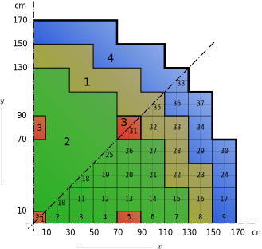{width="100%"}


```feenox
#                       BENCHMARK PROBLEM
#          
# Identification: 11-A2          Source Situation ID.11
# Date Submitted: June 1976      By: R. R. Lee (CE)
#                                    D. A. Menely (Ontario Hydro)
#                                    B. Micheelsen (Riso-Denmark)
#                                    D. R. Vondy (ORNL)
#                                    M. R. Wagner (KWU)
#                                    W. Werner (GRS-Munich)
#
# Date Accepted:  June 1977      By: H. L. Dodds, Jr. (U. of Tenn.)
#                                    M. V. Gregory (SRL)
#
# Descriptive Title: Two-dimensional LWR Problem,
#                    also 2D IAEA Benchmark Problem
#
# Reduction of Source Situation
#           1. Two-groupo diffusion theory
#           2. Two-dimensional (x,y)-geometry
#
PROBLEM neutron_diffusion 2D GROUPS 2
DEFAULT_ARGUMENT_VALUE 1 quarter   # either quarter or eigth
READ_MESH iaea-2dpwr-$1.msh

# define materials and cross sections according to the two-group constants
# each material corresponds to a physical entity in the geometry file
Bg2 = 0.8e-4  # axial geometric buckling in the z direction
MATERIAL fuel1 {
  D1=1.5    Sigma_a1=0.010+D1(x,y)*Bg2    Sigma_s1.2=0.02
  D2=0.4    Sigma_a2=0.080+D2(x,y)*Bg2    nuSigma_f2=0.135   }#eSigmaF_2 nuSigmaF_2(x,y) }

MATERIAL fuel2 {
  D1=1.5    Sigma_a1=0.010+D1(x,y)*Bg2    Sigma_s1.2=0.02
  D2=0.4    Sigma_a2=0.085+D2(x,y)*Bg2    nuSigma_f2=0.135   }#eSigmaF_2 nuSigmaF_2(x,y) }

MATERIAL fuel2rod {
  D1=1.5    Sigma_a1=0.010+D1(x,y)*Bg2    Sigma_s1.2=0.02
  D2=0.4    Sigma_a2=0.130+D2(x,y)*Bg2    nuSigma_f2=0.135   }#eSigmaF_2 nuSigmaF_2(x,y) }

MATERIAL reflector {
  D1=2.0    Sigma_a1=0.000+D1(x,y)*Bg2    Sigma_s1.2=0.04
  D2=0.3    Sigma_a2=0.010+D2(x,y)*Bg2 }

  
# define boundary conditions as requested by the problem
BC external vacuum=0.4692  # "external" is the name of the entity in the .geo
BC mirror   mirror         # the first mirror is the name, the second is the BC type

# # set the power setpoint equal to the volume of the core
# # (and set eSigmaF_2 = nuSigmaF_2 as above)
# power = 17700

SOLVE_PROBLEM   # solve!
PRINT %.5f "keff = " keff
WRITE_MESH iaea-2dpwr-$1.vtk phi1 phi2

```


```terminal
$ gmsh -2 iaea-2dpwr-quarter.geo
$ [...]
$ gmsh -2 iaea-2dpwr-eighth.geo
$ [...]
$ feenox iaea-2dpwr.fee quarter
keff =  1.02986
$ feenox iaea-2dpwr.fee eighth
$keff =  1.02975
$
```


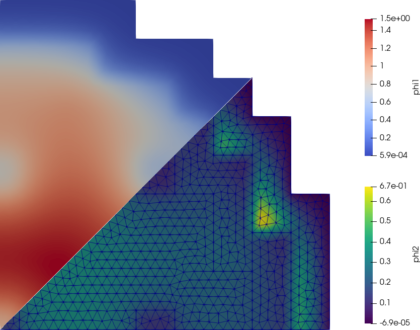{width=100%}

# Cube-spherical bare reactor

It is easy to compute the effective multiplication factor of a one-group
bare cubical reactor. Or a spherical reactor. And we know that for the
same mass, the $k_\text{eff}$ for the former is smaller than for the
latter.

::: {#fig:cube-and-sphere}
{width="49%"} {width="49%"}

One eight of two bare reactors
:::

But what happens "in the middle"? That is to say, how does
$k_\text{eff}$ changes when we morph the cube into a sphere? Enter Gmsh
& Feenox.

::: {#fig:cube-morph-sphere}
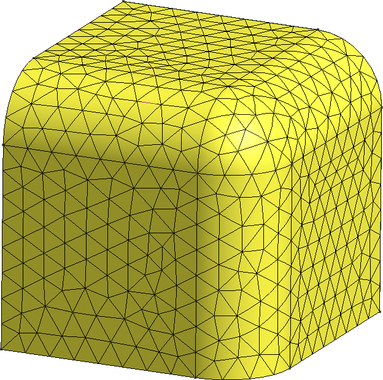{width="33%"}
{width="33%"}
{width="33%"}

Continuous morph between a cube and a sphere
:::

``` python
import os
import math
import gmsh

def create_mesh(vol, F):
  gmsh.initialize()
  gmsh.option.setNumber("General.Terminal", 0)  
  
  f = 0.01*F
  a = (vol / (1/8*4/3*math.pi*f**3 + 3*1/4*math.pi*f**2*(1-f) + 3*f*(1-f)**2 + (1-f)**3))**(1.0/3.0)
  
  internal = []
  gmsh.model.add("cubesphere")
  if (F < 1):
    # a cube
    gmsh.model.occ.addBox(0, 0, 0, a, a, a, 1)
    internal = [1,3,5]
    external = [2,4,6]

  elif (F > 99):
    # a sphere
    gmsh.model.occ.addSphere(0, 0, 0, a, 1, 0, math.pi/2, math.pi/2)
    internal = [2,3,4]
    external = [1]
    
  else:
    gmsh.model.occ.addBox(0, 0, 0, a, a, a, 1)
    gmsh.model.occ.fillet([1], [12, 7, 6], [f*a], True)
    internal = [1,4,6]
    external = [2,3,5,7,8,9,10]

  gmsh.model.occ.synchronize()

  gmsh.model.addPhysicalGroup(3, [1], 1)  
  gmsh.model.setPhysicalName(3, 1, "fuel")
    
  gmsh.model.addPhysicalGroup(2, internal, 2)  
  gmsh.model.setPhysicalName(2, 2, "internal")
  gmsh.model.addPhysicalGroup(2, external, 3)  
  gmsh.model.setPhysicalName(2, 3, "external")
  
  gmsh.model.occ.synchronize()
  
  gmsh.option.setNumber("Mesh.ElementOrder", 2)
  gmsh.option.setNumber("Mesh.Optimize", 1)
  gmsh.option.setNumber("Mesh.OptimizeNetgen", 1)
  gmsh.option.setNumber("Mesh.HighOrderOptimize", 1)
  
  gmsh.option.setNumber("Mesh.CharacteristicLengthMin", a/10);
  gmsh.option.setNumber("Mesh.CharacteristicLengthMax", a/10);
  
  gmsh.model.mesh.generate(3)
  gmsh.write("cubesphere-%g.msh"%(F))  

  gmsh.model.remove()
  #gmsh.fltk.run()
  
  gmsh.finalize()
  return


def main():
  
  vol0 = 100**3
  
  for F in range(0,101,5):   # mesh refinement level
    create_mesh(vol0, F)
    # TODO: FeenoX Python API!
    os.system("feenox cubesphere.fee %g"%(F))
    

if __name__ == "__main__":
  main()
```


```feenox
PROBLEM neutron_diffusion DIMENSIONS 3
READ_MESH cubesphere-$1.msh DIMENSIONS 3

# MATERIAL fuel
D1 = 1.03453E+00
Sigma_a1 = 5.59352E-03
nuSigma_f1 = 6.68462E-03
Sigma_s1.1 = 3.94389E-01

PHYSICAL_GROUP fuel DIM 3
BC internal    mirror
BC external    vacuum

SOLVE_PROBLEM

PRINT HEADER $1 keff 1e5*(keff-1)/keff fuel_volume
```


```terminal
$ python cubesphere.py | tee cubesphere.dat 
0       1.05626 5326.13 1e+06
5       1.05638 5337.54 999980
10      1.05675 5370.58 999980
15      1.05734 5423.19 999992
20      1.05812 5492.93 999995
25      1.05906 5576.95 999995
30      1.06013 5672.15 999996
35      1.06129 5775.31 999997
40      1.06251 5883.41 999998
45      1.06376 5993.39 999998
50      1.06499 6102.55 999998
55      1.06619 6208.37 999998
60      1.06733 6308.65 999998
65      1.06839 6401.41 999999
70      1.06935 6485.03 999998
75      1.07018 6557.96 999998
80      1.07088 6618.95 999998
85      1.07143 6666.98 999999
90      1.07183 6701.24 999999
95      1.07206 6721.33 999998
100     1.07213 6727.64 999999
$
```


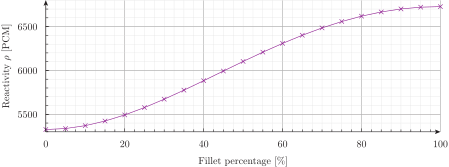{width=100%}

# Illustration of the XS dilution & smearing effect

> The best way to solve a problem is to avoid it in the first place.
>
> Richard M. Stallman

Let us consider a two-zone slab reactor:

a.  Zone $A$ has $k_\infty < 1$ and extends from $x=0$ to $x=a$.
b.  Zone $B$ has $k_\infty > 1$ and extends from $x=a$ to $x=b$.

-   The slab is solved with a one-group diffusion approach.
-   Both zones have uniform macroscopic cross sections.
-   Flux $\phi$ is equal to zero at both at $x=0$ and at $x=b$.

Under these conditions, the overall analytical effective multiplication
factor is $k_\text{eff}$ such that

$$
 \sqrt{D_A\cdot\left(\Sigma_{aA}- \frac{\nu\Sigma_{fA}}{k_\text{eff}}\right)} \cdot
  \tan\left[\sqrt{\frac{1}{D_B} \cdot\left( \frac{\nu\Sigma_{fB}}{k_\text{eff}}-\Sigma_{aB} \right) }\cdot (a-b) \right]
$$ $$
 = \sqrt{D_B\cdot\left(\frac{\nu\Sigma_{fB}}{k_\text{eff}}-\Sigma_{aB}\right)} \cdot
  \tanh\left[\sqrt{\frac{1}{D_A} \cdot\left( \Sigma_{aA}-\frac{\nu\Sigma_{fA}}{k_\text{eff}} \right)} \cdot b\right]
$$

We can then compare the numerical $k_\text{eff}$ computed using...

i.  a non-uniform grid with $n+1$ nodes such that there is a node
    exactly at $x=b$.
ii. an uniform grid (mimicking a neutronic code that cannot handle case
    i.) with $n$ uniformly-spaced elements. The element that contains
    point $x=b$ is assigned to a pseudo material $AB$ that linearly
    interpolates the macroscopic cross sections according to where in
    the element the point $x=b$ lies. That is to say, if the element
    width is 10 and $b=52$ then this $AB$ material will be 20% of
    material $A$ and 80% of material $B$.

The objective of this example is to show that case i. will monotonically
converge to the analytical multiplication factor as
$n \rightarrow \infty$ while case ii. will show a XS dilution and
smearing effect.

``` bash
#!/bin/bash

b="100"   # total width of the slab
if [ -z $1 ]; then
  n="10"    # number of cells
else
  n=$1
fi

rm -rf two-zone-slab-*-${n}.dat

# sweep a (width of first material) between 10 and 90
for a in $(seq 35 57); do
  cat << EOF > ab.geo
a = ${a};
b = ${b};
n = ${n};
lc = b/n;
EOF
  for m in uniform nonuniform; do
    gmsh -1 -v 0 two-zone-slab-${m}.geo
    feenox two-zone-slab.fee ${m} | tee -a two-zone-slab-${m}-${n}.dat
  done
done

```


```feenox

#  FeenoX of course can solve both cases, but there are many other neutronic tools out there that can handle ony structured grids.
PROBLEM neutron_diffusion 1D
DEFAULT_ARGUMENT_VALUE 1 nonuniform
READ_MESH two-zone-slab-$1.msh

# this ab.geo is created from the driving shell script
INCLUDE ab.geo

# pure material A from x=0 to x=a
D1_A = 0.5
Sigma_a1_A = 0.014
nuSigma_f1_A = 0.010

# pure material B from x=a to x=b
D1_B = 1.2
Sigma_a1_B = 0.010
nuSigma_f1_B = 0.014

# meta-material (only used for uniform grid to illustrate XS dilution)
a_left  = floor(a/lc)*lc;
xi = (a - a_left)/lc
Sigma_tr_A = 1/(3*D1_A)
Sigma_tr_B = 1/(3*D1_B)
Sigma_tr_AB = xi*Sigma_tr_A + (1-xi)*Sigma_tr_B
D1_AB = 1/(3*Sigma_tr_AB)
Sigma_a1_AB = xi * Sigma_a1_A + (1-xi)*Sigma_a1_B
nuSigma_f1_AB = xi * nuSigma_f1_A + (1-xi)*nuSigma_f1_B

BC left  null
BC right null

SOLVE_PROBLEM


# compute the analytical keff
F1(k) = sqrt(D1_A*(Sigma_a1_A-nuSigma_f1_A/k)) * tan(sqrt((1/D1_B)*(nuSigma_f1_B/k-Sigma_a1_B))*(a-b))
F2(k) = sqrt(D1_B*(nuSigma_f1_B/k-Sigma_a1_B)) * tanh(sqrt((1/D1_A)*(Sigma_a1_A-nuSigma_f1_A/k))*b)
k = root(F1(k)-F2(k), k, 1, 1.2)

# # and the fluxes (not needed here but for reference)
# B_A = sqrt((Sigma_a1_A - nuSigma_f1_A/k)/D1_A)
# fluxA(x) = sinh(B_A*x)
# 
# B_B = sqrt((nuSigma_f1_B/k - Sigma_a1_B)/D1_B)
# fluxB(x)= sinh(B_A*b)/sin(B_B*(a-b)) * sin(B_B*(a-x))
# 
# # normalization factor
# f = a/(integral(fluxA(x), x, 0, b) + integral(fluxB(x), x, b, a))
# flux(x) := f * if(x < b, fluxA(x), fluxB(x))

PRINT a keff k keff-k b n lc nodes

# PRINT_FUNCTION flux MIN 0 MAX a STEP a/1000 FILE_PATH two-zone-analytical.dat
# PRINT_FUNCTION phi1 phi1(x)-flux(x)         FILE_PATH two-zone-numerical.dat
```


```terminal
$ ./two-zone-slab.sh 10
[...]
$ ./two-zone-slab.sh 20
[...]
$ pyxplot two-zone-slab.ppl
$
```


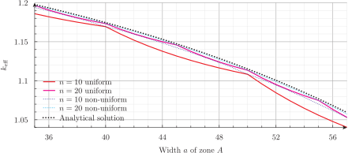{width=100%}

{width=100%}

> To illustrate the point of this example, think about the following 2D case:
>
> {width=50%}\ 
>
>  1. How would you solve something like this with a neutronic tool that only allowed structured grids?
>  2. Even if the two control rods were not slanted, as long as they were not inserted up to the same height there would be XS dilution & semaring when using a structured grid (even if the tool allows non-uniform cells in each direction).
>  3. Consider RMS’s quotation above: the best way to solve a problem (i.e. XS dilution) is to avoid it in the first place (i.e. to use a tool able to handle unstructured grids).

# Parallelepiped whose Young's modulus is a function of the temperature

The problem consists of finding the non-dimensional temperature $T$ and
displacements $u$, $v$ and $w$ distributions within a solid
parallelepiped of length $l$ whose base is a square of $h\times h$. The
solid is subject to heat fluxes and to a traction pressure at the same
time. The non-dimensional Young's modulus $E$ of the material depends on
the temperature $T$ in a know algebraically way, whilst both the Poisson
coefficient $\nu$ and the thermal conductivity $k$ are uniform and do
not depend on the spatial coordinates:

$$
\begin{aligned}
E(T) &= \frac{1000}{800-T} \\
\nu &= 0.3 \\
k &= 1 \\
\end{aligned}
$$

](parallelepiped.svg){#fig:parallelepiped}

References:

-   <http://www.code-aster.org/V2/doc/default/fr/man_v/v7/v7.03.100.pdf>
-   <https://www.seamplex.com/docs/SP-FI-17-BM-12F2-A.pdf>

This thermo-mechanical problem is solved in two stages. First, the heat
conduction equation is solved over a coarse first-order mesh to find the
non-dimensional temperature distribution. Then, a mechanical problem is
solved where $T(x,y,z)$ is read from the first mesh and interpolated
into a finer second-order mesh so to as evaluate the non-dimensional
Young's modulus as

$$E\Big(T(x,y,z)\Big) = \frac{1000}{800-T(x,y,z)}$$

Note that there are not thermal expansion effects (i.e. the thermal
expansion coefficient is $\alpha=0$). Yet, suprinsingly enough, the
problem has analytical solutions for both the temperature and the
displacement fields.

## Thermal problem

The following input solves the thermal problem over a coarse first-order
mesh, writes the resulting temperature distribution into
`parallelepiped-temperature.msh`, and prints the $L_2$ error of the
numerical result with respect to the analytical
solution $T(x,y,z) = 40 - 2x - 3y - 4z$.


```feenox
PROBLEM thermal 3D
READ_MESH parallelepiped-coarse.msh

k = 1     # unitary non-dimensional thermal conductivity

# boundary conditions
BC left    q=+2
BC right   q=-2
BC front   q=+3
BC back    q=-3
BC bottom  q=+4
BC top     q=-4
BC A       T=0

SOLVE_PROBLEM
WRITE_MESH parallelepiped-temperature.msh T

# compute the L-2 norm of the error in the displacement field
Te(x,y,z) = 40 - 2*x - 3*y - 4*z   # analytical solution, "e" means exact
INTEGRATE (T(x,y,z)-Te(x,y,z))^2 RESULT num
PHYSICAL_GROUP bulk DIM 3  # this is just to compute the volume
PRINT num/bulk_volume
```


```terminal
$ gmsh -3 parallelepiped.geo -order 1 -clscale 2 -o parallelepiped-coarse.msh
[...]
Info    : 117 nodes 567 elements
Info    : Writing 'parallelepiped-coarse.msh'...
Info    : Done writing 'parallelepiped-coarse.msh'
Info    : Stopped on Fri Dec 10 10:32:30 2021 (From start: Wall 0.0386516s, CPU 0.183052s)
$ feenox parallelepiped-thermal.fee 
6.18981e-12
$
```


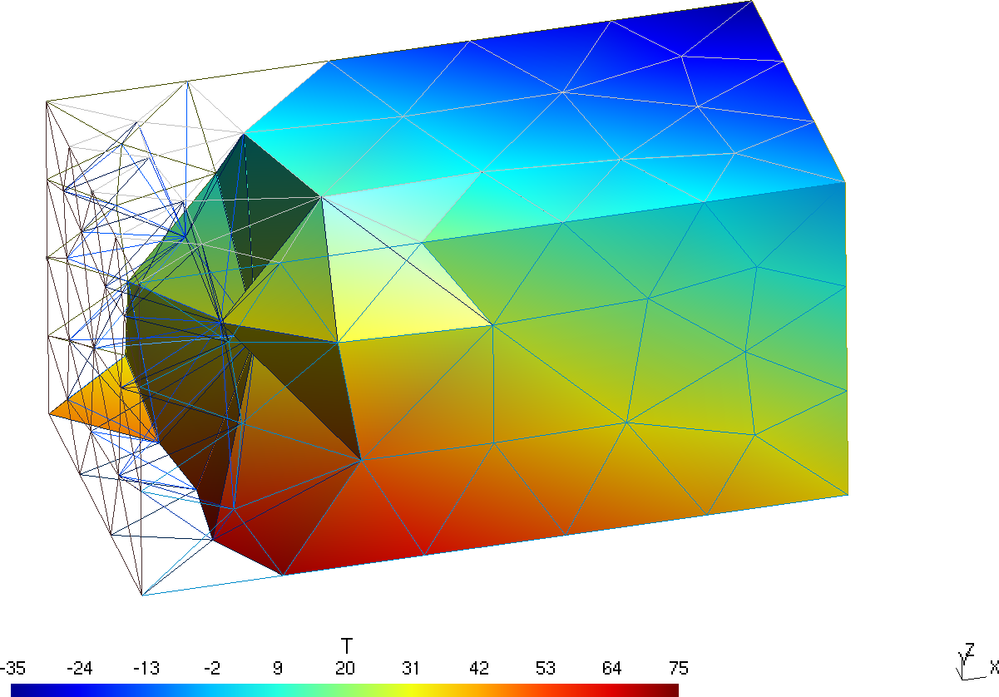

## Mechanical problem

Now this input file reads the scalar function `T` stored in the coarse
first-order mesh file `parallelepiped-temperature.msh` and uses it to
solve the mechanical problem in the finer second-order mesh
`parallelepiped.msh`. The numerical solution for the displacements over
the fine mesh is written in a VTK file (along with the temperature as
interpolated from the coarse mesh) and compared to the analytical
solution using the $L_2$ norm.


```feenox
PROBLEM mechanical 3D

# this is where we solve the mechanical problem
READ_MESH parallelepiped.msh MAIN   

# this is where we read the temperature from
READ_MESH parallelepiped-temperature.msh DIM 3 READ_FUNCTION T

# mechanical properties
E(x,y,z) = 1000/(800-T(x,y,z))   # young's modulus
nu = 0.3                         # poisson's ratio

# boundary conditions
BC O fixed
BC B u=0 w=0
BC C u=0

# here "load" is a fantasy name applied to both "left" and "right"
BC load tension=1 PHYSICAL_GROUP left PHYSICAL_GROUP right

SOLVE_PROBLEM
WRITE_MESH parallelepiped-mechanical.vtk T VECTOR u v w

# analytical solutions
h = 10
A = 0.002
B = 0.003
C = 0.004
D = 0.76

# the "e" means exact
ue(x,y,z) := A/2*(x^2 + nu*(y^2+z^2)) + B*x*y + C*x*z + D*x - nu*A*h/4*(y+z)
ve(x,y,z) := -nu*(A*x*y + B/2*(y^2-z^2+x^2/nu) + C*y*z + D*y -A*h/4*x - C*h/4*z)
we(x,y,z) := -nu*(A*x*z + B*y*z + C/2*(z^2-y^2+x^2/nu) + D*z + C*h/4*y - A*h/4*x)

# compute the L-2 norm of the error in the displacement field
INTEGRATE (u(x,y,z)-ue(x,y,z))^2+(v(x,y,z)-ve(x,y,z))^2+(w(x,y,z)-we(x,y,z))^2 RESULT num MESH parallelepiped.msh
INTEGRATE 1 RESULT den MESH parallelepiped.msh
PRINT num/den
```


```terminal
$ gmsh -3 parallelepiped.geo -order 2
[...]
Info    : 2564 nodes 2162 elements
Info    : Writing 'parallelepiped.msh'...
Info    : Done writing 'parallelepiped.msh'
Info    : Stopped on Fri Dec 10 10:39:27 2021 (From start: Wall 0.165707s, CPU 0.258751s)
$ feenox parallelepiped-mechanical.fee
0.000345839
$
```


# Non-dimensional transient heat conduction on a cylinder

Let us solve a dimensionless transient problem over a cylinder.
Conductivity and heat capacity are unity. Initial condition is a linear
temperature profile along the $x$ axis:

$$
T(x,y,z,0) = x
$$

The base of the cylinder has a prescribed time and space-dependent
temperature

$$
T(0,y,z,t) = \sin( 2\pi \cdot t) \cdot \sin( 2\pi \cdot y)
$$

The other faces have a convection conditions with (non-dimensional) heat
transfer coefficient $h=0.1$ and $T_\text{ref} = 1$.

{width="100%"}


```feenox
PROBLEM thermal 3D
READ_MESH cylinder.msh

end_time = 2  # final time [ non-dimensional units ]
# the time step is automatically computed

# initial condition (if not given, stead-state is computed)
T_0(x,y,z) = x

# dimensionless uniform and constant material properties
k = 1
kappa = 1

# BCs 
BC hot   T=sin(2*pi*t)*sin(2*pi*y)
BC cool  h=0.1  Tref=1

SOLVE_PROBLEM

# print the temperature at the center of the base vs time
PRINT %e t T(0,0,0) T(0.5,0,0) T(1,0,0)

WRITE_MESH temp-cylinder.msh T

IF done
 PRINT "\# open temp-anim-cylinder.geo in Gmsh to create a quick rough video"
 PRINT "\# run  temp-anim-cylinder.py  to get a nicer and smoother video"
ENDIF
```


```terminal
$ gmsh -3 cylinder.geo
[...]
Info    : Done optimizing mesh (Wall 0.624941s, CPU 0.624932s)
Info    : 1986 nodes 10705 elements
Info    : Writing 'cylinder.msh'...
Info    : Done writing 'cylinder.msh'
Info    : Stopped on Fri Dec 24 10:35:32 2021 (From start: Wall 0.800542s, CPU 0.896698s)
$ feenox temp-cylinder-tran.fee 
0.000000e+00    0.000000e+00    5.000000e-01    1.000000e+00
1.451938e-04    4.406425e-07    5.000094e-01    9.960851e-01
3.016938e-04    9.155974e-07    5.000171e-01    9.921274e-01
5.566768e-04    1.689432e-06    5.000251e-01    9.862244e-01
8.565589e-04    2.599523e-06    5.000292e-01    9.800113e-01
1.245867e-03    3.780993e-06    5.000280e-01    9.728705e-01
1.780756e-03    5.404230e-06    5.000176e-01    9.643259e-01
2.492280e-03    7.563410e-06    4.999932e-01    9.545723e-01
3.428621e-03    1.040457e-05    4.999538e-01    9.436480e-01
[...]
1.978669e+00    -6.454358e-05   1.500891e-01    2.286112e-01
1.989334e+00    -3.234439e-05   1.500723e-01    2.285660e-01
2.000000e+00    1.001730e-14    1.500572e-01    2.285223e-01
# open temp-anim-cylinder.geo in Gmsh to create a quick rough video
# run  temp-anim-cylinder.py  to get a nicer and smoother video
$ python3 temp-anim-cylinder.py
Info    : Reading 'temp-cylinder.msh'...
Info    : 1986 nodes
Info    : 10612 elements
Info    : Done reading 'temp-cylinder.msh'
0 1 0.0
0.01 12 0.8208905327853042
0.02 15 0.8187351216040447
0.03 17 0.7902629708599855
[...]
Info    : Writing 'temp-cylinder-smooth-198.png'...
Info    : Done writing 'temp-cylinder-smooth-198.png'
199
Info    : Writing 'temp-cylinder-smooth-199.png'...
Info    : Done writing 'temp-cylinder-smooth-199.png'
all frames dumped, now run
ffmpeg -framerate 20 -f image2 -i temp-cylinder-smooth-%03d.png temp-cylinder-smooth.mp4
to get a video
$ ffmpeg -y -f image2 -i temp-cylinder-smooth-%03d.png  -framerate 20 -pix_fmt yuv420p -c:v libx264 -filter:v crop='floor(in_w/2)*2:floor(in_h/2)*2'  temp-cylinder-smooth.mp4
[...]
$
```


:::: {.not-in-format .latex .texi}
{width=100%}
::::

# Five natural modes of a cantilevered wire

Back in [College](https://www.ib.edu.ar/), we had this subject
Experimental Physics 101. I had to measure the natural modes of two
cantilevered wires and determine the Young modulus of of those
measurements. The [report is
here](https://www.seamplex.com/fino/doc/alambre.pdf). Two comments: 1.
It is in Spanish 2. There was a systematic error and a factor of two
sneaked in into the measured values

Here is a finite-element version of the experimental setup with a
comparison to then theoretical values written directly as Markdown
tables. The material (either aluminum or copper) and the mesh type
(either tet or hex) and be chosen at runtime through command line
arguments.


```feenox
#
DEFAULT_ARGUMENT_VALUE 1 hex       # mesh, either hex or unstruct
DEFAULT_ARGUMENT_VALUE 2 copper    # material, either copper or aluminum

l = 0.5*303e-3   # cantilever wire length [ m ]
d = 1.948e-3     # wire diameter [ m ]


# material properties for copper
m_copper = 0.5*8.02e-3  # total mass (half the measured because of the experimental disposition) [ kg ]
E_copper = 2*66.2e9     # [ Pa ] Young modulus (twice because the factor-two error)

# material properties for aluminum
m_aluminum = 0.5*2.67e-3
E_aluminum = 2*40.2e9

# problem’s properties
E = E_$2                     # [ MPa ]
rho = m_$2/(pi*(0.5*d)^2*l)  # [ kg / m^3 ] density = mass (measured) / volume 
nu = 0                       # Poisson’s ratio (does not appear in Euler-Bernoulli)

# analytical solution
VECTOR kl[5]
VECTOR f_euler[5]

# first compute the first five roots ok cosh(kl)*cos(kl)+1 
kl[i] = root(cosh(t)*cos(t)+1, t, 3*i-2,3*i+1)

# then compute the frequencies according to Euler-Bernoulli
# note that we need to use SI inside the square root
A = pi * (d/2)^2
I = pi/4 * (d/2)^4
f_euler[i] = 1/(2*pi) * kl(i)^2 * sqrt((E * I)/(rho * A * l^4))

# now compute the modes numerically with FEM
# note that each mode is duplicated as it is degenerated
READ_MESH wire-$1.msh DIMENSIONS 3
PROBLEM modal MODES 10
BC fixed fixed
SOLVE_PROBLEM

# github-formatted markdown table
# compare the frequencies
PRINT "  \$n\$   |    FEM [Hz]   |   Euler [Hz]  |  Relative difference [%]"
PRINT   ":------:|:-------------:|:-------------:|:--------------:"
PRINT_VECTOR SEP "\t|\t" i  %.4g f(2*i-1) f_euler   %.2f 100*(f_euler(i)-f(2*i-1))/f_euler(i)
PRINT
PRINT ": $2 wire over $1 mesh"

# commonmark table
PRINT
PRINT "  \$n\$   |          \$L\$          |       \$\\Gamma\$        |      \$\\mu\$    |       \$M\$"
PRINT   ":------:+:---------------------:+:---------------------:+:-------------:+:--------------:"
PRINT_VECTOR SEP "\t|\t" i "%+.1e" L Gamma "%.4f" mu Mu  
PRINT
PRINT ": $2 wire over $1 mesh, participation and excitation factors \$L\$ and \$\\Gamma\$, effective per-mode and cummulative mass fractions \$\\mu\$ and \$M\$"

# write the modes into a vtk file
WRITE_MESH wire-$1-$2.vtk \
 VECTOR u1 v1 w1 VECTOR u2 v2 w2 VECTOR u3 v3 w3 \
 VECTOR u4 v4 w4 VECTOR u5 v5 w5 VECTOR u6 v6 w6 \
 VECTOR u7 v7 w7 VECTOR u8 v8 w8 VECTOR u9 v9 w9 VECTOR u10 v10 w10

# and into a msh file
WRITE_MESH wire-$1-$2.msh {
 u1 v1 w1
 u2 v2 w2
 u3 v3 w3
 u4 v4 w4
 u5 v5 w5
 u6 v6 w6
 u7 v7 w7
 u8 v8 w8
 u9 v9 w9
 u10 v10 w10
}
```


```terminal
$ gmsh -3 wire-hex.geo
[...]
Info    : Done meshing order 2 (Wall 0.0169025s, CPU 0.016804s)
Info    : 8398 nodes 4676 elements
Info    : Writing 'wire-hex.msh'...
Info    : Done writing 'wire-hex.msh'
Info    : Stopped on Fri Dec 24 17:07:19 2021 (From start: Wall 0.0464517s, CPU 0.133498s)
$ gmsh -3 wire-tet.geo
[...]
Info    : Done optimizing mesh (Wall 0.0229018s, CPU 0.022892s)
Info    : 16579 nodes 13610 elements
Info    : Writing 'wire-tet.msh'...
Info    : Done writing 'wire-tet.msh'
Info    : Stopped on Fri Dec 24 17:07:59 2021 (From start: Wall 2.5798s, CPU 2.64745s)
$ feenox wire.fee 
  $n$   |    FEM [Hz]   |   Euler [Hz]  |  Relative difference [%]
:------:|:-------------:|:-------------:|:--------------:
1       |       45.84   |       45.84   |       0.02
2       |       287.1   |       287.3   |       0.06
3       |       803.4   |       804.5   |       0.13
4       |       1573    |       1576    |       0.24
5       |       2596    |       2606    |       0.38

: copper wire over hex mesh

  $n$   |          $L$          |       $\Gamma$        |      $\mu$    |       $M$
:------:+:---------------------:+:---------------------:+:-------------:+:--------------:
1       |       +1.3e-03        |       +4.2e-01        |       0.1371  |       0.1371
2       |       -1.8e-03        |       -5.9e-01        |       0.2716  |       0.4087
3       |       +9.1e-05        |       +1.7e-02        |       0.0004  |       0.4091
4       |       -1.7e-03        |       -3.0e-01        |       0.1252  |       0.5343
5       |       -3.3e-05        |       -5.9e-03        |       0.0000  |       0.5343
6       |       -9.9e-04        |       -1.8e-01        |       0.0431  |       0.5775
7       |       +7.3e-04        |       +1.2e-01        |       0.0221  |       0.5995
8       |       +4.5e-06        |       +7.5e-04        |       0.0000  |       0.5995
9       |       +5.4e-04        |       +9.9e-02        |       0.0134  |       0.6129
10      |       +2.7e-05        |       +4.9e-03        |       0.0000  |       0.6129

: copper wire over hex mesh, participation and excitation factors $L$ and $\Gamma$, effective per-mode and cummulative mass fractions $\mu$ and $M$
$ feenox wire.fee hex copper   | pandoc -o wire-hex-copper.md
$ feenox wire.fee tet copper   | pandoc -o wire-tet-copper.md
$ feenox wire.fee hex aluminum | pandoc -o wire-hex-aluminum.md
$ feenox wire.fee tet aluminum | pandoc -o wire-tet-aluminum.md
```


```include
wire-hex-copper.md
wire-tet-copper.md
wire-hex-aluminum.md
wire-tet-aluminum.md
```

# On the evaluation of thermal expansion coefficients

When solving thermal-mechanical problems it is customary to use thermal
expansion coefficients in order to take into account the mechanical
strains induced by changes in the material temperature with respect to a
reference temperature where the deformation is identically zero. These
coefficients $\alpha$ are defined as the partial derivative of the
strain $\epsilon$ with respect to temperature $T$ such that differential
relationships like

$$
d\epsilon = \frac{\partial \epsilon}{\partial T} \, dT = \alpha \cdot dT
$$

hold. This derivative $\alpha$ is called the *instantaneous* thermal
expansion coefficient. For finite temperature increments, one would like
to be able to write

$$
\Delta \epsilon = \alpha \cdot \Delta T
$$

But if the strain is not linear with respect to the temperature---which
is the most common case---then $\alpha$ depends on $T$. Therefore, when
dealing with finite temperature increments $\Delta T = T-T_0$ where the
thermal expansion coefficient $\alpha(T)$ depends on the temperature
itself then *mean* values for the thermal expansion ought to be used:

$$
\Delta \epsilon = \int_{\epsilon_0}^{\epsilon} d\epsilon^{\prime} 
= \int_{T_0}^{T} \frac{\partial \epsilon}{\partial T^\prime} \, dT^\prime
= \int_{T_0}^{T} \alpha(T^\prime) \, dT^\prime
$$

We can multiply and divide by $\Delta T$ to obtain

$$
\int_{T_0}^{T} \alpha(T^\prime) \, dT^\prime \cdot \frac{\Delta T}{\Delta T}
= \bar{\alpha}(T) \cdot \Delta T
$$

where the mean expansion coefficient for the temperature range $[T_0,T]$
is

$$
\bar{\alpha}(T) = \frac{\displaystyle \int_{T_0}^{T} \alpha(T^\prime) \, dT^\prime}{T-T_0}
$$

This is of course the classical calculus result of the mean value of a
continuous one-dimensional function in a certain range.

Let $\epsilon(T)$ be the linear thermal expansion of a given material in
a certain direction when heating a piece of such material from an
initial temperature $T_0$ up to $T$ so that $\epsilon(T_0)=0$.

.](asme-expansion-table.png){#fig:table-asme-expansion}

From our previous analysis, we can see that in
@fig:table-asme-expansion:

$$
\begin{aligned}
A(T) &= \alpha(T)       = \frac{\partial \epsilon}{\partial T} \\
B(T) &= \bar{\alpha}(T) = \frac{\epsilon(T)}{T-T_0} = \frac{\displaystyle \int_{T_0}^{T} \alpha(T^\prime) \, dT^\prime}{T - T_0} \\
C(T) &= \epsilon(T)     = \int_{T_0}^T \alpha(T^\prime) \, dT^\prime
\end{aligned}
$$

Therefore,

i.  $A(T)$ can be computed out of $C(T)$
ii. $B(T)$ can be computed either out of $A(T)$ or $C(T)$
iii. $C(T)$ can be computed out of $A(T)$


```feenox
# just in case we wanted to interpolate with another method (linear, splines, etc.)
DEFAULT_ARGUMENT_VALUE 1 steffen

# read columns from data file and interpolate
# A is the instantaenous coefficient of thermal expansion x 10^-6 (mm/mm/ºC)
FUNCTION A(T) FILE asme-expansion-table.dat COLUMNS 1 2 INTERPOLATION $1
# B is the mean coefficient of thermal expansion x 10^-6 (mm/mm/ºC) in going
# from 20ºC to indicated temperature
FUNCTION B(T) FILE asme-expansion-table.dat COLUMNS 1 3 INTERPOLATION $1
# C is the linear thermal expansion (mm/m) in going from 20ºC
# to indicated temperature
FUNCTION C(T) FILE asme-expansion-table.dat COLUMNS 1 4 INTERPOLATION $1

VAR T'                   # dummy variable for integration
T0 = 20                  # reference temperature
T_min = vecmin(vec_A_T)  # smallest argument of function A(T)
T_max = vecmax(vec_A_T)  # largest argument of function A(T)

# compute one column from another one
A_fromC(T) := 1e3*derivative(C(T'), T', T)

B_fromA(T) := integral(A(T'), T', T0, T)/(T-T0)
B_fromC(T) := 1e3*C(T)/(T-T0)   # C is in mm/m, hence the 1e3

C_fromA(T) := 1e-3*integral(A(T'), T', T0, T)

# write interpolated results
PRINT_FUNCTION A A_fromC   B B_fromA B_fromC   C C_fromA MIN T_min+1 MAX T_max-1 STEP 1
```


```terminal
$ cat asme-expansion-table.dat 
# temp  A       B        C
20      21.7    21.7     0
50      23.3    22.6     0.7
75      23.9    23.1     1.3
100     24.3    23.4     1.9
125     24.7    23.7     2.5
150     25.2    23.9     3.1
175     25.7    24.2     3.7
200     26.4    24.4     4.4
225     27.0    24.7     5.1
250     27.5    25.0     5.7
275     27.7    25.2     6.4
300     27.6    25.5     7.1
325     27.1    25.6     7.8
$ feenox asme-expansion.fee > asme-expansion-interpolation.dat
$ pyxplot asme-expansion.ppl
$
```


{width=100%}
{width=100%}
{width=100%}

The conclusion (see
[this](https://www.linkedin.com/pulse/accuracy-thermal-expansion-properties-asme-bpv-code-angus-ramsay/),
[this](https://www.seamplex.com/docs/SP-WA-17-TN-F38B-A.pdf) and
[this](https://www.linkedin.com/pulse/ansys-potential-issue-thermal-expansion-calculations-angus-ramsay/) reports)
is that values rounded to only one decimal value as presented in the ASME code
section II subsection D tables are not enough to satisfy the mathematical relationships
between the physical magnitudes related to thermal expansion properties of the materials listed.
Therefore, care has to be taken as which of the three columns is chosen when using the data
for actual thermo-mechanical numerical computations.
As an exercise, the reader is encouraged to try different interpolation algorithms to
see how the results change. _Spoiler alert_: they are also highly sensible to the interpolation method used
to “fill in” the gaps between the table values.

## Orthotropic free expansion of a cube

To illustrate the point of the previous discussion, let us solve the
thermal expansion of an unrestrained unitary cube
$[0,1~\text{mm}]\times[0,1~\text{mm}]\times[0,1~\text{mm}]$ subject to a
linear radially-symmetric temperature field $$
T(x,y,z) = 30 \text{ºC} + 150 \frac{\text{ºC}}{\text{mm}} \sqrt{x^2+y^2+z^2}
$$

with a mean thermal expansion coefficient for each of the three
directions $x$, $y$ and $z$ computed from each of the three columns of
the ASME table TE-2, respectively. If the data was consistent, the
displacement at any point with the same coordinates $x=y=z$ would be
exactly equal.


```feenox
DEFAULT_ARGUMENT_VALUE 1 steffen
DEFAULT_ARGUMENT_VALUE 2 hex

PROBLEM mechanical
READ_MESH cube-hex.msh

# aluminum-like linear isotropic material properties
E = 69e3
nu = 0.28

# free expansion
BC left   u=0
BC front  v=0
BC bottom w=0

# reference temperature is 20ºC
T0 = 20
# spatial temperature distribution symmetric wrt x,y & z
T(x,y,z) = 30+150*sqrt(x^2+y^2+z^2)

# read ASME data
FUNCTION A(T') FILE asme-expansion-table.dat COLUMNS 1 2 INTERPOLATION $1
FUNCTION B(T') FILE asme-expansion-table.dat COLUMNS 1 3 INTERPOLATION $1
FUNCTION C(T') FILE asme-expansion-table.dat COLUMNS 1 4 INTERPOLATION $1

# remember that the thermal expansion coefficients have to be
#  1. the mean value between T0 and T
#  2. functions of space, so temperature has to be written as T(x,y,z)

# in the x direction, we use column B directly
alpha_x(x,y,z) = 1e-6*B(T(x,y,z))

# in the y direction, we convert column A to mean
alpha_y(x,y,z) = 1e-6*integral(A(T'), T', T0, T(x,y,z))/(T(x,y,z)-T0)

# in the z direction, we convert column C to mean
alpha_z(x,y,z) = 1e-3*C(T(x,y,z))/(T(x,y,z)-T0)

SOLVE_PROBLEM

WRITE_MESH cube-orthotropic-expansion-$1-$2.vtk T VECTOR u v w
PRINT %.3e "displacement in x at (1,1,1) = " u(1,1,1)
PRINT %.3e "displacement in y at (1,1,1) = " v(1,1,1)
PRINT %.3e "displacement in z at (1,1,1) = " w(1,1,1)
```


```terminal
$ gmsh -3 cube-hex.geo
[...]
$ gmsh -3 cube-tet.geo
[...]
$ feenox cube-orthotropic-expansion.fee 
displacement in x at (1,1,1) =  4.451e-03
displacement in y at (1,1,1) =  4.449e-03
displacement in z at (1,1,1) =  4.437e-03
$ feenox cube-orthotropic-expansion.fee linear tet
displacement in x at (1,1,1) =  4.451e-03
displacement in y at (1,1,1) =  4.447e-03
displacement in z at (1,1,1) =  4.438e-03
$ feenox cube-orthotropic-expansion.fee akima hex
displacement in x at (1,1,1) =  4.451e-03
displacement in y at (1,1,1) =  4.451e-03
displacement in z at (1,1,1) =  4.437e-03
$ feenox cube-orthotropic-expansion.fee splines tet
displacement in x at (1,1,1) =  4.451e-03
displacement in y at (1,1,1) =  4.450e-03
displacement in z at (1,1,1) =  4.438e-03
$ 
```


{width=100%}

Differences cannot be seen graphically, but they are there as the terminal mimic illustrates.
Yet, they are not as large nor as sensible to meshing and interpolation settings as one would
have expected after seeing the plots from the previous section. 

# Thermo-elastic expansion of finite cylinders

Let us solve the following problem introduced by J. Veeder in his
[technical report AECL-2660 from
1967](https://inis.iaea.org/search/search.aspx?orig_q=RN:40103718).

> 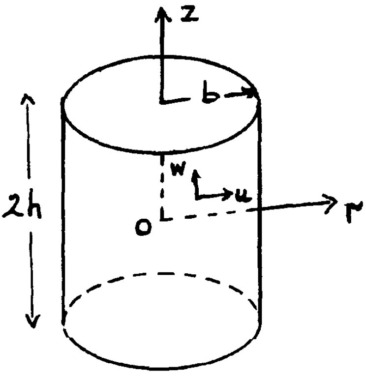{width="50%"}
>
> Consider a finite solid cylinder (see insert) of radius $b$ and
> length $2h$, with the origin of coordinates at the centre. It may be
> shown that the temperature distribution in a cylindrical fuel pellet
> operating in a reactor is given approximately by
>
> $$T(r) = T_0 + T_1 \cdot \left[ 1 - \left(\frac{r}{b} \right)^2 \right]$$
>
> where $T_0$ is the pellet surface temperature and $T_1$ is the
> temperature difference between the centre and surface. The thermal
> expansion is thus seen to be the sum of two terms, the first of which
> produces uniform expansion (zero stress) at constant
> temperature $T_0$, and is therefore computationally trivial. Tho
> second term introduces non-uniform body forces which distort the
> pellet from its original cylindrical shape.

The problem is axisymmetric on the azimutal angle and axially-symmetric
along the mid-plane. The FeenoX input uses the `tangential` and `radial`
boundary conditions applied to the base of the upper half of a 3D
cylinder. The geometry is meshed using 27-noded hexahedra.

Two one-dimensional profiles for the non-dimensional range $[0:1]$ at
the external surfaces are written into an ASCII file ready to be
plotted:

1.  axial dependency of the displacement $v(z') = v(0,v,z'h)$ in the $y$
    direction at fixed $x=0$ and $y=b$, and
2.  radial dependency of the displacement $w(r') = w(0,r'b, h)$ in
    the $z$ direction at fixed $x=0$ and $z=h$

These two profiles are compared to the power expansion series given in
the original report from 1967. Note that the authors expect a 5%
difference between the reference solution and the real one.

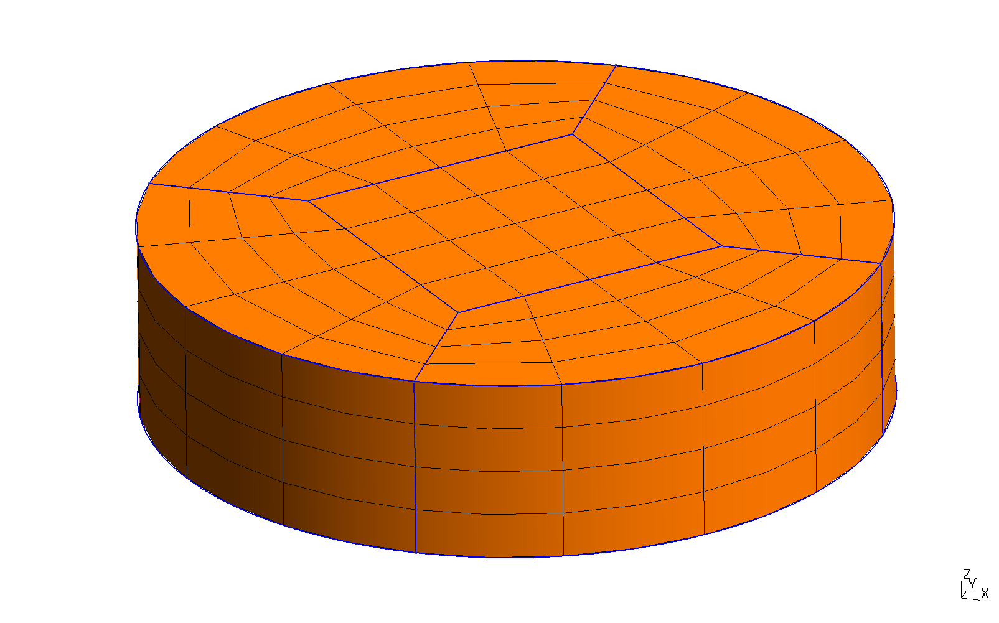


```feenox
PROBLEM mechanical
READ_MESH veeder.msh

b = 1     # cylinder radius
h = 0.5   # cylinder height 

E = 1         # young modulus (does not matter for the displacement, only for stresses)
nu = 1/3      # poisson ratio
alpha = 1e-5  # temperature expansion coefficient

# temperature distribution as in the original paper
T1 = 1        # maximum temperature
T0 = 0        # reference temperature (where expansion is zero)
T(x,y,z) := T0 + T1*(1-(x^2+y^2)/(b^2))


# boundary conditions (note that the cylinder can still expand on the x-y plane)
BC inf      tangential radial

# solve!
SOLVE_PROBLEM

# write vtk output
WRITE_MESH veeder.vtk    T sigma dudx dudy dudz dvdx dvdy dvdz dwdx dwdy dwdz  sigma1 sigma2 sigma3  VECTOR u v w

# non-dimensional numerical displacement profiles 
v_num(z') = v(0, b, z'*h)/(alpha*T1*b)
w_num(r') = w(0, r'*b, h)/(alpha*T1*b)

########
# reference solution
# coefficients of displacement functions for h/b = 0.5
a00 =  0.66056
a01 = -0.44037
a10 =  0.23356
a02 = -0.06945
a11 = -0.10417
a20 =  0.00288

b00 = -0.01773
b01 = -0.46713
b10 = -0.04618
b02 = +0.10417
b11 = -0.01152
b20 = -0.00086
 
# coefficients of displacement functions for h/b = 1.0
# a00 =  0.73197
# a01 = -0.48798
# a10 =  0.45680
# a02 = -0.01140
# a11 = -0.06841
# a20 =  0.13611
# 
# b00 =  0.26941
# b01 = -0.45680
# b10 = -0.25670
# b02 =  0.03420
# b11 = -0.27222
# b20 = -0.08167


R(r') = r'^2 - 1
Z(z') = z'^2 - 1

v_ref(r',z') = r' * (a00 + a01*R(r') + a10*Z(z') + a02* R(r')^2 + a11 * R(r')*Z(z') + a20 * Z(z')^2)
w_ref(r',z') = z' * (b00 + b01*R(r') + b10*Z(z') + b02* R(r')^2 + b11 * R(r')*Z(z') + b20 * Z(z')^2)


PRINT_FUNCTION FILE veeder_v.dat  v_num v_ref(1,z') MIN 0 MAX 1 NSTEPS 50 HEADER
PRINT_FUNCTION FILE veeder_w.dat  w_num w_ref(r',1) MIN 0 MAX 1 NSTEPS 50 HEADER
```


```terminal
$ gmsh -3 veeder.geo
[...]
$ feenox veeder.fee
$ pyxplot veeder.ppl 
$
```


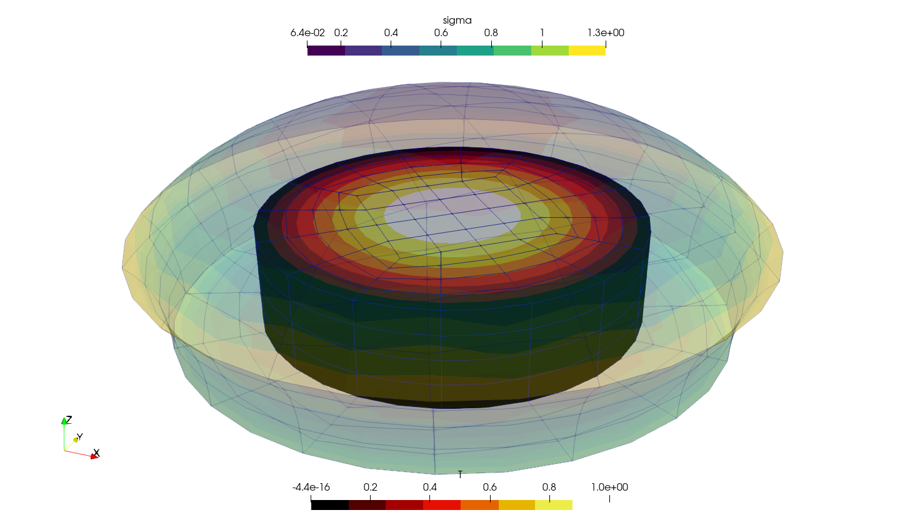{width_latex=75% width_html=100%}

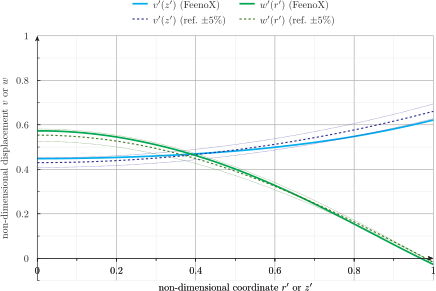{width=100%}

# Temperature-dependent material properties

Let us solve a plane-strain square fixed on the left, with an horizontal
traction on the right and free on the other two sides. The Young modulus
depends on the temperature $E(T)$ as given in the ASME II part D tables
of material properties, interpolated using a [monotonic cubic
scheme](https://en.wikipedia.org/wiki/Monotone_cubic_interpolation).

Actually, this example shows three cases:

1.  Uniform temperature indentically equal to 200ºC

2.  Linear temperature profile on the vertical direction given by an
    algebraic expression

    $$
    T(x,y) = 200 + 350\cdot y
    $$

3.  The same linear profile but read from the output of a thermal
    conduction problem over a non-conformal mesh using this FeenoX
    input:

    ``` feenox
    PROBLEM thermal 2D
    READ_MESH square-centered-unstruct.msh # [-1:+1]x[-1:+1]

    BC bottom    T=-150
    BC top       T=+550
    k = 1

    SOLVE_PROBLEM
    WRITE_MESH thermal-square-temperature.msh T
    ```

Which of the three cases is executed is given by the first argument
provided in the command line after the main input file. Depending on
this argument, which is expanded as `$1` in the main input file, either
one of three secondary input files are included:

1.  `uniform`

    ``` feenox
    # uniform
    T(x,y) := 200
    ```

2.  `linear`

    ``` feenox
    # algebraic expression
    T(x,y) := 200 + 350*y
    ```

3.  `mesh`

    ``` feenox
    # read the temperature from a previous result
    READ_MESH thermal-square-temperature.msh DIM 2 READ_FUNCTION T
    ```


```feenox
# 2d plane strain mechanical problem over the [-1:+1]x[-1:+1] square
PROBLEM mechanical plane_strain
READ_MESH square-centered.msh 

# fixed at left, uniform traction in the x direction at right
BC left    fixed
BC right   tx=50

# ASME II Part D pag. 785 Carbon steels with C<=0.30%
FUNCTION E_carbon(temp) INTERPOLATION steffen DATA {
-200  216
-125  212
-75   209
25    202
100   198
150   195
200   192
250   189
300   185
350   179
400   171
450   162
500   151
550   137
}

# read the temperature according to the run-time argument $1
INCLUDE mechanical-square-temperature-$1.fee

# Young modulus is the function above evaluated at the local temperature
E(x,y) := E_carbon(T(x,y))

# uniform Poisson's ratio
nu = 0.3

SOLVE_PROBLEM
PRINT u(1,1) v(1,1)
WRITE_MESH mechanical-square-temperature-$1.vtk  E T VECTOR u v 0   
```


```terminal
$ gmsh -2 square-centered.geo
[...]
Info    : Done meshing 2D (Wall 0.00117144s, CPU 0.00373s)
Info    : 1089 nodes 1156 elements
Info    : Writing 'square-centered.msh'...
Info    : Done writing 'square-centered.msh'
Info    : Stopped on Thu Aug  4 09:40:09 2022 (From start: Wall 0.00818854s, CPU 0.031239s)
$ feenox mechanical-square-temperature.fee uniform
0.465632        -0.105128
$ feenox mechanical-square-temperature.fee linear
0.589859        -0.216061
$ gmsh -2 square-centered-unstruct.geo 
[...]
Info    : Done meshing 2D (Wall 0.0274833s, CPU 0.061072s)
Info    : 65 nodes 132 elements
Info    : Writing 'square-centered-unstruct.msh'...
Info    : Done writing 'square-centered-unstruct.msh'
Info    : Stopped on Sun Aug  7 18:33:41 2022 (From start: Wall 0.0401667s, CPU 0.107659s)
$ feenox thermal-square.fee
$ feenox mechanical-square-temperature.fee mesh
0.589859        -0.216061
$ 
```


{width=100%}

{width=100%}

