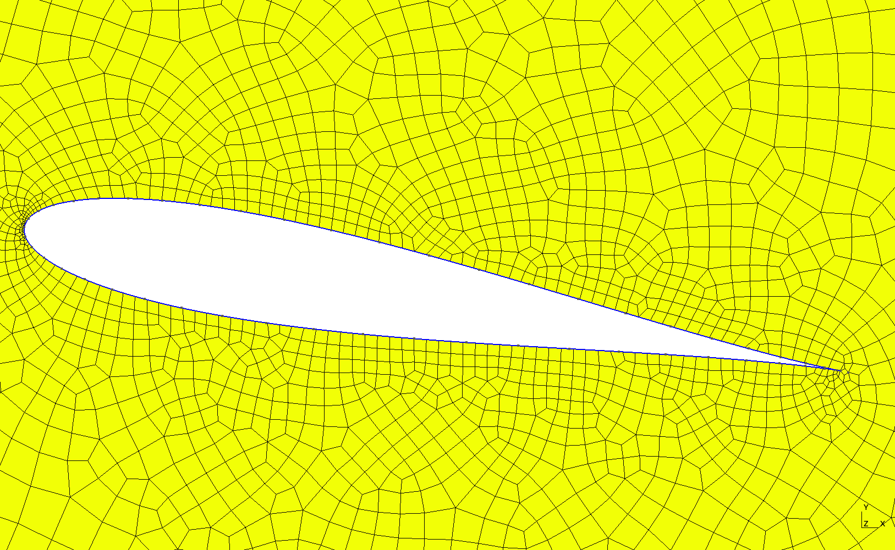
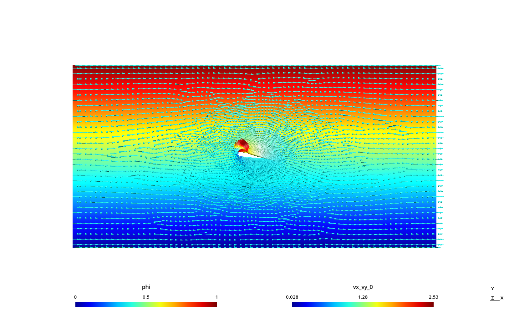

---
title: Laplace’s equation
titleblock: |
 Laplace’s equation
 ==================
lang: en-US
toc: true 
...
# How to solve a maze without AI

> See these LinkedIn posts to see some comments and discussions:
>
> -   <https://www.linkedin.com/feed/update/urn:li:activity:6831291311832760320/>
> -   <https://www.linkedin.com/feed/update/urn:li:activity:6973982270852325376/>
>
> Other people's maze-related posts:
>
> -   <https://www.linkedin.com/feed/update/urn:li:activity:6972370982489509888/>
> -   <https://www.linkedin.com/feed/update/urn:li:activity:6972949021711630336/>
> -   <https://www.linkedin.com/feed/update/urn:li:activity:6973522069703516160/>
> -   <https://www.linkedin.com/feed/update/urn:li:activity:6973921855275458560/>
> -   <https://www.linkedin.com/feed/update/urn:li:activity:6974663157952745472/>
> -   <https://www.linkedin.com/feed/update/urn:li:activity:6974979951049519104/>
> -   <https://www.linkedin.com/feed/update/urn:li:activity:6982049404568449024/>
> -   <https://www.linkedin.com/feed/update/urn:li:activity:6982049404568449024/>
> -   <https://www.linkedin.com/feed/update/urn:li:activity:7206676495879028736/>

Say you are Homer Simpson and you want to solve a maze drawn in a
restaurant's placemat, one where both the start and end are known
beforehand. In order to avoid falling into the alligator's mouth, you
can exploit the ellipticity of the Laplacian operator to solve any maze
(even a hand-drawn one) without needing any fancy AI or ML algorithm.
Just FeenoX and a bunch of standard open source tools to convert a
bitmapped picture of the maze into an unstructured mesh.

{width="100%"}


```feenox
PROBLEM laplace 2D  # pretty self-descriptive, isn't it?
READ_MESH maze.msh

# boundary conditions (default is homogeneous Neumann)
BC start  phi=0 
BC end    phi=1

SOLVE_PROBLEM

# write the norm of gradient as a scalar field
# and the gradient as a 2d vector into a .msh file
WRITE_MESH maze-solved.msh \
    sqrt(dphidx(x,y)^2+dphidy(x,y)^2) \
    VECTOR dphidx dphidy 0 
```


```terminal
$ gmsh -2 maze.geo
[...]
$ feenox maze.fee
$

```


{width_html=100% width_latex=50%}


## Transient top-down

Instead of solving a steady-state en exploiting the ellipticity of
Laplace's operator, let us see what happens if we solve a transient
instead.


```feenox
PROBLEM laplace 2D
READ_MESH maze.msh

phi_0(x,y) = 0              # inital condition
end_time = 100              # some end time where we know we reached the steady-state
alpha = 1e-6                # factor of the time derivative to make it advance faster
BC start   phi=if(t<1,t,1)  # a ramp from zero to avoid discontinuities with the initial condition
BC end     phi=0            # homogeneous BC at the end (so we move from top to bottom)

SOLVE_PROBLEM
PRINT t

WRITE_MESH maze-tran-td.msh phi    sqrt(dphidx(x,y)^2+dphidy(x,y)^2) VECTOR -dphidx(x,y) -dphidy(x,y) 0 
```


```terminal
$ feenox maze-tran-td.fee
0
0.00433078
0.00949491
0.0170774
0.0268599
[...]
55.8631
64.0819
74.5784
87.2892
100
$ gmsh maze-tran-td-anim.geo
# all frames dumped, now run
ffmpeg -y -framerate 20 -f image2 -i maze-tran-td-%03d.png maze-tran-td.mp4
ffmpeg -y -framerate 20 -f image2 -i maze-tran-td-%03d.png maze-tran-td.gif
$ ffmpeg -y -framerate 20 -f image2 -i maze-tran-td-%03d.png maze-tran-td.mp4
[...]
$ ffmpeg -y -framerate 20 -f image2 -i maze-tran-td-%03d.png maze-tran-td.gif
[...]

```


{width_html=100% width_latex=50%}


## Transient bottom-up

Now let us see what happens if we travel the maze from the exit up to
the inlet. It looks like the solver tries a few different paths that
lead nowhere until the actual solution is found.


```feenox
PROBLEM laplace 2D
READ_MESH maze.msh

phi_0(x,y) = 0
end_time = 100
alpha = 1e-6
BC end     phi=if(t<1,t,1)
BC start   phi=0 

SOLVE_PROBLEM
PRINT t

WRITE_MESH maze-tran-bu.msh phi    sqrt(dphidx(x,y)^2+dphidy(x,y)^2) VECTOR -dphidx(x,y) -dphidy(x,y) 0 
```


```terminal
$ feenox maze-tran-bu.fee
0
0.00402961
0.00954806
0.0180156
0.0285787
[...]
65.3715
72.6894
81.8234
90.9117
100
$ gmsh maze-tran-bu-anim.geo
# all frames dumped, now run
ffmpeg -y -framerate 20 -f image2 -i maze-tran-bu-%03d.png maze-tran-bu.mp4
ffmpeg -y -framerate 20 -f image2 -i maze-tran-bu-%03d.png maze-tran-bu.gif
$ ffmpeg -y -framerate 20 -f image2 -i maze-tran-bu-%03d.png maze-tran-bu.mp4
[...]
$ ffmpeg -y -framerate 20 -f image2 -i maze-tran-bu-%03d.png maze-tran-bu.gif
[...]

```


{width_html=100% width_latex=50%}


# Potential flow around a wing profile

The Laplace equation can be used to model potential flow. For the
particular case of a wing profile, the Dirichlet condition at the wing
has to satisfy the Kutta condition.

This example

1.  Creates a symmetric wing-like Joukowsky profile using the the Gmsh
    Python API.
2.  Solves the steady-state 2D Laplace equation with a different
    Dirichlet value at the wing until the solution $\phi$ evaluated at
    the continuation of the wing tip matches the boundary value $c$. It
    then computes the circulation integral of the velocities
    a.  over a circle around the wing profile, computing the unitary
        tangential vector
        i.  from the internal normal variables `nx` and `ny`
        ii. from two functions `tx` and `ty` using the circle's equation
    b.  around the original rectangular domain

{width="100%"}

{width="100%"}


```feenox
PROBLEM laplace 2D
static_steps = 20
READ_MESH wing.msh

# boundary conditions constant -> streamline
BC bottom  phi=0
BC top     phi=1

# initialize c = streamline constant for the wing
DEFAULT_ARGUMENT_VALUE 1 0.5
IF in_static_first
 c = $1
 c_last = c
 e = 1
 e_last = e
ENDIF
BC wing    phi=c

SOLVE_PROBLEM

PHYSICAL_GROUP kutta DIM 0
e = phi(kutta_cog[1], kutta_cog[2]) - c
PRINT step_static %.6f c %+.1e e

# check for convergence
done_static = done_static | (abs(e) < 1e-8)
IF done_static
  PHYSICAL_GROUP left DIM 1
  vx(x,y) = +dphidy(x,y) * left_length
  vy(x,y) = -dphidx(x,y) * left_length

  WRITE_MESH $0-converged.msh phi VECTOR vx vy 0
  WRITE_MESH $0-converged.vtk phi VECTOR vx vy 0
  
  # Function unit tangent:
  PHYSICAL_GROUP circle DIM 1
  cx = circle_cog[1]
  cy = circle_cog[2]
  tx(x,y) = -(y-cy)/sqrt((x-cx)*(x-cx)+(y-cy)*(y-cy))
  ty(x,y) = +(x-cx)/sqrt((x-cx)*(x-cx)+(y-cy)*(y-cy))

  # Circulation on the circumference:
  INTEGRATE vx(x,y)*tx(x,y)+vy(x,y)*ty(x,y) OVER circle RESULT circ
  PRINT "circt: " circ

  INTEGRATE vx(x,y)*(+ny)+vy(x,y)*(-nx) OVER circle RESULT circn
  PRINT "circn: " circn
  
  INTEGRATE -vx(x,y) OVER top    GAUSS RESULT inttop
  INTEGRATE +vx(x,y) OVER bottom GAUSS RESULT intbottom
  INTEGRATE -vy(x,y) OVER left   GAUSS RESULT intleft
  INTEGRATE +vy(x,y) OVER right  GAUSS RESULT intright
  PRINT "box: " inttop+intleft+intbottom+intright
  
ELSE

 # update c
 IF in_static_first
  c_last = c
  e_last = e
  c = c_last - 0.1
 ELSE
  c_next = c_last - e_last * (c_last-c)/(e_last-e)
  c_last = c
  e_last = e
  c = c_next
 ENDIF
ENDIF
```


```terminal
$ python wing.py
[...]
Info    : Writing 'wing.msh'...
Info    : Done writing 'wing.msh'
$ $ feenox wing.fee 
1       0.500000        -3.4e-03
2       0.400000        +3.7e-03
3       0.452068        +5.5e-10
circt:  -2.49946
circn:  -2.49878
box:    -2.50177
$ 

```


{width=100%}

{width=100%}


