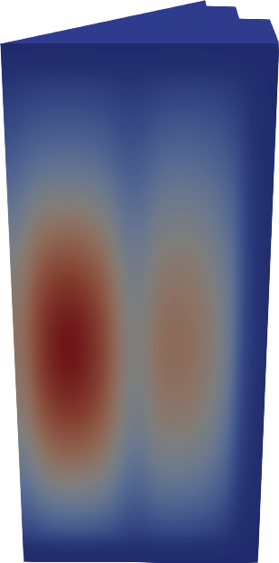
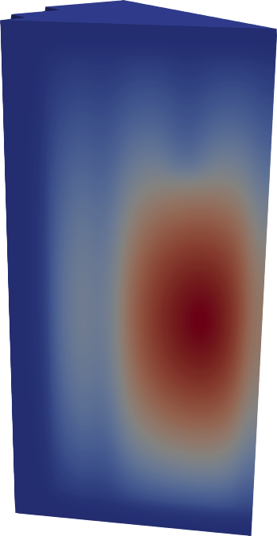
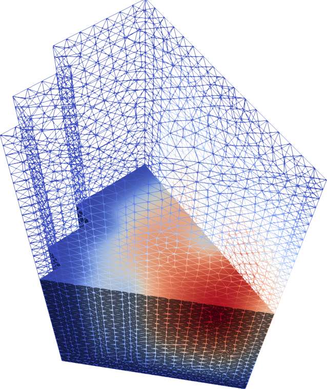
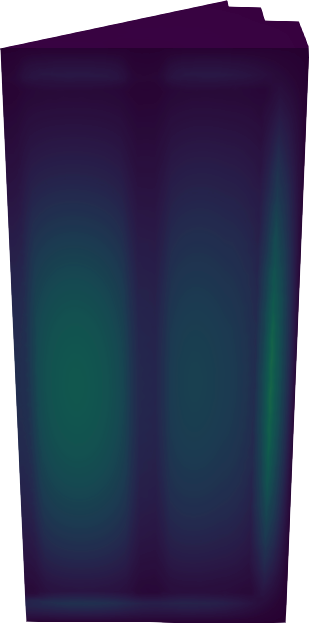
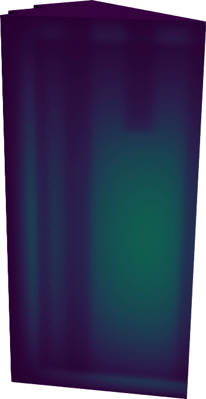
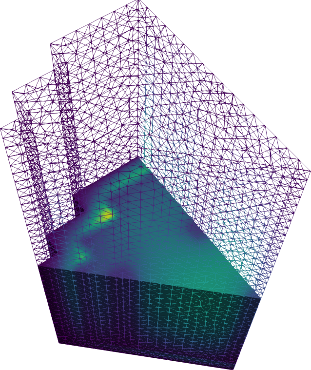
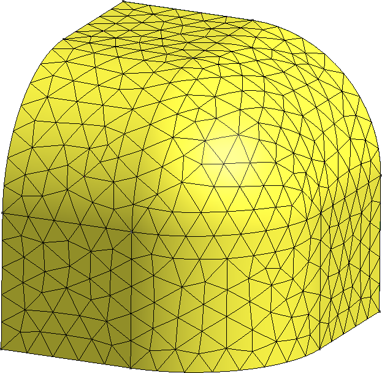
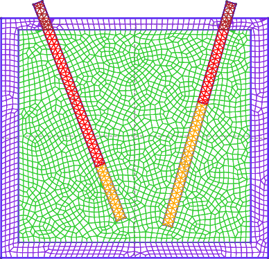

---
title: Neutron diffusion
titleblock: |
 Neutron diffusion
 =================
lang: en-US
toc: true 
...
# IAEA 2D PWR Benchmark

{width="100%"}


```feenox
#                       BENCHMARK PROBLEM
#          
# Identification: 11-A2          Source Situation ID.11
# Date Submitted: June 1976      By: R. R. Lee (CE)
#                                    D. A. Menely (Ontario Hydro)
#                                    B. Micheelsen (Riso-Denmark)
#                                    D. R. Vondy (ORNL)
#                                    M. R. Wagner (KWU)
#                                    W. Werner (GRS-Munich)
#
# Date Accepted:  June 1977      By: H. L. Dodds, Jr. (U. of Tenn.)
#                                    M. V. Gregory (SRL)
#
# Descriptive Title: Two-dimensional LWR Problem,
#                    also 2D IAEA Benchmark Problem
#
# Reduction of Source Situation
#           1. Two-groupo diffusion theory
#           2. Two-dimensional (x,y)-geometry
#
PROBLEM neutron_diffusion 2D GROUPS 2
DEFAULT_ARGUMENT_VALUE 1 quarter   # either quarter or eighth
READ_MESH iaea-2dpwr-$1.msh

# define materials and cross sections according to the two-group constants
# each material corresponds to a physical entity in the geometry file
Bg2 = 0.8e-4  # axial geometric buckling in the z direction
MATERIAL fuel1 {
  D1=1.5    Sigma_a1=0.010+D1(x,y)*Bg2    Sigma_s1.2=0.02
  D2=0.4    Sigma_a2=0.080+D2(x,y)*Bg2    nuSigma_f2=0.135   }#eSigmaF_2 nuSigmaF_2(x,y) }

MATERIAL fuel2 {
  D1=1.5    Sigma_a1=0.010+D1(x,y)*Bg2    Sigma_s1.2=0.02
  D2=0.4    Sigma_a2=0.085+D2(x,y)*Bg2    nuSigma_f2=0.135   }#eSigmaF_2 nuSigmaF_2(x,y) }

MATERIAL fuel2rod {
  D1=1.5    Sigma_a1=0.010+D1(x,y)*Bg2    Sigma_s1.2=0.02
  D2=0.4    Sigma_a2=0.130+D2(x,y)*Bg2    nuSigma_f2=0.135   }#eSigmaF_2 nuSigmaF_2(x,y) }

MATERIAL reflector {
  D1=2.0    Sigma_a1=0.000+D1(x,y)*Bg2    Sigma_s1.2=0.04
  D2=0.3    Sigma_a2=0.010+D2(x,y)*Bg2 }

  
# define boundary conditions as requested by the problem
BC external vacuum=0.4692  # "external" is the name of the entity in the .geo
BC mirror   mirror         # the first mirror is the name, the second is the BC type

# # set the power setpoint equal to the volume of the core
# # (and set eSigmaF_2 = nuSigmaF_2 as above)
# power = 17700

SOLVE_PROBLEM   # solve!
PRINT %.5f "keff = " keff
WRITE_MESH iaea-2dpwr-$1.vtk phi1 phi2
```


```terminal
$ gmsh -2 iaea-2dpwr-quarter.geo
$ [...]
$ gmsh -2 iaea-2dpwr-eighth.geo
$ [...]
$ feenox iaea-2dpwr.fee quarter
keff =  1.02986
$ feenox iaea-2dpwr.fee eighth
keff =  1.02975
$

```


{width=100%}


# IAEA 3D PWR Benchmark

The IAEA 3D PWR Benchmark is a classical problem for core-level
diffusion codes. The original geometry, cross sections and boundary
conditions are shown in
[@fig:iaea-3dpwr-fig1; @fig:iaea-3dpwr-fig2; @fig:iaea-3dpwr-fig3].

{#fig:iaea-3dpwr-fig1}

{#fig:iaea-3dpwr-fig2}

{#fig:iaea-3dpwr-fig3}

The FeenoX approach consists of modeling both the original
one-quarter-symmetric geometry *and* the more reasonable
one-eighth-symmetry geometry in a 3D CAD cloud tool such as Onshape
([@fig:iaea-3dpwr-quarter-onshape; @fig:iaea-3dpwr-eighth-onshape]).
Then, the CAD is imported and meshed in Gmsh to obtain a second-order
unstructured tetrahedral grids suitable to be used by FeenoX to solve
the multi-group neutron diffusion equation
([@fig:iaea-3d-quarter-mesh; @fig:iaea-3d-eighth-mesh])

{#fig:iaea-3dpwr-quarter-onshape}

{#fig:iaea-3dpwr-eighth-onshape}

::: {#fig:iaea-3d-quarter-mesh}
{width="49%"} {width="49%"}

Unstructured second-order tetrahedral grid for the quarter case
:::

::: {#fig:iaea-3d-eighth-mesh}
 

Unstructured second-order tetrahedral grid for the eighth case
:::

The terminal mimic shows that the eighth case can be solved faster and
needs less memory than the original quarter-symmetry case. Recall that
the original problem does have 1/8th symmetry but since historically all
core-level solvers can only handle structured hexahedral grids, nobody
ever took advantage of it.


```feenox
#                       BENCHMARK PROBLEM
#          
# Identification: 11
# Date Submitted: June 1976      By: R. R. Lee (CE)
#                                    D. A. Menely (Ontario Hydro)
#                                    B. Micheelsen (Riso-Denmark)
#                                    D. R. Vondy (ORNL)
#                                    M. R. Wagner (KWU)
#                                    W. Werner (GRS-Munich)
#
# Date Accepted:  June 1977      By: H. L. Dodds, Jr. (U. of Tenn.)
#                                    M. V. Gregory (SRL)
#
# Descriptive Title: Multi-dimensional (x-y-z) LWR model
#
# Suggested Functions: Designed to provide a sever test for
#                      the capabilities of coarse mesh
#                      methods and flux synthesis approximations
#
# Configuration:       Three-dimensional configuration
#                      including space dimensions and region
#                      numbers: 2 Figures
t0 = clock() # start measuring wall time
PROBLEM neutron_diffusion 3D GROUPS 2

DEFAULT_ARGUMENT_VALUE 1 quarter
READ_MESH iaea-3dpwr-$1.msh

MATERIAL fuel1     D1=1.5 D2=0.4 Sigma_s1.2=0.02 Sigma_a1=0.01 Sigma_a2=0.08  nuSigma_f2=0.135
MATERIAL fuel2     D1=1.5 D2=0.4 Sigma_s1.2=0.02 Sigma_a1=0.01 Sigma_a2=0.085 nuSigma_f2=0.135
MATERIAL fuel2rod  D1=1.5 D2=0.4 Sigma_s1.2=0.02 Sigma_a1=0.01 Sigma_a2=0.13  nuSigma_f2=0.135
MATERIAL reflector D1=2.0 D2=0.3 Sigma_s1.2=0.04 Sigma_a1=0    Sigma_a2=0.01  nuSigma_f2=0
MATERIAL reflrod   D1=2.0 D2=0.3 Sigma_s1.2=0.04 Sigma_a1=0    Sigma_a2=0.055 nuSigma_f2=0
  
BC vacuum   vacuum=0.4692
BC mirror   mirror

SOLVE_PROBLEM

# print results
WRITE_RESULTS FORMAT vtk
PRINTF "  keff = %.5f" keff
PRINTF " nodes = %g"   nodes
PRINTF "memory = %.1f Gb" memory()
PRINTF "  wall = %.1f sec" clock()-t0
```


```terminal
$ gmsh -3 iaea-3dpwr-quarter.geo
$ [...]
$ gmsh -3 iaea-3dpwr-eighth.geo
$ [...]
$ feenox iaea-3dpwr.fee quarter
  keff =  1.02918
 nodes =  70779
memory =  3.9 Gb
  wall =  33.8 sec
$ feenox iaea-3dpwr.fee eighth
  keff =  1.02912
 nodes =  47798
memory =  2.5 Gb
  wall =  16.0 sec
$

```


::: {#fig:iaea-3dpwr-eighth-phi1}
{width=25%}
{width=25%}
{width=45%}

Fast flux for the 3D IAEA PWR benchmark in 1/8th symmetry
:::

::: {#fig:iaea-3dpwr-eighth-phi2}
{width=25%}
{width=25%}
{width=45%}

Thermal flux for the 3D IAEA PWR benchmark in 1/8th symmetry
:::


# Cube-spherical bare reactor

It is easy to compute the effective multiplication factor of a one-group
bare cubical reactor. Or a spherical reactor. And we know that for the
same mass, the $k_\text{eff}$ for the former is smaller than for the
latter.

::: {#fig:cube-and-sphere}
{width="49%"} {width="49%"}

One eight of two bare reactors
:::

But what happens "in the middle"? That is to say, how does
$k_\text{eff}$ change when we morph the cube into a sphere? Enter Gmsh &
Feenox.

::: {#fig:cube-morph-sphere}
{width="33%"}
{width="33%"}
{width="33%"}

Continuous morph between a cube and a sphere
:::

``` python
import os
import math
import gmsh

def create_mesh(vol, F):
  gmsh.initialize()
  gmsh.option.setNumber("General.Terminal", 0)  
  
  f = 0.01*F
  a = (vol / (1/8*4/3*math.pi*f**3 + 3*1/4*math.pi*f**2*(1-f) + 3*f*(1-f)**2 + (1-f)**3))**(1.0/3.0)
  
  internal = []
  gmsh.model.add("cubesphere")
  if (F < 1):
    # a cube
    gmsh.model.occ.addBox(0, 0, 0, a, a, a, 1)
    internal = [1,3,5]
    external = [2,4,6]

  elif (F > 99):
    # a sphere
    gmsh.model.occ.addSphere(0, 0, 0, a, 1, 0, math.pi/2, math.pi/2)
    internal = [2,3,4]
    external = [1]
    
  else:
    gmsh.model.occ.addBox(0, 0, 0, a, a, a, 1)
    gmsh.model.occ.fillet([1], [12, 7, 6], [f*a], True)
    internal = [1,4,6]
    external = [2,3,5,7,8,9,10]

  gmsh.model.occ.synchronize()

  gmsh.model.addPhysicalGroup(3, [1], 1)  
  gmsh.model.setPhysicalName(3, 1, "fuel")
    
  gmsh.model.addPhysicalGroup(2, internal, 2)  
  gmsh.model.setPhysicalName(2, 2, "internal")
  gmsh.model.addPhysicalGroup(2, external, 3)  
  gmsh.model.setPhysicalName(2, 3, "external")
  
  gmsh.model.occ.synchronize()
  
  gmsh.option.setNumber("Mesh.ElementOrder", 2)
  gmsh.option.setNumber("Mesh.Optimize", 1)
  gmsh.option.setNumber("Mesh.OptimizeNetgen", 1)
  gmsh.option.setNumber("Mesh.HighOrderOptimize", 1)
  
  gmsh.option.setNumber("Mesh.CharacteristicLengthMin", a/10);
  gmsh.option.setNumber("Mesh.CharacteristicLengthMax", a/10);
  
  gmsh.model.mesh.generate(3)
  gmsh.write("cubesphere-%g.msh"%(F))  

  gmsh.model.remove()
  #gmsh.fltk.run()
  
  gmsh.finalize()
  return


def main():
  
  vol0 = 100**3
  
  for F in range(0,101,5):   # mesh refinement level
    create_mesh(vol0, F)
    # TODO: FeenoX Python API!
    os.system("feenox cubesphere.fee %g"%(F))
    

if __name__ == "__main__":
  main()
```


```feenox
PROBLEM neutron_diffusion DIMENSIONS 3
READ_MESH cubesphere-$1.msh DIMENSIONS 3

# MATERIAL fuel
D1 = 1.03453E+00
Sigma_a1 = 5.59352E-03
nuSigma_f1 = 6.68462E-03
Sigma_s1.1 = 3.94389E-01

PHYSICAL_GROUP fuel DIM 3
BC internal    mirror
BC external    vacuum

SOLVE_PROBLEM

PRINT HEADER $1 keff 1e5*(keff-1)/keff fuel_volume
```


```terminal
$ python cubesphere.py | tee cubesphere.dat 
0       1.05626 5326.13 1e+06
5       1.05638 5337.54 999980
10      1.05675 5370.58 999980
15      1.05734 5423.19 999992
20      1.05812 5492.93 999995
25      1.05906 5576.95 999995
30      1.06013 5672.15 999996
35      1.06129 5775.31 999997
40      1.06251 5883.41 999998
45      1.06376 5993.39 999998
50      1.06499 6102.55 999998
55      1.06619 6208.37 999998
60      1.06733 6308.65 999998
65      1.06839 6401.41 999999
70      1.06935 6485.03 999998
75      1.07018 6557.96 999998
80      1.07088 6618.95 999998
85      1.07143 6666.98 999999
90      1.07183 6701.24 999999
95      1.07206 6721.33 999998
100     1.07213 6727.64 999999
$

```


{width=100%}


# Illustration of the XS dilution & smearing effect

> The best way to solve a problem is to avoid it in the first place.
>
> Richard M. Stallman

Let us consider a two-zone slab reactor:

a.  Zone $A$ has $k_\infty < 1$ and extends from $x=0$ to $x=a$.
b.  Zone $B$ has $k_\infty > 1$ and extends from $x=a$ to $x=b$.

-   The slab is solved with a one-group diffusion approach.
-   Both zones have uniform macroscopic cross sections.
-   Flux $\phi$ is equal to zero at both at $x=0$ and at $x=b$.

Under these conditions, the overall analytical effective multiplication
factor is $k_\text{eff}$ such that

$$
 \sqrt{D_A\cdot\left(\Sigma_{aA}- \frac{\nu\Sigma_{fA}}{k_\text{eff}}\right)} \cdot
  \tan\left[\sqrt{\frac{1}{D_B} \cdot\left( \frac{\nu\Sigma_{fB}}{k_\text{eff}}-\Sigma_{aB} \right) }\cdot (a-b) \right]
$$ $$
 = \sqrt{D_B\cdot\left(\frac{\nu\Sigma_{fB}}{k_\text{eff}}-\Sigma_{aB}\right)} \cdot
  \tanh\left[\sqrt{\frac{1}{D_A} \cdot\left( \Sigma_{aA}-\frac{\nu\Sigma_{fA}}{k_\text{eff}} \right)} \cdot b\right]
$$

We can then compare the numerical $k_\text{eff}$ computed using...

i.  a non-uniform grid with $n+1$ nodes such that there is a node
    exactly at the interface $x=a$.
ii. an uniform grid (mimicking a neutronic code that cannot handle case
    i.) with $n$ uniformly-spaced elements. The element that contains
    point $x=b$ is assigned to a pseudo material $AB$ that linearly
    interpolates the macroscopic cross sections according to where in
    the element the point $x=b$ lies. That is to say, if the element
    width is 10 and $a=52$ then this $AB$ material will be 20% of
    material $A$ and 80% of material $B$.

> The objective of this example is to show that case i. will
> monotonically converge to the analytical multiplication factor as
> $n \rightarrow \infty$ while case ii. will show a XS dilution and
> smearing effect. FeenoX of course can solve both cases, but there are
> many other neutronic tools out there that can handle only structured
> grids.

``` bash
#!/bin/bash

b="100"   # total width of the slab
if [ -z $1 ]; then
  n="10"    # number of cells
else
  n=$1
fi

rm -rf two-zone-slab-*-${n}.dat

# sweep a (width of first material) between 10 and 90
for a in $(seq 35 57); do
  cat << EOF > ab.geo
a = ${a};
b = ${b};
n = ${n};
lc = b/n;
EOF
  for m in uniform nonuniform; do
    gmsh -1 -v 0 two-zone-slab-${m}.geo
    feenox two-zone-slab.fee ${m} | tee -a two-zone-slab-${m}-${n}.dat
  done
done

```


```feenox
PROBLEM neutron_diffusion 1D
DEFAULT_ARGUMENT_VALUE 1 nonuniform
READ_MESH two-zone-slab-$1.msh

# this ab.geo is created from the driving shell script
INCLUDE ab.geo

# pure material A from x=0 to x=a
D1_A = 0.5
Sigma_a1_A = 0.014
nuSigma_f1_A = 0.010

# pure material B from x=a to x=b
D1_B = 1.2
Sigma_a1_B = 0.010
nuSigma_f1_B = 0.014

# meta-material (only used for uniform grid to illustrate XS dilution)
a_left  = floor(a/lc)*lc;
xi = (a - a_left)/lc
Sigma_tr_A = 1/(3*D1_A)
Sigma_tr_B = 1/(3*D1_B)
Sigma_tr_AB = xi*Sigma_tr_A + (1-xi)*Sigma_tr_B
D1_AB = 1/(3*Sigma_tr_AB)
Sigma_a1_AB = xi * Sigma_a1_A + (1-xi)*Sigma_a1_B
nuSigma_f1_AB = xi * nuSigma_f1_A + (1-xi)*nuSigma_f1_B

BC left  null
BC right null

SOLVE_PROBLEM


# compute the analytical keff
F1(k) = sqrt(D1_A*(Sigma_a1_A-nuSigma_f1_A/k)) * tan(sqrt((1/D1_B)*(nuSigma_f1_B/k-Sigma_a1_B))*(a-b))
F2(k) = sqrt(D1_B*(nuSigma_f1_B/k-Sigma_a1_B)) * tanh(sqrt((1/D1_A)*(Sigma_a1_A-nuSigma_f1_A/k))*b)
k = root(F1(k)-F2(k), k, 1, 1.2)

# # and the fluxes (not needed here but for reference)
# B_A = sqrt((Sigma_a1_A - nuSigma_f1_A/k)/D1_A)
# fluxA(x) = sinh(B_A*x)
# 
# B_B = sqrt((nuSigma_f1_B/k - Sigma_a1_B)/D1_B)
# fluxB(x)= sinh(B_A*b)/sin(B_B*(a-b)) * sin(B_B*(a-x))
# 
# # normalization factor
# f = a/(integral(fluxA(x), x, 0, b) + integral(fluxB(x), x, b, a))
# flux(x) := f * if(x < b, fluxA(x), fluxB(x))

PRINT a keff k keff-k b n lc nodes

# PRINT_FUNCTION flux MIN 0 MAX a STEP a/1000 FILE_PATH two-zone-analytical.dat
# PRINT_FUNCTION phi1 phi1(x)-flux(x)         FILE_PATH two-zone-numerical.dat
```


```terminal
$ ./two-zone-slab.sh 10
[...]
$ ./two-zone-slab.sh 20
[...]
$ pyxplot two-zone-slab.ppl
$

```


{width=100%}

{width=100%}

> To illustrate the point of this example, think about the following 2D case:
>
> {width=50%}\ 
>
>  1. How would you solve something like this with a neutronic tool that only allowed structured grids?
>  2. Even if the two control rods were not slanted, as long as they were not inserted up to the same height there would be XS dilution & semaring when using a structured grid (even if the tool allows non-uniform cells in each direction).
>  3. Consider RMS’s quotation above: the best way to solve a problem (i.e. XS dilution) is to avoid it in the first place (i.e. to use a tool able to handle unstructured grids).


