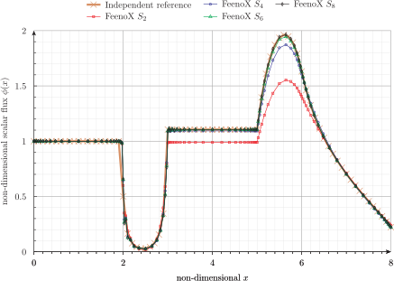

---
title: Neutron transport using $S_N$
titleblock: |
 Neutron transport using $S_N$
 =============================
lang: en-US
toc: true 
...
# Reed's problem

Reed's problem as in

-   [William H. Reed, New Difference Schemes for the Neutron Transport
    Equation, Nuclear Science and Engineering, 46:2, 309-314 (1971).
    DOI: 10.13182/NSE46-309](http://dx.doi.org/10.13182/NSE46-309)

is a common test problem for transport codes. It is comprised of
heterogeneous materials with strong absorber, vacuum, and scattering
regions. These regions are valuable to testing different aspects of
numerical discretizations.

{width="100%"}


```feenox
PROBLEM neutron_sn DIM 1 GROUPS 1 SN $1
READ_MESH reed.msh
 
MATERIAL source1       S1=50 Sigma_t1=50 Sigma_s1.1=0
MATERIAL absorber      S1=0  Sigma_t1=5  Sigma_s1.1=0
MATERIAL void          S1=0  Sigma_t1=0  Sigma_s1.1=0
MATERIAL source2       S1=1  Sigma_t1=1  Sigma_s1.1=0.9
MATERIAL reflector     S1=0  Sigma_t1=1  Sigma_s1.1=0.9

BC left  mirror
BC right vacuum

SOLVE_PROBLEM

PRINT_FUNCTION phi1
```


```terminal
$ gmsh -1 reed.geo
$ [...]
$ for n in 2 4 6 8; do feenox reed.fee ${n} | sort -g > reed-s${n}.csv; done
$

```


The solutions obtained in FeenoX with $S_2$, $S_4$, $S_6$ and $S_8$ are plotted and compared against and independent solution from <https://www.drryanmc.com/solutions-to-reeds-problem/>.

{width=100%}


# Azmy's problem

As in

-   [Y. Y. Azmy, The Weighted Diamond-Difference Form of Nodal Transport
    Methods. NUCLEAR SCIENCE AND ENGINEERING: 98, 29-40 (1988). DOI:
    10.13182/NSE88-6](https://doi.org/10.13182/NSE88-6)


## Second-order complete structured rectangular grid

This example solves the problem using a structured second-order grid. It
computes the mean flux in each quadrant by integrating $\phi_1$ over
each physical group using the instruction
[`INTEGRATE`](https://www.seamplex.com/feenox/doc/feenox-manual.html#integrate).


```feenox
DEFAULT_ARGUMENT_VALUE 1 4
PROBLEM neutron_sn DIM 2 GROUPS 1 SN $1

READ_MESH $0.msh

MATERIAL src S1=1 Sigma_t1=1 Sigma_s1.1=0.5
MATERIAL abs S1=0 Sigma_t1=2 Sigma_s1.1=0.1

PHYSICAL_GROUP llq MATERIAL src
PHYSICAL_GROUP lrq MATERIAL abs
PHYSICAL_GROUP urq MATERIAL abs
PHYSICAL_GROUP ulq MATERIAL abs

BC mirror   mirror
BC vacuum   vacuum

SOLVE_PROBLEM

# compute mean values in each quadrant
INTEGRATE phi1 OVER llq RESULT lower_left_quadrant
INTEGRATE phi1 OVER lrq RESULT lower_right_quadrant
INTEGRATE phi1 OVER urq RESULT upper_right_quadrant

PRINT %.3e "LLQ" lower_left_quadrant/(5*5)  "(ref 1.676e+0)"
PRINT %.3e "LRQ" lower_right_quadrant/(5*5) "(ref 4.159e-2)"
PRINT %.3e "URQ" upper_right_quadrant/(5*5) "(ref 1.992e-3)"

WRITE_RESULTS
PRINT %g total_dofs "unknowns for S" $1 ", memory needed =" %.1f memory() "Gb" SEP " "

```


```terminal
$ gmsh -2 azmy-structured.geo
$ feenox azmy-structured.fee 2
LLQ     1.653e+00       (ref 1.676e+0)
LRQ     4.427e-02       (ref 4.159e-2)
URQ     2.712e-03       (ref 1.992e-3)
16900 unknowns for S 2 , memory needed = 0.1 Gb
$ feenox azmy-structured.fee 4
LLQ     1.676e+00       (ref 1.676e+0)
LRQ     4.164e-02       (ref 4.159e-2)
URQ     1.978e-03       (ref 1.992e-3)
50700 unknowns for S 4 , memory needed = 0.7 Gb
$ feenox azmy-structured.fee 6
LLQ     1.680e+00       (ref 1.676e+0)
LRQ     4.120e-02       (ref 4.159e-2)
URQ     1.874e-03       (ref 1.992e-3)
101400 unknowns for S 6 , memory needed = 2.8 Gb
$

```


## Fist-order locally-refined unstructured triangular grid

This example solves the problem using an unstructured first-order grid.
It computes the mean flux in each quadrant by integrating $\phi_1$
over $x$ and $y$ in custom ranges using the functional
[`integral`](https://www.seamplex.com/feenox/doc/feenox-manual.html#integral).


```feenox
DEFAULT_ARGUMENT_VALUE 1 4
PROBLEM neutron_sn DIM 2 GROUPS 1 SN $1

READ_MESH $0.msh

S1_src = 1
Sigma_t1_src = 1
Sigma_s1.1_src = 0.5

S1_abs = 0
Sigma_t1_abs = 2
Sigma_s1.1_abs = 0.1

BC mirror   mirror
BC vacuum   vacuum

# sn_alpha = 1
SOLVE_PROBLEM

# compute mean values in each quadrant
lower_left_quadrant = integral(integral(phi1(x,y),y,0,5),x,0,5)/(5*5)
lower_right_quadrant = integral(integral(phi1(x,y),y,0,5),x,5,10)/(5*5)
upper_right_quadrant = integral(integral(phi1(x,y),y,5,10),x,5,10)/(5*5)

PRINT %.3e "LLQ" lower_left_quadrant  "(ref 1.676e+0)"
PRINT %.3e "LRQ" lower_right_quadrant "(ref 4.159e-2)"
PRINT %.3e "URQ" upper_right_quadrant "(ref 1.992e-3)"


# compute three profiles along x=constant
profile5(y) = phi1(5.84375,y)
profile7(y) = phi1(7.84375,y)
profile9(y) = phi1(9.84375,y)

PRINT_FUNCTION profile5 profile7 profile9 MIN 0 MAX 10 NSTEPS 100 FILE $0-$1.dat

# WRITE_RESULTS
PRINT %g total_dofs "unknowns for S" $1 ", memory needed =" %.1f memory() "Gb" SEP " "

```


```terminal
$ gmsh -2 azmy.geo
$ feenox azmy.fee 2
LLQ     1.653e+00       (ref 1.676e+0)
LRQ     4.427e-02       (ref 4.159e-2)
URQ     2.717e-03       (ref 1.992e-3)
15704 unknowns for S 2 , memory needed = 0.1 Gb
$ feenox azmy.fee 4
LLQ     1.676e+00       (ref 1.676e+0)
LRQ     4.160e-02       (ref 4.159e-2)
URQ     1.991e-03       (ref 1.992e-3)
47112 unknowns for S 4 , memory needed = 0.4 Gb
$ feenox azmy.fee 6
LLQ     1.680e+00       (ref 1.676e+0)
LRQ     4.115e-02       (ref 4.159e-2)
URQ     1.890e-03       (ref 1.992e-3)
94224 unknowns for S 6 , memory needed = 1.6 Gb
$ feenox azmy.fee 8
LLQ     1.682e+00       (ref 1.676e+0)
LRQ     4.093e-02       (ref 4.159e-2)
URQ     1.844e-03       (ref 1.992e-3)
157040 unknowns for S 8 , memory needed = 4.3 Gb
$ gmsh azmy-s4.geo
$ gmsh azmy-s6.geo
$ gmsh azmy-s8.geo
$

```


  


